> ⚠️ **ARCHIVED** - Superseded by modular documentation structure (November 2025)
>
> This file is preserved for historical reference only. The current documentation is:
> - **Gateway File**: `AGENTS.md` (lightweight 1.5KB gateway)
> - **Modular Structure**: `.claude/instructions-for-agents/` directory
> - **Index**: `.claude/instructions-for-agents/README.md`
>
> **Do NOT update this file.** All changes should go to the modular documentation.

---

# Ghostty Configuration Files - LLM Instructions (2025 Edition) [ARCHIVED]

> 🔧 **CRITICAL**: This file contains NON-NEGOTIABLE requirements that ALL AI assistants (Claude, Gemini, ChatGPT, etc.) working on this repository MUST follow at ALL times.

## 🎯 Project Overview

**Ghostty Configuration Files** is a comprehensive terminal environment setup featuring Ghostty terminal emulator with 2025 performance optimizations, right-click context menu integration, plus integrated AI tools (Claude Code, Gemini CLI) and intelligent update management.

**Quick Links:** [README](README.md) • [CLAUDE Integration](CLAUDE.md) • [Context7 Setup](documentation/setup/context7-mcp.md) • [GitHub MCP Setup](documentation/setup/github-mcp.md) • [Performance Optimizations](#performance-optimizations)

## ⚡ NON-NEGOTIABLE REQUIREMENTS

### 🚨 CRITICAL: Ghostty Performance & Optimization (2025)
- **Linux CGroup Single-Instance**: MANDATORY for performance (`linux-cgroup = single-instance`)
- **Enhanced Shell Integration**: Auto-detection with advanced features
- **Memory Management**: Unlimited scrollback (999999999 lines) with CGroup protection
- **Auto Theme Switching**: Light/dark mode support with Catppuccin themes
- **Security Features**: Clipboard paste protection enabled

### 🚨 CRITICAL: Package Management & Dependencies
- **Ghostty**: Built from source with Zig 0.14.0 (latest stable)
- **ZSH**: Oh My ZSH with enhanced plugins for productivity
- **Node.js**: Latest version (currently v25.2.0) via fnm (Fast Node Manager) for AI tool integration
  - **Global Policy**: Always use the latest Node.js version (not LTS)
  - **Project-level**: Individual projects define their own version requirements via `.nvmrc` or `package.json` engines field
  - **Version Manager**: fnm (Fast Node Manager) - 40x faster than NVM with performance measured and logged startup impact
  - **Health Audit Note**: Latest Node.js version is intentional and should NOT be flagged as a warning
- **Dependencies**: Smart detection and minimal installation footprint

### 🚨 CRITICAL: Installation Prerequisites
- **Passwordless Sudo**: MANDATORY for automated installation
  - Required for: apt package installation, system configuration
  - Security scope: Limited to `/usr/bin/apt` only (not unrestricted)
  - Configuration: `sudo visudo` → Add `username ALL=(ALL) NOPASSWD: /usr/bin/apt`
  - Alternative: Manual installation with interactive password prompts (not recommended)
  - Test: `sudo -n apt update` should run without password prompt
- **Impact**: Installation script will EXIT immediately if passwordless sudo not configured
- **Rationale**: Enables automated daily updates and zero-configuration installation experience

### 🚨 CRITICAL: Context7 MCP Integration & Documentation Synchronization

**Purpose**: Up-to-date documentation and best practices for all project technologies.

**Quick Setup:**
```bash
# 1. Configure environment
cp .env.example .env  # Add CONTEXT7_API_KEY=ctx7sk-your-api-key

# 2. Verify configuration
./scripts/check_context7_health.sh

# 3. Restart Claude Code to load MCP servers
exit && claude
```

**Health Check:** `./scripts/check_context7_health.sh`

**Available Tools:**
- `mcp__context7__resolve-library-id` - Find library IDs for documentation queries
- `mcp__context7__get-library-docs` - Retrieve up-to-date library documentation

**Constitutional Compliance:**
- **MANDATORY**: Query Context7 before major configuration changes
- **RECOMMENDED**: Add Context7 validation to local CI/CD workflows
- **BEST PRACTICE**: Document Context7 queries in conversation logs

**Complete Setup Guide:** [Context7 MCP Setup](documentation/setup/context7-mcp.md) - Installation, configuration, troubleshooting, examples

### 🚨 CRITICAL: GitHub MCP Integration & Repository Operations

**Purpose**: Direct GitHub API integration for repository operations, issues, PRs, and search.

**Quick Setup:**
```bash
# 1. Verify GitHub CLI authentication
gh auth status

# 2. Run health check
./scripts/check_github_mcp_health.sh

# 3. Restart Claude Code to load MCP servers
exit && claude
```

**Health Check:** `./scripts/check_github_mcp_health.sh`

**Core Capabilities:**
- **Repository Operations**: List, create, manage repositories
- **Issue Management**: Create, update, search issues
- **Pull Request Operations**: Create, review, merge PRs
- **Branch Management**: Create, list, delete branches
- **File Operations**: Read, create, update repository files
- **Search Operations**: Search repos, issues, PRs, code

**Constitutional Compliance:**
- **MANDATORY**: Use GitHub MCP for all repository operations (no manual gh CLI)
- **RECOMMENDED**: GitHub MCP operations follow branch preservation strategy
- **REQUIREMENT**: Respect branch naming conventions (YYYYMMDD-HHMMSS-type-description)

**Security:**
- ✅ Token stored in .env (not committed)
- ✅ Leverages existing gh CLI authentication
- ✅ Token auto-refreshes via gh CLI

**Complete Setup Guide:** [GitHub MCP Setup](documentation/setup/github-mcp.md) - Installation, configuration, usage examples, troubleshooting

### 🚨 CRITICAL: Branch Management & Git Strategy

#### Branch Preservation (MANDATORY)
- **NEVER DELETE BRANCHES** without explicit user permission
- **ALL BRANCHES** contain valuable configuration history
- **NO** automatic cleanup with `git branch -d`
- **YES** to automatic merge to main branch, preserving dedicated branch

#### Branch Naming (MANDATORY SCHEMA)
**Format**: `YYYYMMDD-HHMMSS-type-short-description`

Examples:
- `20250919-143000-feat-context-menu-integration`
- `20250919-143515-fix-performance-optimization`
- `20250919-144030-docs-agents-enhancement`

#### GitHub Safety Strategy
```bash
# MANDATORY: Every commit must use this workflow
DATETIME=$(date +"%Y%m%d-%H%M%S")
BRANCH_NAME="${DATETIME}-feat-description"
git checkout -b "$BRANCH_NAME"
git add .
git commit -m "Descriptive commit message

🤖 Generated with [Claude Code](https://claude.ai/code)
Co-Authored-By: Claude <noreply@anthropic.com>"
git push -u origin "$BRANCH_NAME"
git checkout main
git merge "$BRANCH_NAME" --no-ff
git push origin main
# NEVER: git branch -d "$BRANCH_NAME"
```

#### Constitutional Branch Workflow

> This workflow diagram illustrates the MANDATORY constitutional branch management strategy. Every branch represents valuable configuration history and must never be deleted without explicit user permission.

```mermaid
flowchart TD
    Start([New feature/fix needed]) --> CreateBranch[Create timestamped branch<br/>YYYYMMDD-HHMMSS-type-description]
    CreateBranch --> LocalCICD{Run local CI/CD<br/>./.runners-local/workflows/gh-workflow-local.sh all}

    LocalCICD -->|Fails| FixIssues[Fix validation errors]
    FixIssues --> LocalCICD
    LocalCICD -->|Success| Checkout[git checkout -b BRANCH_NAME]

    Checkout --> MakeChanges[Make code changes]
    MakeChanges --> Validate[Validate: ghostty +show-config]
    Validate --> Commit[git add .<br/>git commit -m 'message']

    Commit --> Push[git push -u origin BRANCH_NAME]
    Push --> CheckoutMain[git checkout main]
    CheckoutMain --> Merge[git merge BRANCH_NAME --no-ff]

    Merge --> PushMain[git push origin main]
    PushMain --> Preserve{⚠️ NEVER DELETE BRANCH<br/>Preservation MANDATORY}

    Preserve -->|Correct| Keep[✅ Branch preserved<br/>Complete history maintained]
    Preserve -->|❌ Attempted deletion| Warn[🚨 CONSTITUTIONAL VIOLATION<br/>Stop immediately]

    Keep --> Complete([✅ Workflow complete<br/>Branch preserved])
    Warn --> RollBack[Restore branch from remote]
    RollBack --> Complete

    style Start fill:#e1f5fe
    style Complete fill:#c8e6c9
    style Preserve fill:#ffcdd2
    style Warn fill:#ff5252,color:#fff
    style LocalCICD fill:#fff9c4
    style Keep fill:#81c784
```



### 🚨 CRITICAL: Script Proliferation Prevention (CONSTITUTIONAL PRINCIPLE)

**MANDATORY REQUIREMENT**: All improvements MUST enhance existing scripts, not create new ones.

> "Improve existing scripts directly. Minimize creating scripts to solve other scripts, creating more and more scripts just to solve issues caused by other scripts."
>
> — User Constitutional Requirement, 2025-11-21

**Constitutional Rules**:
1. **NEVER create wrapper scripts** to fix issues in other scripts
2. **NEVER create helper scripts** when existing scripts can be enhanced
3. **NEVER create management scripts** that only call other scripts
4. **Test files are EXEMPT** (`tests/`, `*_test.sh`, `test_*.sh`)

**Before Creating ANY New `.sh` File - MANDATORY Checklist**:
- [ ] Can this be added to an existing script? (If YES → add it there, DO NOT create new file)
- [ ] Is this a test file? (Only YES if in `tests/` or testing infrastructure)
- [ ] Does this violate script proliferation principle? (If YES → STOP immediately)
- [ ] Is this absolutely necessary as a separate file? (If NO → find alternative approach)

**Validation Requirements**:
- All agents MUST check `.claude/principles/script-proliferation.md` before creating files
- 002-compliance validates all new script creation
- Any new script requires explicit justification in commit message

**Examples**:

**❌ VIOLATION - Creating Helper Scripts**:
```bash
# Wrong: Creating new helper for version comparison
lib/utils/version-compare.sh
lib/verification/test_version_compare.sh  # Exception: test files allowed

# Wrong: Creating wrapper to fix broken script
scripts/fix-installer.sh  # Wraps installer.sh
scripts/enhanced-setup.sh  # Wraps setup.sh
```

**✅ COMPLIANT - Enhancing Existing Scripts**:
```bash
# Correct: Add function to existing core library
lib/core/logging.sh  # Add version_compare() function

# Correct: Enhance existing installer directly
lib/installers/ghostty/steps/05-install-binary.sh  # Add update detection logic

# Correct: Add to existing prerequisite check
lib/installers/nodejs_fnm/steps/00-check-prerequisites.sh  # Add snap detection
```

**Enforcement**:
- **Detection**: Repository monitors for new `.sh` file creation
- **Validation**: 002-compliance blocks proliferation violations
- **Override**: Requires explicit user approval with documented justification

**Metrics**:
- **Baseline (2025-11-21)**: TBD script count
- **Target**: Stable or decreasing count over time
- **Alert**: +5 scripts per month triggers review

**Complete Guidelines**: See `.claude/principles/script-proliferation.md` for detailed rules, examples, and enforcement procedures.

### 🚨 CRITICAL: GitHub Pages Infrastructure (MANDATORY)
- **`.nojekyll` File**: ABSOLUTELY CRITICAL for GitHub Pages deployment
- **Location**: `docs/.nojekyll` (empty file, no content needed)
- **Purpose**: Disables Jekyll processing to allow `_astro/` directory assets
- **Impact**: Without this file, ALL CSS/JS assets return 404 errors
- **WARNING**: This file is ESSENTIAL - never remove during cleanup operations
- **Alternative**: No alternative - this file is required for Astro + GitHub Pages

#### Jekyll Cleanup Protection (MANDATORY)
```bash
# BEFORE removing ANY Jekyll-related files, verify this file exists:
ls -la docs/.nojekyll

# If missing, recreate immediately:
touch docs/.nojekyll
git add docs/.nojekyll
git commit -m "CRITICAL: Restore .nojekyll for GitHub Pages asset loading"
```

### 🚨 CRITICAL: Local CI/CD Requirements

#### Pre-Deployment Verification (MANDATORY)
**EVERY** configuration change MUST complete these steps locally FIRST:

```bash
# 1. Run local workflow (MANDATORY before GitHub)
./.runners-local/workflows/gh-workflow-local.sh local

# 2. Verify local build success
./.runners-local/workflows/gh-workflow-local.sh status

# 3. Test configuration locally
ghostty +show-config && ./scripts/check_updates.sh

# 4. Only then commit using branch strategy
DATETIME=$(date +"%Y%m%d-%H%M%S")
BRANCH_NAME="${DATETIME}-config-optimization"
git checkout -b "$BRANCH_NAME"
# ... rest of workflow
```

#### Local CI/CD Pipeline Stages

> **MANDATORY WORKFLOW**: Every configuration change must complete all 7 local CI/CD stages before GitHub deployment. This ensures zero GitHub Actions consumption and maintains constitutional compliance.


#### Local Workflow Tools (MANDATORY)
- **`./.runners-local/workflows/gh-workflow-local.sh`** - Local GitHub Actions simulation
- **`./.runners-local/workflows/gh-pages-setup.sh`** - Zero-cost Pages configuration
- **Commands**: `local`, `status`, `trigger`, `pages`, `all`
- **Requirement**: Local success BEFORE any GitHub deployment

#### Cost Verification (MANDATORY)
```bash
# Check GitHub Actions usage
gh api user/settings/billing/actions

# Monitor workflow runs
gh run list --limit 10 --json status,conclusion,name,createdAt

# Verify zero-cost compliance
./.runners-local/workflows/gh-pages-setup.sh
```

#### Logging & Debugging (MANDATORY) - Dual-Mode Output System
```bash
# Comprehensive dual-mode logging system
# Terminal: Docker-like collapsed (default) OR --verbose for full output
# Log Files: FULL verbose output ALWAYS captured (regardless of mode)

LOG_LOCATIONS="${REPO_ROOT}/logs/"
├── installation/
│   ├── start-TIMESTAMP.log             # Human-readable summary
│   ├── start-TIMESTAMP.log.json        # Structured JSON log
│   ├── start-TIMESTAMP-verbose.log     # FULL command output (debugging)
│   └── .gitkeep
├── components/
│   ├── ghostty-TIMESTAMP.log           # Per-component logs
│   ├── zsh-TIMESTAMP.log
│   ├── python_uv-TIMESTAMP.log
│   ├── nodejs_fnm-TIMESTAMP.log
│   ├── ai_tools-TIMESTAMP.log
│   └── .gitkeep
└── errors.log                           # All errors (consolidated)

# Local CI/CD logs
LOCAL_CI_LOGS="./.runners-local/logs/"
├── workflow-TIMESTAMP.log       # Local workflow execution
├── gh-pages-TIMESTAMP.log       # GitHub Pages simulation
├── performance-TIMESTAMP.json   # CI performance metrics
└── test-results-TIMESTAMP.json  # Test execution results

# View full verbose logs (COMPLETE debugging info)
less logs/installation/start-*-verbose.log | tail -1

# View component-specific logs
less logs/components/ghostty-*.log | tail -1

# Display log locations
./start.sh --show-logs
```

**CRITICAL LOGGING REQUIREMENT** (2025-11-21):
- **Terminal Output**: Docker-like collapsed by default (VERBOSE_MODE=false)
- **Log Files**: FULL verbose output ALWAYS captured (every command, every byte)
- **User Experience**: Clean, professional collapsed UI
- **Debugging**: Complete information preserved in permanent log files
- **Location**: `${REPO_ROOT}/logs/` (NOT `/tmp` - persistent across reboots)

**Complete Guide**: [LOGGING_GUIDE.md](documentation/developer/LOGGING_GUIDE.md)

## 🏗️ System Architecture

### Directory Structure (MANDATORY)

**Essential Structure** (Restructured 2025-11-20):
```
/home/kkk/Apps/ghostty-config-files/
├── start.sh                    # Installation orchestrator script
├── CLAUDE.md, README.md        # AI instructions & user documentation
├── configs/                    # Ghostty config, themes, dircolors, workspace
├── scripts/                    # Utility scripts (manage.sh, updates, health checks)
├── lib/                        # Modular task libraries (ghostty/, zsh/, python_uv/, etc.)
├── documentation/              # SINGLE documentation folder (consolidated)
│   ├── setup/                  # Setup guides (MCP, new-device, zsh-security)
│   ├── architecture/           # Architecture docs (MODULAR_TASK_ARCHITECTURE.md)
│   ├── developer/              # Developer docs (handoff summaries, guides)
│   ├── user/                   # User guides
│   ├── specifications/         # Feature specifications
│   └── archive/                # Historical documentation
├── astro-website/              # Astro.build source (CONSOLIDATED)
│   ├── src/                    # Astro source files & markdown content
│   ├── public/                 # Static assets (.nojekyll, favicon, manifest)
│   ├── astro.config.mjs        # Astro configuration (outDir: '../docs')
│   └── package.json            # Dependencies
├── docs/                       # Astro BUILD OUTPUT ONLY (GitHub Pages)
│   └── .nojekyll               # CRITICAL - never delete
├── tests/                      # Test infrastructure
├── .runners-local/             # Local CI/CD infrastructure (see below)
└── archive-spec-kit/           # Archived spec-kit materials (.specify/)
```

**Detailed .runners-local/ Structure**:
```
.runners-local/                   # Consolidated local CI/CD infrastructure
├── workflows/                    # Workflow execution scripts (committed)
│   ├── gh-workflow-local.sh     # GitHub Actions local simulation
│   ├── astro-build-local.sh     # Astro build workflows
│   ├── performance-monitor.sh   # Performance tracking
│   └── gh-pages-setup.sh        # GitHub Pages setup
├── self-hosted/                  # Self-hosted runner management
│   ├── setup-self-hosted-runner.sh  # Runner setup (committed)
│   └── config/                   # Runner credentials (GITIGNORED)
├── tests/                        # Complete test infrastructure (committed)
│   ├── contract/                # Contract tests
│   ├── unit/                    # Unit tests
│   ├── integration/             # Integration tests
│   ├── validation/              # Validation scripts
│   └── fixtures/                # Test fixtures
├── logs/                         # Execution logs (GITIGNORED)
│   ├── workflows/               # Workflow logs
│   ├── builds/                  # Build logs
│   ├── tests/                   # Test logs
│   └── .runners-local/workflows/                 # Runner service logs
├── docs/                         # Runner documentation (committed)
└── README.md                     # Infrastructure documentation
```

**Complete Structure**: See [DIRECTORY_STRUCTURE.md](documentation/setup/DIRECTORY_STRUCTURE.md) for detailed directory tree with file descriptions, design patterns, and naming conventions.

### Technology Stack (NON-NEGOTIABLE)

**Terminal Environment**:
- **Ghostty**: Latest from source (Zig 0.14.0) with 2025 optimizations
- **ZSH**: Oh My ZSH with productivity plugins
- **Context Menu**: Nautilus integration for "Open in Ghostty"

**AI Integration**:
- **Claude Code**: Latest CLI via npm for code assistance
- **Gemini CLI**: Google's AI assistant with Ptyxis integration
- **Context7 MCP**: Up-to-date documentation server for best practices synchronization
- **Node.js**: Latest version (v25.2.0+) via fnm for modern JavaScript features and optimal performance
  - Global installations use latest Node.js for cutting-edge features
  - Project-specific versions managed via fnm when required by individual projects

**Local CI/CD**:
- **GitHub CLI**: For workflow simulation and API access
- **Local Runners**: Shell-based workflow execution
- **Performance Monitoring**: System state and timing analysis
- **Zero-Cost Strategy**: All CI/CD runs locally before GitHub

**Directory Color Configuration**:
- **XDG Compliance**: Follows XDG Base Directory Specification
- **Location**: `~/.config/dircolors` (not `~/.dircolors` in home directory)
- **Deployment**: Automatic via `start.sh` installation script
- **Shell Integration**: Auto-configured for bash and zsh

### 🎨 Directory Colors & Readability (XDG-Compliant)

The repository includes a carefully configured `dircolors` file that solves common readability issues with directory listings, particularly for world-writable directories.

#### Problem Solved
Default LS_COLORS often render certain directories (like `Desktop`, `Templates`, `.password-store`, `.keras`) with unreadable color combinations:
- **World-writable directories** (`drwxrwxrwx`): Blue text on green background (nearly impossible to read)
- **Standard directories**: Bold blue text (can be difficult to read on some terminal backgrounds)

#### Solution Implementation
**Location**: `configs/ghostty/dircolors` (deployed to `~/.config/dircolors`)

**Key Color Customizations**:
```bash
DIR 01;33                    # Directories: Bold yellow (highly readable)
OTHER_WRITABLE 30;43         # World-writable: Black on yellow (clear contrast)
STICKY_OTHER_WRITABLE 30;42  # Sticky+writable: Black on green
```

**XDG Base Directory Compliance**:
- **Traditional approach** (❌): `~/.dircolors` (clutters home directory)
- **XDG-compliant** (✅): `~/.config/dircolors` (organized, follows standards)
- **Reference**: [XDG Base Directory Specification](https://specifications.freedesktop.org/basedir/latest/)

#### Automatic Deployment

The `start.sh` script automatically:
1. Copies `configs/ghostty/dircolors` to `~/.config/dircolors`
2. Adds XDG-compliant dircolors loading to `.bashrc` and `.zshrc`:
   ```bash
   eval "$(dircolors ${XDG_CONFIG_HOME:-$HOME/.config}/dircolors)"
   ```
3. Preserves existing customizations (idempotent updates)

#### Manual Testing
```bash
# Apply dircolors configuration immediately
eval "$(dircolors ${XDG_CONFIG_HOME:-$HOME/.config}/dircolors)"

# Test with directory listing
ls -la ~

# Verify world-writable directories are readable
# (Desktop, Templates, etc. should show black on yellow)
```

#### Benefits
- ✅ **XDG Standards Compliance**: Keeps home directory clean
- ✅ **Automatic Deployment**: One-command installation via `start.sh`
- ✅ **Enhanced Readability**: World-writable directories clearly visible
- ✅ **Shell Agnostic**: Works with bash, zsh, and other POSIX shells
- ✅ **Preservation**: User customizations maintained during updates

## 📊 Core Functionality

### Primary Goals
1. **Zero-Configuration Terminal**: One-command setup for Ubuntu fresh installs
2. **2025 Performance Optimizations**: Latest Ghostty features and speed improvements
3. **Context Menu Integration**: Right-click "Open in Ghostty" in file manager
4. **Intelligent Updates**: Smart detection and preservation of user customizations
5. **Local CI/CD**: Complete workflow execution without GitHub Actions costs
6. **AI Tool Integration**: Seamless Claude Code and Gemini CLI setup
7. **Enhanced Readability**: XDG-compliant dircolors for readable directory listings
8. **Automated Daily Updates**: System-wide updates run automatically at 9:00 AM daily

### Local CI/CD Workflows
```
Local Development Workflow:
├── Configuration change detection
├── Local testing and validation
├── Performance impact assessment
├── GitHub Actions simulation
├── Documentation update verification
├── Branch creation and safe merging
└── Zero-cost GitHub deployment

CI/CD Pipeline Stages:
├── 01-validate-config        # Ghostty configuration validation
├── 02-test-performance       # 2025 optimization verification
├── 03-check-compatibility    # Cross-system compatibility
├── 04-simulate-workflows     # GitHub Actions local simulation
├── 05-generate-docs          # Documentation update and validation
├── 06-package-release        # Release artifact preparation
└── 07-deploy-pages           # GitHub Pages local build and test
```

## 🛠️ Development Commands (MANDATORY)

### Environment Setup
```bash
# MANDATORY: One-command fresh Ubuntu setup
cd /home/kkk/Apps/ghostty-config-files
./start.sh

# Initialize local CI/CD infrastructure
./.runners-local/workflows/gh-workflow-local.sh init

# Setup GitHub CLI integration
gh auth login
gh repo set-default
```

### Local CI/CD Operations
```bash
# Complete local workflow execution
./.runners-local/workflows/gh-workflow-local.sh all

# Individual workflow stages
./.runners-local/workflows/gh-workflow-local.sh validate    # Config validation
./.runners-local/workflows/gh-workflow-local.sh test       # Performance testing
./.runners-local/workflows/gh-workflow-local.sh build      # Build simulation
./.runners-local/workflows/gh-workflow-local.sh deploy     # Deployment simulation

# GitHub Actions cost monitoring
./.runners-local/workflows/gh-workflow-local.sh billing    # Check usage
./.runners-local/workflows/gh-workflow-local.sh status     # Workflow status
```

### Update Management
```bash
# Smart update detection and application
./scripts/check_updates.sh              # Check and apply necessary updates
./scripts/check_updates.sh --force      # Force all updates
./scripts/check_updates.sh --config-only # Configuration updates only

# Local CI/CD for updates
./.runners-local/workflows/gh-workflow-local.sh update     # Update workflow
```

### Daily Automated Updates
```bash
# Run updates manually anytime
update-all                              # Execute all system updates now

# View update logs and status
update-logs                             # Latest update summary
update-logs-full                        # Complete detailed log
update-logs-errors                      # Errors only
ls -la /tmp/daily-updates-logs/         # All log files

# Configuration and scheduling
crontab -l                              # View current schedule (default: 9:00 AM)
crontab -e                              # Edit schedule

# Passwordless sudo setup (for fully automated apt updates)
sudo EDITOR=nano visudo                 # Add: kkk ALL=(ALL) NOPASSWD: /usr/bin/apt
```

**What Gets Updated Daily:**
- System packages (apt: GitHub CLI, all system packages, autoremove)
- Oh My Zsh framework and plugins
- npm package manager and all global packages
- Claude CLI (@anthropic-ai/claude-code)
- Gemini CLI (@google/gemini-cli)
- GitHub Copilot CLI (@github/copilot)

**Automatic Features:**
- Runs daily at 9:00 AM via cron
- Full output logging to /tmp/daily-updates-logs/
- Terminal startup notifications (once per day)
- Passwordless execution (with proper sudoers configuration)

### Testing & Validation
```bash
# Configuration validation
ghostty +show-config                    # Validate current configuration
./.runners-local/workflows/validate-modules.sh ./scripts  # Module validation
./.runners-local/workflows/pre-commit-local.sh           # Pre-commit checks

# Performance monitoring
./.runners-local/workflows/performance-monitor.sh --baseline # Establish baseline
./.runners-local/workflows/performance-monitor.sh --compare  # Compare performance
./.runners-local/workflows/benchmark-runner.sh all          # Constitutional benchmarks
./.runners-local/workflows/performance-dashboard.sh view    # View performance dashboard

# Documentation synchronization
./.runners-local/workflows/documentation-sync-checker.sh    # Validate docs sync

# System testing
./start.sh --verbose                    # Full installation with detailed logs
```

### Astro Build & Deployment
```bash
# Astro build workflow
./.runners-local/workflows/astro-build-local.sh build      # Complete build workflow
./.runners-local/workflows/astro-build-local.sh check      # TypeScript validation
./.runners-local/workflows/astro-build-local.sh validate   # GitHub Pages validation
./.runners-local/workflows/astro-build-local.sh clean      # Clean build output
```

## 🔄 Local CI/CD Implementation

### GitHub CLI Integration

**Script**: `.runners-local/workflows/gh-workflow-local.sh`

The gh-workflow-local.sh script provides comprehensive local CI/CD capabilities with zero GitHub Actions cost. It includes configuration validation, performance testing, workflow status monitoring, and billing checks.

**Usage**:
```bash
# Run complete local workflow
./.runners-local/workflows/gh-workflow-local.sh all

# Individual operations
./.runners-local/workflows/gh-workflow-local.sh local      # Simulate GitHub Actions locally
./.runners-local/workflows/gh-workflow-local.sh status    # Check workflow status
./.runners-local/workflows/gh-workflow-local.sh billing   # Monitor Actions usage
./.runners-local/workflows/gh-workflow-local.sh pages     # Local Pages simulation

# Get help
./.runners-local/workflows/gh-workflow-local.sh --help
```

**Features**:
- Robust error handling with `set -euo pipefail`
- Structured logging with timestamps and color-coded output
- Performance timing for all operations
- Automatic cleanup with trap handlers
- 2025 Ghostty optimization validation
- GitHub Actions cost monitoring

### Performance Monitoring

**Script**: `.runners-local/workflows/performance-monitor.sh`

Monitors Ghostty terminal performance, tracks 2025 optimizations, and generates comprehensive performance reports.

**Usage**:
```bash
# Run performance test
./.runners-local/workflows/performance-monitor.sh --test

# Establish baseline
./.runners-local/workflows/performance-monitor.sh --baseline

# Generate weekly report
./.runners-local/workflows/performance-monitor.sh --weekly-report

# Get help
./.runners-local/workflows/performance-monitor.sh --help
```

**Metrics Collected**:
- Startup time measurement
- Configuration load time
- CGroup single-instance optimization status
- Shell integration detection status
- System information (hostname, kernel, uptime)

**Output**: Performance data saved to `./.runners-local/logs/performance-*.json`

### Zero-Cost GitHub Pages Setup

**Script**: `.runners-local/workflows/gh-pages-setup.sh`

Configures zero-cost GitHub Pages deployment with Astro.build, including critical `.nojekyll` file validation.

**Usage**:
```bash
# Complete setup (verify, build, configure)
./.runners-local/workflows/gh-pages-setup.sh

# Individual operations
./.runners-local/workflows/gh-pages-setup.sh --verify      # Verify build and .nojekyll
./.runners-local/workflows/gh-pages-setup.sh --build       # Run Astro build
./.runners-local/workflows/gh-pages-setup.sh --configure   # Configure GitHub Pages

# Get help
./.runners-local/workflows/gh-pages-setup.sh --help
```

**Critical Validations**:
- ✅ `.nojekyll` file existence (REQUIRED for Astro + GitHub Pages)
- ✅ Astro build output verification (`docs/index.html`)
- ✅ Asset directory verification (`docs/_astro/`)
- ✅ GitHub Pages configuration via GitHub CLI
- ✅ Manual setup instructions fallback

**Note**: The `.nojekyll` file is CRITICAL - without it, ALL CSS/JS assets will return 404 errors on GitHub Pages.

## 🚨 LLM Conversation Logging (MANDATORY)

**CRITICAL REQUIREMENT**: All AI assistants working on this repository **MUST** save complete conversation logs and maintain debugging information.

### Requirements
- **Complete Logs**: Save entire conversation from start to finish
- **Exclude Sensitive Data**: Remove API keys, passwords, personal information
- **Storage Location**: `documentation/developer/conversation_logs/`
- **Naming Convention**: `CONVERSATION_LOG_YYYYMMDD_DESCRIPTION.md`
- **System State**: Capture before/after system states for debugging
- **CI/CD Logs**: Include local workflow execution logs

### Example Workflow
```bash
# After completing work, save conversation log and system state
mkdir -p documentation/developer/conversation_logs/
cp /path/to/conversation.md documentation/developer/conversation_logs/CONVERSATION_LOG_20250919_local_cicd_setup.md

# Capture system state and CI/CD logs
cp /tmp/ghostty-start-logs/system_state_*.json documentation/developer/system_states/
cp ./.runners-local/logs/* documentation/developer/ci_cd_logs/

git add documentation/developer/
git commit -m "Add conversation log, system state, and CI/CD logs for local infrastructure setup"
```

## ⚠️ ABSOLUTE PROHIBITIONS

### DO NOT
- **NEVER REMOVE `docs/.nojekyll`** - This breaks ALL CSS/JS loading on GitHub Pages
- Delete branches without explicit user permission
- Use GitHub Actions for anything that consumes minutes
- Skip local CI/CD validation before GitHub deployment
- Ignore existing user customizations during updates
- Apply configuration changes without backup
- Commit sensitive data (API keys, passwords, personal information)
- Bypass the intelligent update system for configuration changes
- Remove Jekyll-related files without verifying `.nojekyll` preservation

### DO NOT BYPASS
- Branch preservation requirements
- Local CI/CD execution requirements
- Zero-cost operation constraints
- Configuration validation steps
- User customization preservation
- Logging and debugging requirements

## ✅ MANDATORY ACTIONS

### Before Every Configuration Change
1. **Local CI/CD Execution**: Run `./.runners-local/workflows/gh-workflow-local.sh all`
2. **Configuration Validation**: Run `ghostty +show-config` to ensure validity
3. **Performance Testing**: Execute `./.runners-local/workflows/performance-monitor.sh`
4. **Backup Creation**: Automatic timestamped backup of existing configuration
5. **User Preservation**: Extract and preserve user customizations
6. **Documentation**: Update relevant docs if adding features
7. **Conversation Log**: Save complete AI conversation log with system state

### Quality Gates
- Local CI/CD workflows execute successfully
- Configuration validates without errors via `ghostty +show-config`
- All 2025 performance optimizations are present and functional
- User customizations are preserved and functional
- Context menu integration works correctly
- GitHub Actions usage remains within free tier limits
- All logging systems capture complete information

## 🎯 Success Criteria

### Performance Metrics (2025)
- **Startup Time**: <500ms for new Ghostty instance (CGroup optimization)
- **Memory Usage**: <100MB baseline with optimized scrollback management
- **Shell Integration**: 100% feature detection and activation
- **Theme Switching**: Instant response to system light/dark mode changes
- **CI/CD Performance**: <2 minutes for complete local workflow execution

### User Experience Metrics
- **One-Command Setup**: Fresh Ubuntu system fully configured in <10 minutes
- **Context Menu**: "Open in Ghostty" available immediately after installation
- **Update Efficiency**: Only necessary components updated, no full reinstalls
- **Customization Preservation**: 100% user setting retention during updates
- **Zero-Cost Operation**: No GitHub Actions minutes consumed for routine operations

### Technical Metrics
- **Configuration Validity**: 100% successful validation rate
- **Update Success**: >99% successful intelligent update application
- **Error Recovery**: Automatic rollback on configuration failures
- **Logging Coverage**: Complete system state capture for all operations
- **CI/CD Success**: >99% local workflow execution success rate

## 📚 Documentation & Help

### Key Documents
- [README.md](README.md) - User documentation and quick start guide
- [CLAUDE.md](CLAUDE.md) - Claude Code integration details (symlink to this file)
- [GEMINI.md](GEMINI.md) - Gemini CLI integration details (symlink to this file)

### 🚨 CRITICAL: Documentation Structure (CONSTITUTIONAL REQUIREMENT - Restructured 2025-11-20)
- **`docs/`** - **Astro.build output ONLY** → GitHub Pages deployment (committed, DO NOT manually edit)
- **`astro-website/src/`** - **Astro source files** → Editable markdown documentation (user-guide/, ai-guidelines/, developer/)
- **`documentation/`** - **SINGLE documentation folder** (consolidated from docs-setup/, documentations/, specs/):
  - `documentation/setup/` - Setup guides (MCP integration, new-device, zsh-security)
  - `documentation/architecture/` - Architecture docs (MODULAR_TASK_ARCHITECTURE.md, DIRECTORY_STRUCTURE.md)
  - `documentation/developer/` - Developer docs (handoff summaries, conversation logs, guides)
  - `documentation/user/` - User guides
  - `documentation/specifications/` - Feature specifications (001-modern-tui-system/)
  - `documentation/archive/` - Historical documentation
- **`archive-spec-kit/`** - **Archived spec-kit materials** (.specify/ folder, no longer active)

## 🌐 Modern TUI System Infrastructure

**Active Spec**: Modern TUI Installation System (001) - Phases 1-6 MVP complete with gum.sh module and comprehensive documentation.

**Complete Specification**: [spec.md](documentation/specifications/001-modern-tui-system/spec.md) - Core components, performance targets, implementation phases, task tracking.

### Support Commands
```bash
# Get help with installation
./start.sh --help

# Get help with local CI/CD
./.runners-local/workflows/gh-workflow-local.sh --help

# Get help with updates
./scripts/check_updates.sh --help

# Validate system state
ghostty +show-config
# Note: Use health-check.sh or gh-workflow-local.sh for comprehensive validation

# Emergency configuration recovery
cp ~/.config/ghostty/config.backup-* ~/.config/ghostty/config
ghostty +show-config
```

### Debugging & Troubleshooting
```bash
# View comprehensive logs
ls -la /tmp/ghostty-start-logs/
ls -la ./.runners-local/logs/

# Analyze system state
jq '.' /tmp/ghostty-start-logs/system_state_*.json

# Check CI/CD performance
jq '.' ./.runners-local/logs/performance-*.json

# View errors only
cat /tmp/ghostty-start-logs/errors.log
cat ./.runners-local/logs/workflow-errors.log
```

## 🔄 Continuous Integration & Automation

### Daily Maintenance (Recommended)
```bash
# Add to crontab for automatic local CI/CD
# 0 9 * * * cd /home/kkk/Apps/ghostty-config-files && ./.runners-local/workflows/gh-workflow-local.sh all

# Weekly performance monitoring
# 0 9 * * 0 cd /home/kkk/Apps/ghostty-config-files && ./.runners-local/workflows/performance-monitor.sh --weekly-report
```

### GitHub CLI Automation
```bash
# Monitor repository activity
gh repo view --json name,description,pushedAt,isPrivate

# Check workflow status without triggering actions
gh run list --limit 10 --json status,conclusion,name,createdAt

# Monitor billing to ensure zero cost
gh api user/settings/billing/actions | jq '{total_minutes_used, included_minutes, total_paid_minutes_used}'
```

---

**CRITICAL**: These requirements are NON-NEGOTIABLE. All AI assistants must follow these guidelines exactly. Failure to comply may result in configuration corruption, performance degradation, user data loss, or unexpected GitHub Actions charges.

**Version**: 2.0-2025-LocalCI
**Last Updated**: 2025-09-19
**Status**: ACTIVE - MANDATORY COMPLIANCE
**Target**: Ubuntu 25.10 (Questing) with Ghostty 1.1.4+ (1.2.0 upgrade planned) and zero-cost local CI/CD
**Review**: Required before any major configuration changes

## Active Technologies
- ZSH (Ubuntu 25.10 default shell), Node.js latest (v25.2.0+) via fnm (for Astro.build documentation site and AI CLI tools) (001-repo-structure-refactor)
- File-based configuration and documentation (no database) (001-repo-structure-refactor)
- ZSH (Ubuntu 25.10 default shell) + apt/dpkg (package management), snapd (snap installation), systemd (service management), jq (JSON processing), GitHub CLI (workflow integration) (005-apt-snap-migration)
- File-based logs in `/tmp/ghostty-start-logs/` and `./.runners-local/logs/`, backup storage in `~/.config/package-migration/backups/`, JSON state files for migration tracking (005-apt-snap-migration)
- Bash 5.x+ with YAML/Markdown processing (yq/jq), spec archive system (20251111-042534-feat-task-archive-consolidation)

## Recent Changes
- 001-repo-structure-refactor: Added ZSH (Ubuntu 25.10 default shell), Node.js latest (v25.2.0+) via fnm (for Astro.build documentation site and AI CLI tools)