# 🚨 CRITICAL: Branch Management & Git Strategy

[← Back to AGENTS.md](../../../../AGENTS.md)

**Related Sections**:
- [Local CI/CD Operations](./local-cicd-operations.md) - Workflow execution
- [Script Proliferation](../principles/script-proliferation.md) - Constitutional principles
- [Critical Requirements](./CRITICAL-requirements.md) - All critical requirements

---

## Branch Preservation (MANDATORY)

- **NEVER DELETE BRANCHES** without explicit user permission
- **ALL BRANCHES** contain valuable configuration history
- **NO** automatic cleanup with `git branch -d`
- **YES** to automatic merge to main branch, preserving dedicated branch

---

## Branch Naming (MANDATORY SCHEMA)

**Format**: `YYYYMMDD-HHMMSS-type-short-description`

**Examples:**
- `20250919-143000-feat-context-menu-integration`
- `20250919-143515-fix-performance-optimization`
- `20250919-144030-docs-agents-enhancement`

**Valid Types:**
- `feat` - New feature
- `fix` - Bug fix
- `docs` - Documentation changes
- `refactor` - Code restructuring
- `test` - Test additions/modifications
- `chore` - Maintenance tasks

---

## GitHub Safety Strategy

**MANDATORY: Every commit must use this workflow**

```bash
# 1. Create timestamped branch
DATETIME=$(date +"%Y%m%d-%H%M%S")
BRANCH_NAME="${DATETIME}-feat-description"
git checkout -b "$BRANCH_NAME"

# 2. Make changes and commit
git add .
git commit -m "Descriptive commit message

🤖 Generated with [Claude Code](https://claude.ai/code)
Co-Authored-By: Claude <noreply@anthropic.com>"

# 3. Push to remote
git push -u origin "$BRANCH_NAME"

# 4. Merge to main (preserving branch)
git checkout main
git merge "$BRANCH_NAME" --no-ff
git push origin main

# 5. NEVER delete the branch
# ❌ WRONG: git branch -d "$BRANCH_NAME"
# ✅ CORRECT: Branch remains for historical reference
```

---

## Constitutional Branch Workflow

> This workflow diagram illustrates the MANDATORY constitutional branch management strategy. Every branch represents valuable configuration history and must never be deleted without explicit user permission.

```mermaid
flowchart TD
    Start([New feature/fix needed]) --> CreateBranch[Create timestamped branch<br/>YYYYMMDD-HHMMSS-type-description]
    CreateBranch --> LocalCICD{Run local CI/CD<br/>./.runners-local/workflows/gh-workflow-local.sh all}

    LocalCICD -->|Fails| FixIssues[Fix validation errors]
    FixIssues --> LocalCICD
    LocalCICD -->|Success| Checkout[git checkout -b BRANCH_NAME]

    Checkout --> MakeChanges[Make code changes]
    MakeChanges --> Validate[Validate: ghostty +show-config]
    Validate --> Commit[git add .<br/>git commit -m 'message']

    Commit --> Push[git push -u origin BRANCH_NAME]
    Push --> CheckoutMain[git checkout main]
    CheckoutMain --> Merge[git merge BRANCH_NAME --no-ff]

    Merge --> PushMain[git push origin main]
    PushMain --> Preserve{⚠️ NEVER DELETE BRANCH<br/>Preservation MANDATORY}

    Preserve -->|Correct| Keep[✅ Branch preserved<br/>Complete history maintained]
    Preserve -->|❌ Attempted deletion| Warn[🚨 CONSTITUTIONAL VIOLATION<br/>Stop immediately]

    Keep --> Complete([✅ Workflow complete<br/>Branch preserved])
    Warn --> RollBack[Restore branch from remote]
    RollBack --> Complete

    style Start fill:#e1f5fe
    style Complete fill:#c8e6c9
    style Preserve fill:#ffcdd2
    style Warn fill:#ff5252,color:#fff
    style LocalCICD fill:#fff9c4
    style Keep fill:#81c784
```



---

## Commit Message Format

**Standard Format:**
```
<type>: <short description>

<optional detailed explanation>

🤖 Generated with [Claude Code](https://claude.ai/code)
Co-Authored-By: Claude <noreply@anthropic.com>
```

**Examples:**

```
feat: Add Context7 MCP integration for up-to-date documentation

Implements Context7 MCP server setup with health checks and
constitutional compliance validation.

🤖 Generated with [Claude Code](https://claude.ai/code)
Co-Authored-By: Claude <noreply@anthropic.com>
```

```
fix: Restore .nojekyll file for GitHub Pages asset loading

Critical fix to prevent 404 errors on all CSS/JS assets.

🤖 Generated with [Claude Code](https://claude.ai/code)
Co-Authored-By: Claude <noreply@anthropic.com>
```

---

## Pre-Commit Checklist

**Before EVERY commit:**

- [ ] Run local CI/CD: `./.runners-local/workflows/gh-workflow-local.sh all`
- [ ] Validate configuration: `ghostty +show-config`
- [ ] Check script proliferation: Review `.claude/principles/script-proliferation.md`
- [ ] Verify no sensitive data: No API keys, passwords, personal info
- [ ] Test changes locally: Ensure functionality works
- [ ] Update documentation: If adding features
- [ ] Branch naming correct: `YYYYMMDD-HHMMSS-type-description` format

---

## Emergency Recovery

**If branch accidentally deleted:**

```bash
# 1. Check remote branches
git branch -r | grep "your-branch-name"

# 2. Restore from remote
git checkout -b branch-name origin/branch-name

# 3. Verify restoration
git log --oneline -10
```

**If commit history corrupted:**

```bash
# 1. Check reflog
git reflog

# 2. Restore to previous state
git reset --hard HEAD@{N}  # N = number from reflog

# 3. Force push if needed (with extreme caution)
git push --force-with-lease origin branch-name
```

---

[← Back to AGENTS.md](../../../../AGENTS.md)
