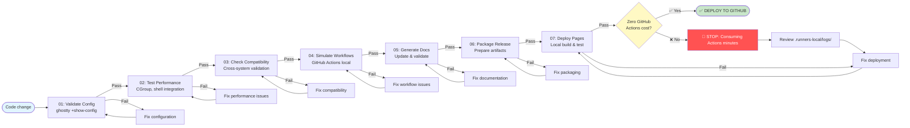

# 🚨 CRITICAL: Local CI/CD Requirements

[← Back to AGENTS.md](../../../../AGENTS.md)

**Related Sections**:
- [Git Strategy](./git-strategy.md) - Branch workflow integration
- [Local CI/CD Guide](../guides/local-cicd-guide.md) - Operational how-to guide
- [System Architecture](../architecture/system-architecture.md) - Infrastructure details

---

## Pre-Deployment Verification (MANDATORY)

**EVERY** configuration change MUST complete these steps locally FIRST:

```bash
# 1. Run local workflow (MANDATORY before GitHub)
./.runners-local/workflows/gh-workflow-local.sh local

# 2. Verify local build success
./.runners-local/workflows/gh-workflow-local.sh status

# 3. Test configuration locally
ghostty +show-config && ./scripts/check_updates.sh

# 4. Only then commit using branch strategy
DATETIME=$(date +"%Y%m%d-%H%M%S")
BRANCH_NAME="${DATETIME}-config-optimization"
git checkout -b "$BRANCH_NAME"
# ... rest of workflow
```

---

## Local CI/CD Pipeline Stages

> **MANDATORY WORKFLOW**: Every configuration change must complete all 7 local CI/CD stages before GitHub deployment. This ensures zero GitHub Actions consumption and maintains constitutional compliance.



---

## Local Workflow Tools (MANDATORY)

### Primary Script
**`./.runners-local/workflows/gh-workflow-local.sh`** - Local GitHub Actions simulation

**Commands:**
- `local` - Simulate GitHub Actions locally
- `status` - Check workflow status
- `trigger` - Trigger specific workflow
- `pages` - Local Pages simulation
- `all` - Complete workflow execution
- `billing` - Check GitHub Actions usage

**Example:**
```bash
# Complete local workflow
./.runners-local/workflows/gh-workflow-local.sh all

# Individual stage
./.runners-local/workflows/gh-workflow-local.sh validate
```

### Supporting Scripts
- **`./.runners-local/workflows/gh-pages-setup.sh`** - Zero-cost Pages configuration
- **`./.runners-local/workflows/performance-monitor.sh`** - Performance tracking
- **`./.runners-local/workflows/astro-build-local.sh`** - Astro build workflows

---

## Cost Verification (MANDATORY)

**Check GitHub Actions usage:**
```bash
# Check billing status
gh api user/settings/billing/actions

# Monitor workflow runs
gh run list --limit 10 --json status,conclusion,name,createdAt

# Verify zero-cost compliance
./.runners-local/workflows/gh-pages-setup.sh
```

**Zero-Cost Requirements:**
- ✅ All testing runs locally FIRST
- ✅ GitHub Actions only for final deployment
- ✅ No CI/CD workflows consume minutes
- ✅ Local runners handle all validation

---

## Logging & Debugging (MANDATORY) - Dual-Mode Output System

### Log Locations

```bash
# Installation logs
LOG_LOCATIONS="${REPO_ROOT}/logs/"
├── installation/
│   ├── start-TIMESTAMP.log             # Human-readable summary
│   ├── start-TIMESTAMP.log.json        # Structured JSON log
│   ├── start-TIMESTAMP-verbose.log     # FULL command output (debugging)
│   └── .gitkeep
├── components/
│   ├── ghostty-TIMESTAMP.log           # Per-component logs
│   ├── zsh-TIMESTAMP.log
│   ├── python_uv-TIMESTAMP.log
│   ├── nodejs_fnm-TIMESTAMP.log
│   ├── ai_tools-TIMESTAMP.log
│   └── .gitkeep
└── errors.log                           # All errors (consolidated)

# Local CI/CD logs
LOCAL_CI_LOGS="./.runners-local/logs/"
├── workflow-TIMESTAMP.log       # Local workflow execution
├── gh-pages-TIMESTAMP.log       # GitHub Pages simulation
├── performance-TIMESTAMP.json   # CI performance metrics
└── test-results-TIMESTAMP.json  # Test execution results
```

### Viewing Logs

```bash
# View full verbose logs (COMPLETE debugging info)
less logs/installation/start-*-verbose.log | tail -1

# View component-specific logs
less logs/components/ghostty-*.log | tail -1

# Display log locations
./start.sh --show-logs

# View CI/CD logs
less ./.runners-local/logs/workflow-*.log | tail -1
```

### Dual-Mode Logging System

**CRITICAL LOGGING REQUIREMENT** (2025-11-21):
- **Terminal Output**: Docker-like collapsed by default (VERBOSE_MODE=false)
- **Log Files**: FULL verbose output ALWAYS captured (every command, every byte)
- **User Experience**: Clean, professional collapsed UI
- **Debugging**: Complete information preserved in permanent log files
- **Location**: `${REPO_ROOT}/logs/` (NOT `/tmp` - persistent across reboots)

**Complete Guide**: [LOGGING_GUIDE.md](../guides/LOGGING_GUIDE.md)

---

## Workflow Execution Requirements

### Before Every GitHub Push

**MANDATORY checklist:**

1. ✅ Local CI/CD passes: `./.runners-local/workflows/gh-workflow-local.sh all`
2. ✅ Configuration validates: `ghostty +show-config`
3. ✅ Performance test passes: `./.runners-local/workflows/performance-monitor.sh`
4. ✅ Documentation updated: Relevant docs reflect changes
5. ✅ Logs reviewed: Check `./.runners-local/logs/` for errors
6. ✅ Branch created: Timestamped branch following naming convention
7. ✅ Commit message formatted: Includes co-authorship

### Quality Gates

**All must pass:**
- Local CI/CD workflows execute successfully
- Configuration validates without errors
- All 2025 performance optimizations functional
- User customizations preserved
- Context menu integration works
- GitHub Actions usage within free tier
- All logging systems capture complete information

---

## Workflow Status Monitoring

### Check Workflow Status
```bash
# Local workflow status
./.runners-local/workflows/gh-workflow-local.sh status

# GitHub workflow status
gh run list --limit 10

# Specific workflow details
gh run view <run-id>
```

### Performance Monitoring
```bash
# Establish baseline
./.runners-local/workflows/performance-monitor.sh --baseline

# Compare performance
./.runners-local/workflows/performance-monitor.sh --compare

# Weekly report
./.runners-local/workflows/performance-monitor.sh --weekly-report
```

---

## Emergency Procedures

### If Local CI/CD Fails

```bash
# 1. Review error logs
cat ./.runners-local/logs/workflow-errors.log

# 2. Check configuration
ghostty +show-config

# 3. Restore backup if needed
cp ~/.config/ghostty/config.backup-* ~/.config/ghostty/config

# 4. Re-run validation
./.runners-local/workflows/gh-workflow-local.sh validate
```

### If GitHub Actions Consuming Minutes

```bash
# 1. Stop all running workflows
gh run list --limit 10 | grep "in_progress" | awk '{print $7}' | xargs -I {} gh run cancel {}

# 2. Review billing
gh api user/settings/billing/actions

# 3. Investigate why local CI/CD didn't catch issue
less ./.runners-local/logs/workflow-*.log | tail -1
```

---

[← Back to AGENTS.md](../../../../AGENTS.md)
