# Integration Test Suite

Comprehensive end-to-end testing suite for validating critical project workflows and functionality.

## Overview

The integration test suite provides end-to-end validation of core project components including:

- Complete installation workflows (start.sh)
- Astro build and GitHub Pages deployment
- MCP (Model Context Protocol) server integration
- Local CI/CD pipeline execution
- Health check scripts and monitoring
- System update detection and application

## Quick Start

### Run All Integration Tests

```bash
./.runners-local/tests/integration/run_integration_tests.sh
```

### Run Specific Test Suite

```bash
./.runners-local/tests/integration/run_integration_tests.sh --suite test_health_checks.sh
```

### Run With Verbose Output

```bash
./.runners-local/tests/integration/run_integration_tests.sh --verbose
```

### List Available Test Suites

```bash
./.runners-local/tests/integration/run_integration_tests.sh --list
```

## Test Suites

### 1. test_full_installation.sh

**Purpose**: End-to-end testing of complete start.sh installation

**What It Validates**:
- start.sh and manage.sh are present and executable
- Installation configuration structure is valid
- Required installation scripts exist
- Configuration templates are accessible
- Common utility functions load without errors
- Health check scripts are present and executable
- Documentation structure is correct
- GitHub Pages .nojekyll file is critical (MUST exist)
- .runners-local infrastructure is complete

**Expected Duration**: < 5 seconds

**Key Assertions**:
- start.sh is executable
- Configuration directories exist
- Utility modules load without errors
- GitHub Pages .nojekyll is present (CRITICAL)

### 2. test_astro_build_deploy.sh

**Purpose**: End-to-end testing of Astro build and GitHub Pages deployment

**What It Validates**:
- Astro build workflow script exists
- Website source directory structure is valid
- docs output directory is present
- .nojekyll file exists (CRITICAL for GitHub Pages)
- GitHub Pages configuration is set
- Astro configuration file is valid
- package.json has build scripts
- Documentation source files are present
- Documentation pages are generated
- Astro assets directory exists with CSS/JS
- Build output is not empty
- Sitemap is generated

**Expected Duration**: < 10 seconds

**Critical Requirements**:
- **docs/.nojekyll** file MUST exist - without it, ALL CSS/JS assets return 404 errors on GitHub Pages
- docs/_astro/ directory must contain generated assets
- docs/index.html must exist

**Key Assertions**:
- Astro config exists
- .nojekyll file exists (CRITICAL)
- docs/ directory contains generated files
- Assets are properly generated

### 3. test_mcp_integration.sh

**Purpose**: End-to-end testing of MCP server activation and configuration

**What It Validates**:
- Context7 MCP health check script exists
- GitHub MCP health check script exists
- MCP setup documentation exists
- Environment configuration template (.env.example) exists
- Context7 MCP docs mention API key setup
- GitHub CLI integration documentation exists
- spec-kit installation script exists
- CLAUDE.md mentions MCP integration
- Claude Code integration is documented
- Health check scripts are executable
- MCP configuration examples exist
- Documentation includes MCP setup guides
- Installation scripts include MCP setup

**Expected Duration**: < 5 seconds

**Prerequisites**:
- Context7 API key configured in .env (for full integration)
- GitHub CLI authentication configured

**Key Assertions**:
- MCP health check scripts exist
- Documentation covers setup requirements
- Installation includes MCP configuration

### 4. test_local_cicd_workflow.sh

**Purpose**: End-to-end testing of complete CI/CD pipeline execution

**What It Validates**:
- Main CI/CD workflow script (gh-workflow-local.sh) exists
- All required workflow scripts are present and executable:
  - astro-build-local.sh
  - gh-pages-setup.sh
  - performance-monitor.sh
  - validate-modules.sh
  - pre-commit-local.sh
- Logs directory structure exists
- Performance monitoring infrastructure exists
- Validation scripts are present
- Workflow documentation exists
- Test infrastructure is complete
- GitHub CLI integration scripts exist
- Self-hosted runner infrastructure exists
- .github/workflows directory exists
- Health check scripts are available
- Zero-cost operation strategy is documented
- Local CI/CD logs structure is documented
- Pipeline stages are documented

**Expected Duration**: < 10 seconds

**Key Workflows**:
1. Configuration validation
2. Performance testing
3. Cross-system compatibility checking
4. GitHub Actions simulation
5. Documentation generation
6. Release packaging
7. GitHub Pages deployment

**Key Assertions**:
- All workflow scripts are executable
- Complete test infrastructure exists
- Zero-cost requirements are documented

### 5. test_health_checks.sh

**Purpose**: End-to-end testing of all health check scripts

**What It Validates**:
- system_health_check.sh exists and is executable
- check_updates.sh exists and is executable
- check_context7_health.sh exists and is executable
- check_github_mcp_health.sh exists and is executable
- health_dashboard.sh exists
- daily-updates.sh exists
- update_ghostty.sh exists
- install_node.sh exists
- package_migration.sh exists
- audit_packages.sh exists
- Health check results directory structure is valid
- Common utilities (common.sh, progress.sh) are available
- Backup utilities exist for recovery
- Health check dependencies are documented
- Validation infrastructure exists

**Expected Duration**: < 10 seconds

**Health Check Categories**:
- **System Health**: Overall system status and readiness
- **Update Checks**: Available and pending updates
- **Context7 Integration**: MCP documentation server status
- **GitHub MCP**: GitHub CLI and repository integration
- **Performance**: System performance metrics

**Key Assertions**:
- All health check scripts are executable
- Common utilities are loadable
- Documentation covers health check requirements

### 6. test_update_workflow.sh

**Purpose**: End-to-end testing of update detection and application

**What It Validates**:
- check_updates.sh exists and is executable
- daily-updates.sh exists and is executable
- update_ghostty.sh exists and is executable
- Backup utilities exist for update recovery
- Common utilities are available
- Node.js installation script exists
- package_migration.sh exists
- Update logs directory exists
- Ghostty config installation script exists
- Update workflow is documented
- Configuration backup strategy is in place
- Update status monitoring is available
- All update workflow components are present
- Update workflow preserves user customizations
- Update strategy is documented in README
- smart_commit.sh exists for update tracking
- Update validation infrastructure exists

**Expected Duration**: < 10 seconds

**Update Workflow Stages**:
1. Update detection (check for available updates)
2. Pre-update backup (preserve current configuration)
3. Update application (apply new versions)
4. Validation (ensure updates don't break configuration)
5. Customization preservation (maintain user modifications)
6. Status reporting (log results)

**Key Assertions**:
- All update scripts exist and are executable
- Backup strategy is documented
- Customization preservation is guaranteed
- Update validation is available

## Test Execution Flow

```mermaid
graph TD
    Start([Run integration tests]) --> Validate[Validate test suites]
    Validate --> Parse[Parse command arguments]
    Parse --> Select{Selected suites?}

    Select -->|All suites| RunAll["Run all 6 test suites"]
    Select -->|Specific suites| RunSelected["Run selected suites"]

    RunAll --> T1["test_full_installation.sh"]
    RunAll --> T2["test_astro_build_deploy.sh"]
    RunAll --> T3["test_mcp_integration.sh"]
    RunAll --> T4["test_local_cicd_workflow.sh"]
    RunAll --> T5["test_health_checks.sh"]
    RunAll --> T6["test_update_workflow.sh"]

    T1 --> Collect["Collect test results"]
    T2 --> Collect
    T3 --> Collect
    T4 --> Collect
    T5 --> Collect
    T6 --> Collect

    RunSelected --> Collect

    Collect --> Generate["Generate summary report"]
    Generate --> Print["Print console summary"]
    Print --> Evaluate{All suites passed?}

    Evaluate -->|Yes| Success([✅ Exit 0])
    Evaluate -->|No| Failure([❌ Exit 1])

    style Start fill:#e1f5fe
    style Success fill:#c8e6c9
    style Failure fill:#ffcdd2
    style Collect fill:#fff9c4
```



## Test Structure

### Setup Phase
- Create isolated test environment (temporary directories)
- Override necessary environment variables
- Initialize test fixtures and mocks

### Test Phase
- Execute individual test cases using assertion helpers
- Capture test output and results
- Track passed/failed tests

### Teardown Phase
- Remove temporary directories
- Clean up test artifacts
- Restore original environment

### Assertion Helpers

All tests use consistent assertion functions from `test_functions.sh`:

```bash
# Equality assertions
assert_equals <expected> <actual> [message]
assert_not_equals <expected> <actual> [message]

# Boolean assertions
assert_true <condition> [message]
assert_false <condition> [message]

# String assertions
assert_contains <haystack> <needle> [message]
assert_not_contains <haystack> <needle> [message]

# File/Directory assertions
assert_file_exists <path> [message]
assert_file_not_exists <path> [message]
assert_dir_exists <path> [message]

# Command assertions
assert_success <command> [args...] [message]
assert_fails <command> [args...] [message]
assert_exit_code <expected> <command> [args...]

# Performance assertions
assert_completes_within <max_ms> <command> [args...]
```

## Output and Logging

### Console Output

Each test displays real-time progress with emojis:
- ✅ PASS - Test passed
- ❌ FAIL - Test failed
- 🧪 Running - Test in progress
- 📊 Results - Summary statistics

### Log Files

Test results are logged to `.runners-local/logs/`:

```
.runners-local/logs/
├── integration-tests-YYYYMMDD-HHMMSS.log      # Detailed execution log
└── integration-tests-summary-YYYYMMDD-HHMMSS.txt  # Summary report
```

## Integration with CI/CD

### Local Execution

Run before committing changes:

```bash
# Run all integration tests
./.runners-local/tests/integration/run_integration_tests.sh

# Run with verbose output for debugging
./.runners-local/tests/integration/run_integration_tests.sh --verbose
```

### GitHub Actions (Future)

Integration tests can be incorporated into GitHub Actions workflows:

```yaml
- name: Run Integration Tests
  run: ./.runners-local/tests/integration/run_integration_tests.sh
```

## Prerequisites

### System Requirements
- Bash 5.0+
- Standard Unix utilities (grep, sed, awk)
- Test framework (test_functions.sh)

### Environment Variables
Optional environment variables for testing:

```bash
# Enable verbose logging
VERBOSE=true

# Custom log directory
LOG_DIR=/custom/path

# Parallel execution (experimental)
PARALLEL=true
```

## Troubleshooting

### Test Fails Unexpectedly

**Solution 1**: Run with verbose output for detailed error messages:
```bash
./.runners-local/tests/integration/run_integration_tests.sh --verbose
```

**Solution 2**: Run individual test suite:
```bash
./.runners-local/tests/integration/test_health_checks.sh
```

**Solution 3**: Check logs for detailed information:
```bash
cat .runners-local/logs/integration-tests-*.log
```

### Test Environment Issues

**Problem**: Permission denied
```bash
# Fix: Make test scripts executable
chmod +x .runners-local/tests/integration/*.sh
```

**Problem**: Temp directory cleanup fails
```bash
# Fix: Manually clean up
rm -rf /tmp/tmp.* 2>/dev/null || true
```

### MCP Integration Tests Fail

**Problem**: Context7 API key not configured
```bash
# Fix: Configure .env file
cp .env.example .env
# Edit .env and add: CONTEXT7_API_KEY=your-api-key
```

**Problem**: GitHub CLI not authenticated
```bash
# Fix: Authenticate GitHub CLI
gh auth login
```

## Performance Expectations

Expected execution times on standard Ubuntu system:

| Test Suite | Duration | Notes |
|-----------|----------|-------|
| Full Installation | < 5 seconds | File existence checks |
| Astro Build Deploy | < 10 seconds | Validates build system |
| MCP Integration | < 5 seconds | Documentation checks |
| Local CI/CD | < 10 seconds | Workflow validation |
| Health Checks | < 10 seconds | System health checks |
| Update Workflow | < 10 seconds | Update system validation |
| **Total** | **< 50 seconds** | All tests combined |

## Test Coverage

### Components Tested

✅ **Installation System**
- start.sh and manage.sh
- Configuration templates
- Installation scripts
- Utility functions

✅ **Documentation & Deployment**
- Astro build system
- GitHub Pages configuration
- .nojekyll (CRITICAL)
- Asset generation

✅ **AI Integration**
- MCP setup scripts
- Context7 integration
- GitHub MCP integration
- Claude Code setup

✅ **CI/CD Pipeline**
- Workflow orchestration
- Performance monitoring
- Validation infrastructure
- GitHub CLI integration

✅ **System Health**
- Update management
- Configuration validation
- Backup/recovery
- Status monitoring

## Contributing

### Adding New Test Cases

1. Edit relevant test suite in `.runners-local/tests/integration/`
2. Follow existing assertion patterns
3. Add descriptive test name and comments
4. Update this README with new test coverage
5. Run full test suite to validate

### Adding New Test Suites

1. Create `test_new_feature.sh` in this directory
2. Follow template from existing test suites
3. Include setup/teardown functions
4. Use consistent assertion helpers
5. Add to `TEST_SUITES` array in `run_integration_tests.sh`
6. Update README with suite documentation

## Related Documentation

- [Local CI/CD Infrastructure](./../README.md)
- [Test Utilities](../unit/test_functions.sh)
- [Project Structure Documentation](../../documentations/developer/)
- [Installation Guide](../../README.md)
- [Configuration Guide](../../CLAUDE.md)

## Support

For issues with integration tests:

1. Check test output and logs: `.runners-local/logs/`
2. Review test suite source code for assertions
3. Verify system environment and prerequisites
4. Run individual test suites for isolation
5. Use `--verbose` flag for detailed output

## Version History

- **v1.0** (2025-11-16): Initial integration test suite with 6 core test suites
  - Full installation testing
  - Astro build validation
  - MCP integration
  - Local CI/CD workflow
  - Health checks
  - Update workflow

---

Last Updated: 2025-11-16
Test Framework Version: 1.0
Status: Production Ready
