# Git Strategy & Branch Management

Complete guide to branch preservation, naming conventions, and constitutional git workflows.

## Branch Preservation (NON-NEGOTIABLE)

### Core Rule
**NEVER DELETE BRANCHES** without explicit user permission. All branches contain valuable configuration history.

### Key Requirements
- **ALL BRANCHES** contain valuable configuration history
- **NO** automatic cleanup with `git branch -d`
- **YES** to automatic merge to main branch, preserving dedicated branch
- Branches remain available for historical reference, regression analysis, and architectural archaeology

### Rationale
Branch preservation maintains complete development history for:
- Configuration debugging across multiple releases
- Regression analysis when issues emerge
- Architectural decision archaeology
- Historical reference for similar features
- Complete audit trail for compliance

---

## Branch Naming Schema (MANDATORY)

### Format
`YYYYMMDD-HHMMSS-type-short-description`

### Components
- **YYYYMMDD**: Date (e.g., 20250919)
- **HHMMSS**: Time (e.g., 143000)
- **type**: One of: `feat`, `fix`, `docs`, `refactor`, `test`, `chore`, `perf`
- **short-description**: Kebab-case description (e.g., `context-menu-integration`)

### Examples
```
20250919-143000-feat-context-menu-integration
20250919-143515-fix-performance-optimization
20250919-144030-docs-agents-enhancement
20251115-202826-feat-speckit-audit-consolidation
20251115-124950-feat-guardian-commands-master-orchestrator
```

### Benefits
- **Chronological ordering**: Branches naturally sort by creation time
- **No naming conflicts**: Timestamp ensures uniqueness in multi-developer scenarios
- **Clear intent**: Type prefix immediately communicates purpose
- **Traceable history**: Date/time correlates with commit timestamps and conversation logs

---

## Constitutional Git Workflow

### Standard Workflow
```bash
# 1. Create timestamped branch name
DATETIME=$(date +"%Y%m%d-%H%M%S")
BRANCH_NAME="${DATETIME}-feat-description"

# 2. Create and checkout branch
git checkout -b "$BRANCH_NAME"

# 3. Make changes and commit
git add .
git commit -m "Descriptive commit message

🤖 Generated with [Claude Code](https://claude.ai/code)
Co-Authored-By: Claude <noreply@anthropic.com>"

# 4. Push branch to remote
git push -u origin "$BRANCH_NAME"

# 5. Return to main and merge (preserving branch)
git checkout main
git merge "$BRANCH_NAME" --no-ff

# 6. Push main to remote
git push origin main

# 7. NEVER DELETE BRANCH (constitutional violation)
# NEVER: git branch -d "$BRANCH_NAME"
```

### Integration with Local CI/CD
```bash
# 1. Run local CI/CD BEFORE creating branch
./.runners-local/workflows/gh-workflow-local.sh all

# 2. If validation passes, create branch
DATETIME=$(date +"%Y%m%d-%H%M%S")
BRANCH_NAME="${DATETIME}-config-optimization"
git checkout -b "$BRANCH_NAME"

# 3. Commit and push
git add .
git commit -m "..."
git push -u origin "$BRANCH_NAME"

# 4. Merge to main (preserving branch)
git checkout main
git merge "$BRANCH_NAME" --no-ff
git push origin main
```

---

## Spec-Kit Integration

### Branch Generation
The spec-kit `create-new-feature.sh` script automatically generates constitutional branch names:

```bash
# Script usage
./.specify/scripts/bash/create-new-feature.sh "feature description"

# Generates branch name like:
# 20251116-073000-feat-feature-description
```

### Critical Fix (2025-11-09)
**Problem**: Spec-kit was generating non-compliant branch names (`001-name`, `002-name`)
**Solution**: Updated to generate constitutional datetime-based names
**Impact**: All future features created via `/speckit.specify` use compliant naming
**Legacy**: Existing non-compliant branches remain for historical reference

---

## Commit Message Standards

### Format
```
<type>(<scope>): <subject>

<body>

🤖 Generated with [Claude Code](https://claude.ai/code)
Co-Authored-By: Claude <noreply@anthropic.com>
```

### Type Values
- **feat**: New feature
- **fix**: Bug fix
- **docs**: Documentation changes
- **refactor**: Code refactoring
- **test**: Test additions/modifications
- **chore**: Maintenance tasks
- **perf**: Performance improvements

### Example
```
feat(ci-cd): Add local workflow validation

Implements comprehensive local CI/CD validation before GitHub
deployment to ensure zero Actions consumption and prevent
production failures.

🤖 Generated with [Claude Code](https://claude.ai/code)
Co-Authored-By: Claude <noreply@anthropic.com>
```

---

## Branch Recovery

### If Branch Accidentally Deleted
```bash
# 1. Check remote branches
git branch -r

# 2. Restore from remote
git checkout -b branch-name origin/branch-name

# 3. Verify restoration
git log --oneline -n 10
```

### If Branch Not Pushed
```bash
# 1. Check reflog
git reflog

# 2. Find commit hash for deleted branch
# Look for: "commit: <message>" or "checkout: moving from <branch>"

# 3. Recreate branch from commit
git checkout -b branch-name <commit-hash>
```

---

## Prohibited Actions

### NEVER
- Delete branches with `git branch -d` or `git branch -D`
- Force push to main: `git push --force origin main`
- Rewrite published history: `git rebase -i` on pushed commits
- Squash commits on shared branches
- Deviate from datetime-based naming convention

### ALWAYS
- Preserve branches after merge
- Use `--no-ff` flag for merges
- Push branches before merging
- Follow constitutional naming format
- Run local CI/CD before creating branches

---

## Mermaid Workflow Diagram

```mermaid
flowchart TD
    Start([New feature/fix needed]) --> CreateBranch[Create timestamped branch<br/>YYYYMMDD-HHMMSS-type-description]
    CreateBranch --> LocalCICD{Run local CI/CD<br/>./.runners-local/workflows/gh-workflow-local.sh all}

    LocalCICD -->|Fails| FixIssues[Fix validation errors]
    FixIssues --> LocalCICD
    LocalCICD -->|Success| Checkout[git checkout -b BRANCH_NAME]

    Checkout --> MakeChanges[Make code changes]
    MakeChanges --> Validate[Validate: ghostty +show-config]
    Validate --> Commit[git add .<br/>git commit -m 'message']

    Commit --> Push[git push -u origin BRANCH_NAME]
    Push --> CheckoutMain[git checkout main]
    CheckoutMain --> Merge[git merge BRANCH_NAME --no-ff]

    Merge --> PushMain[git push origin main]
    PushMain --> Preserve{⚠️ NEVER DELETE BRANCH<br/>Preservation MANDATORY}

    Preserve -->|Correct| Keep[✅ Branch preserved<br/>Complete history maintained]
    Preserve -->|❌ Attempted deletion| Warn[🚨 CONSTITUTIONAL VIOLATION<br/>Stop immediately]

    Keep --> Complete([✅ Workflow complete<br/>Branch preserved])
    Warn --> RollBack[Restore branch from remote]
    RollBack --> Complete

    style Start fill:#e1f5fe
    style Complete fill:#c8e6c9
    style Preserve fill:#ffcdd2
    style Warn fill:#ff5252,color:#fff
    style LocalCICD fill:#fff9c4
    style Keep fill:#81c784
```



---

**Back to**: [constitution.md](constitution.md)
**Version**: 1.0.0
**Last Updated**: 2025-11-16
