# Ghostty Configuration Files

This repository contains a comprehensive terminal environment setup featuring the Ghostty terminal emulator with performance optimizations, right-click context menu integration, and integrated AI tools.

## Features

- **Ghostty Terminal v1.2.3+**: Installed via official .deb package with 2025 optimizations.
  - **Fast Installation**: ~2 minutes via .deb (80% faster than source builds)
  - **Performance**: linux-cgroup single-instance for optimal responsiveness
  - **Unlimited History**: 999,999,999 lines of scrollback (~1 billion lines)
  - **Memory Management**: CGroup limits prevent excessive memory consumption
  - **Shell Integration**: Auto-detection with advanced features
- **Charm TUI Ecosystem**: Beautiful terminal UI components
  - **gum**: Tables, spinners, prompts, styled output
  - **glow**: Markdown viewer for documentation
  - **VHS**: Terminal session recorder for demos
- **ZSH + Oh My ZSH**: A powerful shell with useful plugins.
- **Modern Unix Tools**: `eza`, `fzf`, `zoxide`, and `fastfetch`.
- **AI Integration**: Claude Code and Gemini CLI (Node.js latest via fnm with system Node.js fallback).
- **Context Menu**: "Open in Ghostty" right-click option in your file manager.
- **Automated Daily Updates**: System-wide updates run automatically every day at 9:00 AM.
- **Modern TUI Installation System**: Intelligent installation with gum TUI framework
  - **Pre-Installation Audit**: System state table shows all tools with versions
  - **Colored Progress Bars**: Beautiful visual feedback during installation
  - **VHS Auto-Recording**: Automatic demo capture (opt-in)
  - **Duplicate Detection**: Automatic cleanup of conflicting installations
  - **Idempotent Re-runs**: Safe to run multiple times - preserves user customizations
  - **Real Verification**: System state checks (no hard-coded success messages)
  - **Modular Architecture**: Clean lib/ directory structure for maintainability
- **Astro-Based Website**: A documentation and dashboard website built with Astro.
- **System Cleanup Utilities**: Automated cleanup scripts for common bloatware
  - **LibreOffice Removal**: Safe removal of both APT and Snap LibreOffice installations (~700-800 MB freed)
  - **Legacy Ghostty Cleanup**: Removes Snap/source builds when migrating to .deb

## Getting Started

### Installation Workflow

> The installation process follows a structured workflow with automatic dependency detection and fallback strategies. Passwordless sudo configuration is required for automated installation.

```mermaid
flowchart TD
    Start([User wants Ghostty setup]) --> CheckSudo{Passwordless<br/>sudo configured?}

    CheckSudo -->|No| ConfigSudo[Configure passwordless sudo<br/>sudo visudo]
    CheckSudo -->|Yes| CloneRepo[Clone repository<br/>git clone ghostty-config-files]
    ConfigSudo --> TestSudo{Test: sudo -n apt update}
    TestSudo -->|Fails| ShowError[Show setup instructions]
    TestSudo -->|Success| CloneRepo

    CloneRepo --> RunInstall[Run: ./start.sh]
    RunInstall --> SystemAudit[Display system audit table<br/>Show current tool status]
    SystemAudit --> CheckDeps{All dependencies<br/>available?}

    CheckDeps -->|Missing| InstallDeps[Install: gum, glow, vhs, Git]
    CheckDeps -->|Present| CleanupLegacy[Cleanup legacy installations<br/>Snap/source builds]
    InstallDeps --> CleanupLegacy

    CleanupLegacy --> InstallGhostty[Install Ghostty via .deb<br/>~2 minutes]
    InstallGhostty --> ConfigZsh[Setup ZSH + Oh My ZSH]
    ConfigZsh --> InstallNode{Node.js<br/>installation}

    InstallNode -->|fnm success| InstallAI[Install AI tools<br/>Claude, Gemini]
    InstallNode -->|fnm fails| SystemNode[Fallback: system Node.js]
    SystemNode --> InstallAI

    InstallAI --> ConfigContext[Setup context menu<br/>Right-click integration]
    ConfigContext --> DailyUpdates[Configure daily updates<br/>9:00 AM cron]
    DailyUpdates --> Complete([Installation Complete<br/>Restart terminal])

    ShowError --> Manual[Manual installation<br/>with interactive sudo]
    Manual --> CloneRepo

    style Start fill:#e1f5fe
    style Complete fill:#c8e6c9
    style ShowError fill:#ffcdd2
    style CheckSudo fill:#fff9c4
    style InstallNode fill:#fff9c4
    style SystemAudit fill:#e8f5e9
```



### Prerequisites

- Ubuntu 25.10 (Questing) or a compatible Linux distribution.
- Git installed on your system.
- **Passwordless sudo configured for apt commands** (Required for automated installation)

#### Configure Passwordless Sudo (One-time setup)

Before running the installation, configure passwordless sudo to enable automated package installation:

```bash
sudo EDITOR=nano visudo
# Add this line at the end (replace 'yourusername' with your actual username):
yourusername ALL=(ALL) NOPASSWD: /usr/bin/apt
# Save: Ctrl+O, Enter | Exit: Ctrl+X
```

**Why This is Required:**
- The installation script requires non-interactive sudo access
- Enables automated daily updates without password prompts
- Only grants sudo access to `/usr/bin/apt` (not unrestricted sudo)

**Test Configuration:**
```bash
sudo -n apt update  # Should run without password prompt
```

### Installation

1.  **Clone the repository:**
    ```bash
    git clone https://github.com/yourusername/ghostty-config-files.git
    cd ghostty-config-files
    ```

2.  **Run the installation script:**
    ```bash
    ./start.sh
    ```

This script will install all necessary dependencies, configure your terminal, and set up the Astro website.

### Using manage.sh

The repository includes a unified management interface:

```bash
# Install complete environment
./scripts/manage.sh install

# Update all components
./scripts/manage.sh update

# Validate system
./scripts/manage.sh validate

# Build documentation
./scripts/manage.sh docs build

# Start documentation dev server
./scripts/manage.sh docs dev

# Get help
./scripts/manage.sh --help
./scripts/manage.sh <command> --help
```

For detailed usage, see [website/src/user-guide/usage.md](website/src/user-guide/usage.md).

### System Cleanup Utilities

#### Remove LibreOffice

Safe removal of LibreOffice (both APT and Snap versions) to free up 700-800 MB:

```bash
# Remove all LibreOffice installations
sudo ./scripts/remove_libreoffice.sh
```

**What it does:**
- Removes APT LibreOffice packages (~410 MB)
- Removes Snap LibreOffice package (~300-400 MB)
- Cleans up all configuration files
- Removes desktop entries
- **Guaranteed safe** - no system dependencies

**After removal:**
- Logout/login to refresh your application menu
- LibreOffice entries will disappear from launcher
- System remains fully functional

**To reinstall later:**
```bash
sudo apt install libreoffice  # or
sudo snap install libreoffice
```

### Daily Automated Updates

The installation automatically sets up a daily update system that keeps your entire development environment current.

**What Gets Updated (12+ Components):**
- System packages (apt)
- Ghostty Terminal (version check against GitHub releases)
- Charm TUI tools (gum, glow, vhs)
- GitHub CLI
- Oh My Zsh
- fnm (Fast Node Manager)
- npm and all global packages
- Claude CLI
- Gemini CLI
- GitHub Copilot CLI
- uv (Python package installer)
- Spec-Kit CLI (via uv)

**Automatic Schedule:**
- Updates run daily at 9:00 AM via cron
- Full output logging for troubleshooting
- Terminal startup notifications with update summaries

**Manual Controls:**

```bash
# Run updates manually anytime
update-all

# View latest update summary
update-logs

# View complete update details
update-logs-full

# View errors only
update-logs-errors

# View all available logs
ls -la /tmp/daily-updates-logs/
```

**Configuration:**

To change the update schedule:
```bash
crontab -e
# Change: 0 9 * * * to your preferred time
```

To enable passwordless apt updates:
```bash
sudo EDITOR=nano visudo
# Add: kkk ALL=(ALL) NOPASSWD: /usr/bin/apt
```

**Advanced Features (v4.0):**
- **.deb Package Updates**: Ghostty updates via official .deb from mkasberg/ghostty-ubuntu
- **Intelligent Version Detection**: Automatic comparison against upstream GitHub releases
- **Graceful Error Handling**: Continues updating other components if one fails
- **Comprehensive Logging**: All operations logged to `/tmp/daily-updates-logs/` with timestamps
- **VHS Recording**: Update sessions can be recorded for demo purposes

For complete documentation, see [scripts/DAILY_UPDATES_README.md](scripts/DAILY_UPDATES_README.md).

### Running the Website

After the installation is complete, you can run the website locally:

```bash
npm run dev
```

This will start a development server, and you can view the website at `http://localhost:4321/ghostty-config-files/`.

## Project Structure

-   `scripts/manage.sh`: Unified management interface for all repository operations (Phase 3)
-   `src/`: Contains the source code for the Astro website.
    -   `components/`: Reusable Astro components.
    -   `layouts/`: Layout components for pages.
    -   `pages/`: The pages of the website.
-   `configs/`: Configuration files for Ghostty, ZSH, and other tools.
-   `lib/`: Modular task libraries for installation, configuration, and uninstallation.
    -   `installers/ghostty/`: Ghostty .deb installation modules and uninstall script
    -   `installers/gum/`, `installers/glow/`, `installers/vhs/`: Charm TUI tools
    -   `installers/fastfetch/`, `installers/feh/`: System tools
    -   `ui/vhs-auto-record.sh`: VHS auto-recording library
    -   `tasks/system_audit.sh`: Pre-installation system audit
-   `scripts/`: Utility scripts organized by function.
    -   `updates/daily-updates.sh`: Comprehensive update system (v4.0)
    -   `mcp/`: MCP server scripts
    -   `vhs/`: VHS recording utilities
-   `website/src/`: **Editable documentation source** (git-tracked)
    -   `user-guide/`: User documentation (installation, configuration, usage)
    -   `ai-guidelines/`: AI assistant guidelines (modular extracts from AGENTS.md)
    -   `developer/`: Developer documentation (architecture, contributing, testing)
-   `docs/`: **Documentation build output** (Astro static site, **committed for GitHub Pages**)
-   `documentations/`: **Centralized documentation hub** (as of 2025-11-09)
    -   `user/`: End-user documentation (installation guides, configuration, troubleshooting)
    -   `developer/`: Developer documentation (architecture, analysis)
    -   `specifications/`: Active feature specifications (Spec 001, 002, 004)
    -   `archive/`: Historical/obsolete documentation
-   `.runners-local/`: Local CI/CD infrastructure for zero-cost testing and validation.
    -   `tests/unit/`: Unit tests for modular scripts (Phase 1, 5)
    -   `.runners-local/workflows/`: Local CI/CD execution scripts

## Development

### Running Tests

To run the test suite, which uses `astro check` for type-checking, run the following command:

```bash
npm test
```

### Building the Website

To build the website for production, run the following command:

```bash
npm run build
```

The output will be generated in the `docs/` directory.

## Documentation

### For Users
- **[Installation Guide](website/src/user-guide/installation.md)** - Complete setup instructions
- **[Configuration Guide](website/src/user-guide/configuration.md)** - Customize your environment
- **[Usage Guide](website/src/user-guide/usage.md)** - manage.sh command reference

### For Developers
- **[Architecture Overview](website/src/developer/architecture.md)** - System design and patterns
- **[Contributing Guide](website/src/developer/contributing.md)** - How to contribute
- **[Testing Guide](website/src/developer/testing.md)** - Testing strategies

### For AI Assistants
- **[Core Principles](website/src/ai-guidelines/core-principles.md)** - Project requirements
- **[Git Strategy](website/src/ai-guidelines/git-strategy.md)** - Branch management
- **[CI/CD Requirements](website/src/ai-guidelines/ci-cd-requirements.md)** - Local CI/CD
- **[Development Commands](website/src/ai-guidelines/development-commands.md)** - Quick reference

**Note**: Edit documentation in `website/src/`, not `docs/` (which is auto-generated).

## Contributing

Contributions are welcome! Please read our comprehensive [Contributing Guide](.github/CONTRIBUTING.md) for:
- Documentation structure explained (docs/ vs documentation/ vs astro-website/src/)
- Git workflow and branch preservation policy
- Development commands and testing procedures
- Code style guidelines

For detailed developer documentation, see [website/src/developer/contributing.md](website/src/developer/contributing.md).

## License

This project is licensed under the MIT License. See the [LICENSE](LICENSE) file for details.
