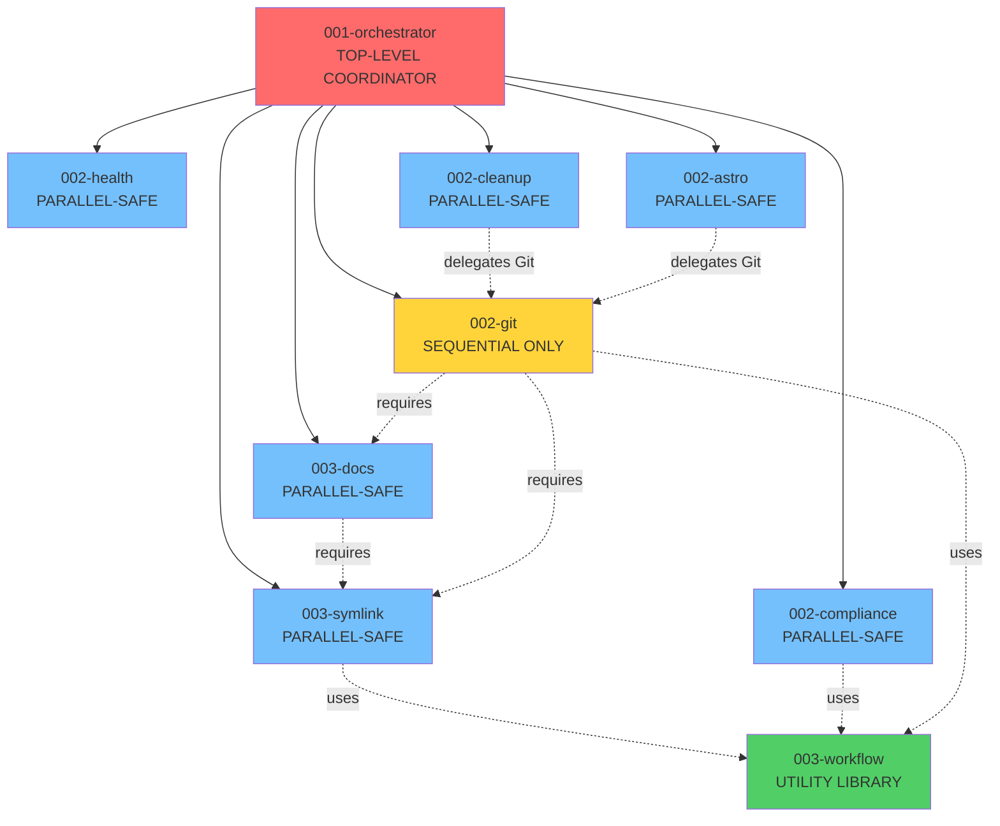

> **Note**: This documentation reflects the agent system as of 2025-11-15. AGENTS.md remains the single source of truth for implementation details.

## Overview

The ghostty-config-files project employs a sophisticated **9-agent constitutional orchestration system** designed for parallel workflow execution, dependency management, automated verification, and iterative refinement. This system maximizes efficiency while maintaining strict constitutional compliance and zero GitHub Actions cost.

## Agent Registry (9 Specialized Agents)

### Core Coordination

#### 1. **001-orchestrator** (35KB)
**Primary Function**: Multi-agent coordination and parallel execution planning

**When to Invoke**:
- Complex multi-step requests requiring multiple agents
- Spec-Kit workflow execution
- Tasks with parallel execution opportunities
- Dependency-aware task decomposition

**Key Capabilities**:
- Parallel workflow decomposition
- Dependency management with topological sorting
- Automated verification and testing
- Iterative refinement on failures
- Spec-Kit integration (spec.md, plan.md, tasks.md)

**Example**:
```
User: "Review all documentation, fix issues, run tests, and deploy"
AI: Uses 001-orchestrator to coordinate 003-docs,
    002-compliance, testing, and 002-astro
    in parallel phases with dependency management.
```

**Parallel-Safe**: ✅ Yes (coordinates other agents)
**Dependencies**: None (top-level coordinator)

---

### Documentation Integrity Agents

#### 2. **003-symlink** (16KB)
**Primary Function**: Verify and restore CLAUDE.md/GEMINI.md symlinks to AGENTS.md

**When to Invoke**:
- Pre-commit validation
- Post-merge verification
- On-demand symlink integrity checks
- When CLAUDE.md or GEMINI.md are accidentally modified as regular files

**Key Capabilities**:
- Symlink integrity verification
- Intelligent content merging (when symlinks diverge)
- Automatic symlink restoration
- Pre-commit MANDATORY validation

**Constitutional Requirement**: CLAUDE.md and GEMINI.md MUST be symlinks to AGENTS.md (single source of truth)

**Example Workflow**:
```bash
# Verify symlinks before commit
003-symlink detects CLAUDE.md is a regular file
→ Merges unique content from CLAUDE.md into AGENTS.md
→ Deletes CLAUDE.md regular file
→ Creates symlink: CLAUDE.md → AGENTS.md
→ Prevents commit until symlinks are valid
```

**Parallel-Safe**: ✅ Yes
**Dependencies**: None

---

#### 3. **002-compliance** (22KB)
**Primary Function**: Ensure AGENTS.md remains <40KB by modularizing large sections

**When to Invoke**:
- AGENTS.md size approaching 40KB limit
- Adding substantial content to AGENTS.md
- Proactive documentation modularization audits
- When sections exceed 250 lines

**Key Capabilities**:
- AGENTS.md size monitoring
- Automatic section modularization
- Extract large sections to separate files
- Maintain cross-references and navigation
- Preserve constitutional compliance

**Modularization Strategy**:
```
IF AGENTS.md > 40KB:
  1. Identify largest sections
  2. Extract to documentations/[category]/[section].md
  3. Replace with summary + link in AGENTS.md
  4. Update cross-references
  5. Verify all links valid
```

**Parallel-Safe**: ✅ Yes
**Dependencies**: None

---

#### 4. **003-docs** (18KB)
**Primary Function**: Enforce AGENTS.md as single source of truth

**When to Invoke**:
- AGENTS.md modifications detected
- Symlink integrity issues
- Documentation consistency audits
- Cross-reference validation needed

**Key Capabilities**:
- Single source of truth enforcement
- Documentation consistency verification
- Cross-reference validation
- Link integrity checks
- Duplicate content detection

**Constitutional Requirement**: All AI assistant instructions MUST originate from AGENTS.md. CLAUDE.md and GEMINI.md are symlinks only.

**Parallel-Safe**: ✅ Yes
**Dependencies**: 003-symlink (run symlink checks first)

---

### Build & Deployment Agents

#### 5. **002-astro** (18KB)
**Primary Function**: Astro.build operations and .nojekyll validation

**When to Invoke**:
- Website content changes require rebuild
- Deployment to GitHub Pages
- Build failure troubleshooting
- .nojekyll file integrity verification

**Key Capabilities**:
- Astro build execution
- Build output validation
- **CRITICAL**: .nojekyll file verification
- GitHub Pages deployment readiness
- Build artifact management

**Critical Validation**:
```bash
# MANDATORY checks before deployment
✅ docs/.nojekyll exists (WITHOUT this, ALL CSS/JS return 404)
✅ docs/index.html exists
✅ docs/_astro/ directory exists
✅ All HTML pages generated correctly
```

**Parallel-Safe**: ✅ Yes
**Dependencies**: None (delegates Git operations to 002-git)

---

#### 6. **002-git** (19KB)
**Primary Function**: ALL Git and GitHub operations with constitutional compliance

**When to Invoke**:
- Any commit, push, pull, fetch operation
- Branch creation or management
- Conflict resolution
- GitHub CLI operations (issues, PRs, releases)

**Key Capabilities**:
- Constitutional branch naming (YYYYMMDD-HHMMSS-type-description)
- Branch preservation enforcement (NEVER delete without permission)
- Constitutional commit formatting
- Merge operations (always --no-ff)
- GitHub CLI integration

**Constitutional Workflow**:
```bash
# MANDATORY workflow for ALL commits
DATETIME=$(date +"%Y%m%d-%H%M%S")
BRANCH="${DATETIME}-feat-description"
git checkout -b "$BRANCH"
git add .
git commit -m "Message

🤖 Generated with [Claude Code](https://claude.ai/code)
Co-Authored-By: Claude <noreply@anthropic.com>"
git push -u origin "$BRANCH"
git checkout main
git merge "$BRANCH" --no-ff
git push origin main
# NEVER: git branch -d "$BRANCH" (preserve ALL branches)
```

**Parallel-Safe**: ❌ NO (SEQUENTIAL ONLY - conflicts if parallel)
**Dependencies**: 003-symlink, 003-docs (run before Git operations)

---

### Validation & Health Agents

#### 7. **002-health** (19KB)
**Primary Function**: Comprehensive health checks and Context7 MCP integration

**When to Invoke**:
- Scheduled weekly health audits
- First-time project setup
- Context7 MCP troubleshooting
- Standards compliance verification
- Before major deployments

**Key Capabilities**:
- Context7 MCP configuration validation
- GitHub MCP authentication checks
- Project configuration audits
- Best practices verification (via Context7 queries)
- System state validation

**Health Metrics Monitored**:
- Context7 API key configuration
- GitHub CLI authentication
- MCP server connectivity
- Configuration file validity
- Documentation integrity
- Build status

**Parallel-Safe**: ✅ Yes
**Dependencies**: None

---

#### 8. **002-cleanup** (21KB)
**Primary Function**: Identify redundancy and consolidate directory structures

**When to Invoke**:
- Post-migration cleanup needed
- Repository clutter detected
- Redundant file identification
- Directory consolidation required
- Proactive cleanup audits

**Key Capabilities**:
- Redundant file detection
- Directory structure consolidation
- Dead symlink removal
- Orphaned file identification
- Constitutional cleanup workflows

**Safety Protocols**:
- ALWAYS delegate Git operations to 002-git
- NEVER delete without constitutional workflow
- Preserve branch history
- Backup before cleanup

**Parallel-Safe**: ✅ Yes
**Dependencies**: None (delegates Git to 002-git)

---

### Shared Utilities

#### 9. **003-workflow** (18KB)
**Primary Function**: Shared workflow templates and utility functions

**When to Invoke**: NOT invoked directly - referenced by other agents as a library

**Key Capabilities**:
- Standardized branch naming templates
- Constitutional commit message formatting
- Merge operation templates
- Workflow function library
- Code reuse across agents

**Usage Pattern**:
```markdown
Other agents reference templates like:
"Use 003-workflow templates for branch naming"
"Follow 003-workflow commit format"
```

**Parallel-Safe**: N/A (utility library, not directly invoked)
**Dependencies**: None

---

## Agent Delegation Network



**Legend**:
- **Red**: Master coordinator
- **Yellow**: Sequential-only (no parallel execution)
- **Green**: Utility library (not directly invoked)
- **Blue**: Parallel-safe agents

---

## Parallel Execution Strategy

### Phase-Based Execution

**Phase 1 (Parallel)**:
```bash
├─ 003-symlink
├─ 002-compliance
├─ 002-health
└─ 002-cleanup
```

**Phase 2 (Parallel, depends on Phase 1)**:
```bash
├─ 003-docs (requires 003-symlink complete)
└─ 002-astro
```

**Phase 3 (Sequential ONLY)**:
```bash
└─ 002-git (requires ALL previous phases complete)
```

### Dependency Management

**Strict Ordering Rules**:
1. 003-symlink MUST complete before 003-docs
2. 003-docs MUST complete before 002-git
3. 002-git MUST run sequentially (never parallel)
4. Parallel agents can run simultaneously if no dependencies

**Example Multi-Agent Workflow**:
```
User Request: "Audit project, fix issues, rebuild website, commit changes"

001-orchestrator decomposition:
┌─ Phase 1 (Parallel) ─────────────────────┐
│ • 002-health                 │
│ • 003-symlink                       │
│ • 002-compliance        │
└──────────────────────────────────────────┘
         ↓ (wait for completion)
┌─ Phase 2 (Parallel) ─────────────────────┐
│ • 003-docs                 │
│ • 002-astro                 │
└──────────────────────────────────────────┘
         ↓ (wait for completion)
┌─ Phase 3 (Sequential) ───────────────────┐
│ • 002-git              │
└──────────────────────────────────────────┘
```

---

## Slash Command Integration

The agent system is exposed through constitutional slash commands:

### /guardian-health
**Agents Invoked**: 002-health, 003-docs, 002-astro

**Execution**: ALL THREE IN PARALLEL

**Output**: Consolidated health report covering:
- Context7 MCP status
- GitHub MCP status
- Documentation symlinks
- Astro build status
- GitHub Pages deployment readiness

---

### /guardian-documentation
**Agents Invoked**: 001-orchestrator, 002-compliance, 003-docs, 003-symlink

**Execution**: Coordinated by 001-orchestrator

**Output**: Comprehensive documentation integrity report:
- Agent system verification (9 agents + registry)
- Documentation structure (documentations/ organization)
- Symlink integrity (CLAUDE.md/GEMINI.md → AGENTS.md)
- Cross-reference validation
- Consolidation compliance
- Agent documentation consistency

---

### /guardian-cleanup
**Agents Invoked**: 002-cleanup, 002-git

**Execution**: Sequential (cleanup analysis → Git operations)

**Output**: Cleanup report with constitutional Git workflow

---

### /guardian-commit
**Agents Invoked**: 003-symlink, 002-git

**Execution**: Sequential (symlink verification → Git commit)

**Output**: Constitutional commit with branch preservation

---

### /guardian-deploy
**Agents Invoked**: 002-astro, 002-git

**Execution**: Sequential (build validation → deployment commit)

**Output**: Complete deployment with constitutional compliance

---

## Verification & Testing Loop

**Every agent execution includes**:

```python
def verify_and_finalize(results):
    verification_checks = [
        check_symlink_integrity(),
        check_documentation_size(),
        check_build_output(),
        check_git_status(),
        check_constitutional_compliance()
    ]

    if any_check_fails:
        # Identify which agents need re-execution
        retry_agents = determine_retry_agents(failed_checks)

        # Re-execute with improved context
        return execute_orchestrated_workflow(
            generate_retry_plan(retry_agents, failed_checks)
        )

    return success
```

---

## Error Handling & Recovery

### Error Classification

**Transient Errors**:
- Action: Retry immediately
- Max retries: 3

**Input Errors**:
- Action: Fix input and retry
- Max retries: 2

**Dependency Failures**:
- Action: Fix upstream agent, then retry downstream
- Max retries: 2

**Constitutional Violations**:
- Action: Abort and report to user immediately
- Max retries: 0 (manual intervention required)

---

## Constitutional Compliance

**ALL agents enforce**:
1. Branch preservation (NEVER delete without permission)
2. Constitutional branch naming (YYYYMMDD-HHMMSS-type-description)
3. Constitutional commit formatting (with Claude Code footer)
4. Zero GitHub Actions cost (all CI/CD runs locally first)
5. Symlink integrity (CLAUDE.md/GEMINI.md → AGENTS.md)
6. Documentation size limits (AGENTS.md < 40KB)
7. .nojekyll file preservation (CRITICAL for GitHub Pages)

---

## Best Practices

### For AI Assistants

**DO**:
- Use 001-orchestrator for complex multi-agent tasks
- Verify symlink integrity before Git operations
- Run parallel agents simultaneously when possible
- Always check dependencies before execution
- Validate all outputs before marking tasks complete

**DON'T**:
- Run 002-git in parallel
- Skip dependency validation
- Bypass constitutional workflows
- Delete branches without explicit permission
- Remove .nojekyll file under any circumstances

---

## Agent File Locations

All agents stored in:
```
.claude/agents/
├── 001-orchestrator.md
├── 003-symlink.md
├── 002-compliance.md
├── 003-docs.md
├── 002-git.md
├── 002-astro.md
├── 002-health.md
├── 002-cleanup.md
└── 003-workflow.md
```

All slash commands stored in:
```
.claude/commands/
├── guardian-health.md
├── guardian-documentation.md
├── guardian-cleanup.md
├── guardian-commit.md
└── guardian-deploy.md
```

---

## References

- **AGENTS.md**: Single source of truth for AI assistant instructions
- **AGENT_REGISTRY.md**: (Planned) Centralized agent capability registry
- **.claude/agents/**: Agent implementation files
- **.claude/commands/**: Slash command definitions
- **documentations/developer/architecture/**: Architecture documentation
- **.runners-local/workflows/**: Local CI/CD infrastructure

---

**Version**: 1.0
**Last Updated**: 2025-11-15
**Status**: ACTIVE - CONSTITUTIONAL COMPLIANCE REQUIRED
