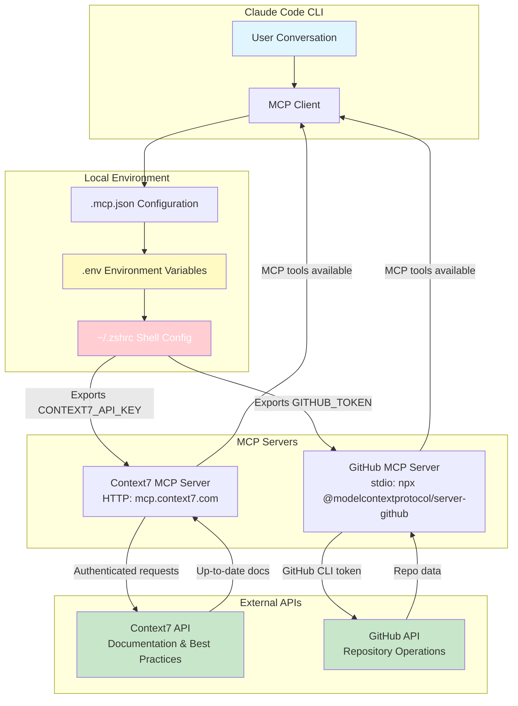

# Context7 MCP Setup Guide

## 🎯 Overview

Context7 MCP (Model Context Protocol) server provides up-to-date documentation and best practices for all technologies in this project. This guide explains how to configure and use Context7 with Claude Code CLI.

### MCP Architecture

> **CRITICAL**: The red-highlighted shell configuration (`.zshrc`) is essential. Environment variables MUST be exported to the shell environment using `set -a; source .env; set +a` for Claude Code to access them via `${VARIABLE_NAME}` syntax.



## 📋 Prerequisites

- Claude Code CLI installed and authenticated
- API key from Context7 (https://context7.com/)
- Project cloned to local machine

## 🚀 Quick Setup

### Step 1: Configure Environment Variables

```bash
# Copy the example environment file
cp .env.example .env

# Edit .env and add your Context7 API key
# CONTEXT7_API_KEY=ctx7sk-your-api-key-here
```

**Security Note**: The `.env` file is gitignored and will never be committed to the repository.

### Step 1.5: Export Environment Variables to Shell (CRITICAL)

**⚠️ CRITICAL REQUIREMENT**: Claude Code's `.mcp.json` uses `${VARIABLE_NAME}` syntax to reference **shell environment variables**. These variables must be exported to your shell environment for MCP servers to access them.

**Option A: Automatic Loading (RECOMMENDED)**

Add environment variable loading to your shell configuration:

```bash
# Add to ~/.zshrc (or ~/.bashrc for bash users)
cat >> ~/.zshrc << 'EOF'

# ═══════════════════════════════════════════════════════════
# Context7 MCP & GitHub Token Configuration
# Automatically load environment variables from ghostty-config-files
# ═══════════════════════════════════════════════════════════
if [ -f /home/kkk/Apps/ghostty-config-files/.env ]; then
    # Use set -a to automatically export all variables
    set -a
    source /home/kkk/Apps/ghostty-config-files/.env
    set +a
fi
EOF

# Reload your shell configuration
source ~/.zshrc
```

**Option B: Manual Export (per-session)**

```bash
# Export environment variables before starting Claude Code
set -a
source /home/kkk/Apps/ghostty-config-files/.env
set +a

# Then start Claude Code
claude
```

**Verification**:

```bash
# Verify environment variables are exported
echo "CONTEXT7_API_KEY: ${CONTEXT7_API_KEY:0:15}..."
echo "GITHUB_TOKEN: ${GITHUB_TOKEN:0:15}..."

# Should show key prefixes, not empty strings
```

### Step 2: Verify Configuration

Run the automated health check script:

```bash
./scripts/check_context7_health.sh
```

This script will verify:
- ✅ Environment variables are set correctly
- ✅ Project MCP configuration exists
- ✅ Global MCP configuration is updated
- ✅ Security settings (gitignore) are correct
- ✅ Template files are present

### Step 3: Restart Claude Code

**⚠️ CRITICAL**: MCP servers load when Claude Code starts. Configuration changes require a restart to take effect.

```bash
# Exit current Claude Code session
exit

# Start a new session to load the new MCP configuration
claude
```

## 🧪 Testing Context7 Connectivity

After restarting Claude Code, test Context7 within a conversation:

```
Can you use Context7 to get the latest Astro.build best practices?
```

Or:

```
Use Context7 to check Ghostty terminal optimization recommendations for 2025.
```

## 📁 Configuration Files

### Project-Level Configuration

**File**: `.mcp.json`
**Status**: Gitignored (contains references to secrets)
**Purpose**: Project-specific MCP server configuration

```json
{
  "mcpServers": {
    "context7": {
      "type": "http",
      "url": "https://mcp.context7.com/mcp",
      "headers": {
        "CONTEXT7_API_KEY": "${CONTEXT7_API_KEY}"
      }
    }
  }
}
```

**Note**: Uses environment variable expansion (${CONTEXT7_API_KEY}) for security.

### Global Configuration

**File**: `~/.claude.json`
**Status**: User-level configuration
**Purpose**: Fallback configuration for all projects

The global configuration has also been updated with your API key. Project-level `.mcp.json` takes precedence.

### Template Files

**Committed to repository** (safe to share):
- `.env.example` - Environment variable template without secrets
- `.mcp.json.example` - MCP configuration template with placeholders

## 🔧 Available Context7 Tools

Within Claude Code conversations, these MCP tools are available:

1. **mcp__context7__resolve-library-id**
   - Purpose: Find library IDs for documentation queries
   - Example: Resolve "astro" to "/withastro/astro"

2. **mcp__context7__get-library-docs**
   - Purpose: Retrieve up-to-date documentation for libraries
   - Example: Get latest Astro.build best practices

## 📚 Usage Examples

### Technology Stack Queries

```bash
# Within Claude Code conversation:
"Use Context7 to get the latest Astro 5.x + Tailwind CSS best practices"
"Check Context7 for Ghostty terminal performance optimization techniques"
"Query Context7 for Node.js LTS package management best practices"
```

### Architecture & Patterns

```bash
"Use Context7 to find best practices for static site generation with Astro"
"Check Context7 for local CI/CD implementation patterns"
"Query Context7 for XDG Base Directory Specification compliance"
```

### Security & Performance

```bash
"Use Context7 to review GitHub Pages security best practices"
"Check Context7 for terminal emulator performance benchmarking"
"Query Context7 for zero-cost DevOps strategies"
```

## 🔒 Security Best Practices

### API Key Protection

✅ **DO**:
- Store API keys in `.env` file
- Use environment variable expansion in `.mcp.json`
- Keep `.env` gitignored
- Use `.env.example` for sharing templates

❌ **DON'T**:
- Hardcode API keys in `.mcp.json`
- Commit `.env` to version control
- Share API keys in public documentation
- Use plain text API keys in configuration files

### Configuration Verification

```bash
# Verify .env is gitignored
grep -q "^\.env$" .gitignore && echo "✅ Secure" || echo "❌ Risk"

# Verify .mcp.json uses environment variables
grep -q "\${CONTEXT7_API_KEY}" .mcp.json && echo "✅ Secure" || echo "❌ Risk"

# Check for exposed secrets in git
git status --ignored | grep -E "\.env|\.mcp\.json"
```

## 🛠️ Troubleshooting

### Problem: `/doctor` Shows "Missing environment variables" Warning

**Symptoms**:
```
[Warning] [context7] mcpServers.context7: Missing environment variables: CONTEXT7_API_KEY
[Warning] [github] mcpServers.github: Missing environment variables: GITHUB_TOKEN
```

**Root Cause**: Environment variables exist in `.env` file but are NOT exported to the shell environment where Claude Code runs.

**Solution**:
1. **Add automatic loading to shell config** (recommended):
   ```bash
   cat >> ~/.zshrc << 'EOF'
   if [ -f /home/kkk/Apps/ghostty-config-files/.env ]; then
       set -a
       source /home/kkk/Apps/ghostty-config-files/.env
       set +a
   fi
   EOF
   ```
2. **Reload shell configuration**: `source ~/.zshrc`
3. **Verify variables are exported**: `env | grep -E 'CONTEXT7_API_KEY|GITHUB_TOKEN'`
4. **Restart Claude Code**: `exit` then `claude`
5. **Verify fix**: Run `/doctor` again - warnings should be gone

### Problem: Context7 returns "Unauthorized"

**Solution**:
1. Verify API key is set: `source .env && echo ${CONTEXT7_API_KEY:0:12}...`
2. Check configuration: `./scripts/check_context7_health.sh`
3. Restart Claude Code to reload MCP servers
4. Verify API key is valid at https://context7.com/

### Problem: MCP tools not available

**Solution**:
1. Ensure you've restarted Claude Code after configuration
2. Check MCP server status within conversation: "Can you check if Context7 MCP is available?"
3. Verify .mcp.json exists and is valid JSON
4. Run health check: `./scripts/check_context7_health.sh`

### Problem: Old API key still being used

**Solution**:
1. Update both `~/.claude.json` and `.mcp.json`
2. **Critical**: Restart Claude Code (MCP servers load at startup)
3. Clear any cached sessions
4. Verify with health check script

## 📖 Additional Resources

- **Context7 Website**: https://context7.com/
- **MCP Documentation**: https://modelcontextprotocol.io/
- **Claude Code Docs**: https://docs.claude.com/en/docs/claude-code
- **Project AGENTS.md**: See "Context7 MCP Integration" section

## 🔄 Maintenance

### Updating API Key

```bash
# 1. Update .env file
vim .env  # Change CONTEXT7_API_KEY value

# 2. Update global config (optional)
# Edit ~/.claude.json mcpServers.context7.headers.CONTEXT7_API_KEY

# 3. Verify changes
./scripts/check_context7_health.sh

# 4. Restart Claude Code
exit
claude
```

### Health Checks

Run the health check script regularly to ensure configuration integrity:

```bash
# Quick check
./scripts/check_context7_health.sh

# Add to local CI/CD
# Edit ./.runners-local/workflows/gh-workflow-local.sh:
# ./scripts/check_context7_health.sh || exit 1
```

## ✅ Success Criteria

Context7 MCP is properly configured when:

- ✅ Health check script passes all checks
- ✅ API key is stored securely in `.env`
- ✅ `.mcp.json` uses environment variables
- ✅ `.env` is gitignored
- ✅ Context7 tools work within Claude Code conversations
- ✅ Documentation queries return up-to-date information

---

**Last Updated**: 2025-11-11
**Configuration Version**: 1.0
**Status**: Active
