# Constitutional Git Workflow

This project enforces a constitutional Git workflow that prioritizes branch preservation and configuration history.

## Core Constitutional Requirement

**NEVER DELETE BRANCHES** without explicit user permission.

Every branch represents valuable configuration history and must be preserved. This is a non-negotiable constitutional requirement.

## Branch Naming Convention (MANDATORY)

**Format**: `YYYYMMDD-HHMMSS-type-short-description`

### Components

- `YYYYMMDD`: Date in year-month-day format
- `HHMMSS`: Time in hour-minute-second format (24-hour)
- `type`: One of: `feat`, `fix`, `docs`, `refactor`, `test`, `chore`
- `short-description`: Brief kebab-case description

### Examples

```bash
20250919-143000-feat-context-menu-integration
20250919-143515-fix-performance-optimization
20250919-144030-docs-agents-enhancement
20251113-135712-feat-automatic-commit-analysis
```

## Standard Workflow

### 1. Create Timestamped Branch

```bash
# Generate timestamp and create branch
DATETIME=$(date +"%Y%m%d-%H%M%S")
BRANCH_NAME="${DATETIME}-feat-your-feature-description"
git checkout -b "$BRANCH_NAME"
```

### 2. Make Changes

```bash
# Make your code changes
# Test thoroughly
# Ensure all local CI/CD checks pass
./.runners-local/workflows/gh-workflow-local.sh all
```

### 3. Commit Changes

```bash
# Stage changes
git add .

# Commit with constitutional message
git commit -m "Descriptive commit message

🤖 Generated with [Claude Code](https://claude.ai/code)
Co-Authored-By: Claude <noreply@anthropic.com>"
```

### 4. Push Branch

```bash
# Push to remote with tracking
git push -u origin "$BRANCH_NAME"
```

### 5. Merge to Main (Preserving Branch)

```bash
# Switch to main
git checkout main

# Merge with no-fast-forward (preserves branch history)
git merge "$BRANCH_NAME" --no-ff

# Push main
git push origin main

# ⚠️ CRITICAL: DO NOT DELETE THE BRANCH
# NEVER: git branch -d "$BRANCH_NAME"
```

## Constitutional Branch Workflow Diagram

```mermaid
flowchart TD
    Start([New feature/fix needed]) --> CreateBranch[Create timestamped branch<br/>YYYYMMDD-HHMMSS-type-description]
    CreateBranch --> LocalCICD{Run local CI/CD<br/>./.runners-local/workflows/gh-workflow-local.sh all}

    LocalCICD -->|Fails| FixIssues[Fix validation errors]
    FixIssues --> LocalCICD
    LocalCICD -->|Success| Checkout[git checkout -b BRANCH_NAME]

    Checkout --> MakeChanges[Make code changes]
    MakeChanges --> Validate[Validate: ghostty +show-config]
    Validate --> Commit[git add .<br/>git commit -m 'message']

    Commit --> Push[git push -u origin BRANCH_NAME]
    Push --> CheckoutMain[git checkout main]
    CheckoutMain --> Merge[git merge BRANCH_NAME --no-ff]

    Merge --> PushMain[git push origin main]
    PushMain --> Preserve{⚠️ NEVER DELETE BRANCH<br/>Preservation MANDATORY}

    Preserve -->|Correct| Keep[✅ Branch preserved<br/>Complete history maintained]
    Preserve -->|❌ Attempted deletion| Warn[🚨 CONSTITUTIONAL VIOLATION<br/>Stop immediately]

    Keep --> Complete([✅ Workflow complete<br/>Branch preserved])
    Warn --> RollBack[Restore branch from remote]
    RollBack --> Complete

    style Start fill:#e1f5fe
    style Complete fill:#c8e6c9
    style Preserve fill:#ffcdd2
    style Warn fill:#ff5252,color:#fff
    style LocalCICD fill:#fff9c4
    style Keep fill:#81c784
```



## Why Branch Preservation?

### Historical Context
Every configuration change has context:
- Why was the change made?
- What problem did it solve?
- What alternatives were considered?

### Debugging Benefits
Preserved branches enable:
- Time-travel debugging
- Configuration archaeology
- Pattern recognition across changes

### Rollback Safety
If a change causes issues:
- Full branch history available
- Easy comparison between versions
- Safe rollback with context

### Learning Resource
Branches serve as:
- Documentation of evolution
- Examples for future changes
- Training material for contributors

## Guardian Command Integration

Use guardian commands for constitutional compliance:

### /guardian-commit

Fully automatic constitutional Git commit:

```bash
/guardian-commit
```

This command:
1. Analyzes changes
2. Generates commit message
3. Creates timestamped branch
4. Commits changes
5. Merges to main
6. **Preserves branch** (never deletes)

### /guardian-deploy

Complete deployment workflow:

```bash
/guardian-deploy
```

Includes:
1. Astro build
2. Validation
3. Constitutional commit
4. GitHub Pages deployment
5. Branch preservation

## Local CI/CD Integration

### Pre-Commit Validation

Run before committing:

```bash
# Complete workflow validation
./.runners-local/workflows/gh-workflow-local.sh all

# Individual checks
./.runners-local/workflows/gh-workflow-local.sh validate  # Config
./.runners-local/workflows/gh-workflow-local.sh test      # Tests
./.runners-local/workflows/gh-workflow-local.sh build     # Build
```

### Automated Checks

The workflow automatically:
- Validates Ghostty configuration
- Checks 2025 optimizations
- Tests performance
- Verifies documentation
- Ensures constitutional compliance

## Branch Management

### View All Branches

```bash
# Local branches
git branch

# Remote branches
git branch -r

# All branches with details
git branch -av
```

### Search Branch History

```bash
# Find branches by pattern
git branch | grep "feat-"

# Find branches by date
git branch | grep "20251113"

# Search commit messages across branches
git log --all --grep="performance"
```

### Compare Branches

```bash
# See differences between branches
git diff main..20251113-135712-feat-automatic-commit

# View commits unique to branch
git log main..20251113-135712-feat-automatic-commit

# View file changes
git diff --stat main..20251113-135712-feat-automatic-commit
```

## Emergency Procedures

### Branch Accidentally Deleted

If a branch was deleted locally:

```bash
# Restore from remote
git checkout -b branch-name origin/branch-name

# Or fetch all remote branches
git fetch --all
```

### Need to Clean Up (After Permission)

If user explicitly requests cleanup:

```bash
# Review branches first
git branch -av

# Delete only with explicit permission
git branch -d branch-name
git push origin --delete branch-name

# Document the deletion decision
git log --oneline -1 >> branch-deletion-log.txt
```

## Best Practices

### Commit Messages

Good commit messages include:
- Clear summary of what changed
- Why the change was made
- Impact on system
- Constitutional attribution

Example:
```
feat: Add MCP integration for Context7 documentation

Integrates Context7 MCP server for up-to-date documentation
access. Enables AI assistants to query latest best practices
before configuration changes.

Impact: Enhanced constitutional compliance validation
Dependencies: Context7 API key required

🤖 Generated with [Claude Code](https://claude.ai/code)
Co-Authored-By: Claude <noreply@anthropic.com>
```

### Branch Descriptions

Add branch descriptions for context:

```bash
# Add description to current branch
git branch --edit-description

# Example description:
# Implements automatic commit analysis for guardian commands.
# Analyzes git status and diff to generate comprehensive commit
# messages with constitutional compliance.
```

### Regular Synchronization

Keep branches synchronized:

```bash
# Update main branch
git checkout main
git pull origin main

# Update feature branch with main changes
git checkout feature-branch
git merge main --no-ff

# Push updates
git push origin feature-branch
```

## Integration with GitHub MCP

Use GitHub MCP for constitutional operations:

```bash
# Create branch via MCP
mcp__github__create_branch

# Push files via MCP
mcp__github__push_files

# Create PR via MCP (preserves branch)
mcp__github__create_pull_request
```

GitHub MCP automatically:
- Follows branch naming conventions
- Preserves all branches
- Maintains constitutional compliance
- Logs all operations

## Monitoring and Auditing

### Review Branch Activity

```bash
# Recent commits across all branches
git log --all --oneline --graph --decorate -20

# Branches by last activity
git for-each-ref --sort=-committerdate refs/heads/

# Statistics per branch
git log --all --numstat --format="%H" | awk 'NF==3 {plus+=$1; minus+=$2} END {printf("+%d, -%d\n", plus, minus)}'
```

### Audit Branch Preservation

```bash
# Check for deleted branches in reflog
git reflog | grep "delete"

# Verify remote branch count matches local
git branch -r | wc -l
git branch | wc -l
```

## Related Documentation

- [Architecture Overview](./architecture.md) - System design
- [Testing Guide](./testing.md) - Validation procedures
- [Contributing Guide](./contributing.md) - Contribution workflow
- [AI Guidelines](../ai-guidelines/git-strategy.md) - AI assistant requirements
