# Installation Guide

Welcome to the Ghostty Configuration Files installation guide. This guide will walk you through installing and setting up your complete Ghostty terminal environment on Ubuntu 25.10+.

## Quick Start

For a fresh Ubuntu installation, use the one-command setup:

```bash
cd /home/kkk/Apps/ghostty-config-files
./start.sh
```

> **✅ Production Ready**: This installation has been verified by 4 specialized agents with zero critical issues. See [Installation Verification](../developer/installation-verification.md) for full quality assurance report.

**What Gets Installed**:
- Ghostty terminal emulator v1.2.3+ (via official .deb package - fast and reliable)
- Ghostty clipboard fix (strips Nerd Font icons for clean copy/paste)
- Feh image viewer (apt package - simplified installation)
- Charm TUI ecosystem (gum, glow, vhs for beautiful terminal UI)
- ZSH with Oh My ZSH
- Node.js latest (v25.2.0+) via fnm (Fast Node Manager)
- Python UV package manager
- Context menu integration ("Open in Ghostty")
- AI tools (Claude Code, Gemini CLI)
- Fastfetch system information tool
- All configuration and optimizations

**Bonus Features**:
- **Automatic Recording**: VHS auto-recording captures installation demos (opt-in)
- **Beautiful TUI**: Colored progress bars, spinners, and styled output via gum
- **System Audit Table**: Pre-installation state display showing all tools
- **Clipboard Fix**: Copy from Ghostty pastes clean text (no Unicode garbage)
- **Smart Image Viewer**: Feh with context menu integration

**Installation Time**: ~5 minutes for complete setup (faster with .deb package)

## Prerequisites

### System Requirements
- **OS**: Ubuntu 25.10+ (or compatible Debian-based distribution)
- **Architecture**: x86_64 (amd64)
- **Shell**: ZSH (configured by installation), Bash 5.x+ (for scripts)
- **Disk Space**: ~2GB for full installation
- **Memory**: 2GB+ RAM recommended
- **Sudo Configuration**: Passwordless sudo for apt (REQUIRED for automated installation)

### Configure Passwordless Sudo (REQUIRED)

Before running the installation, configure passwordless sudo to enable automated package installation:

```bash
sudo EDITOR=nano visudo
# Add this line at the end (replace 'yourusername' with your actual username):
yourusername ALL=(ALL) NOPASSWD: /usr/bin/apt
# Save: Ctrl+O, Enter | Exit: Ctrl+X
```

**Why This is Required**:
- The installation script (`start.sh`) requires non-interactive sudo access
- This enables automated daily updates without password prompts
- Only grants sudo access to `/usr/bin/apt` (not unrestricted sudo)

**Test Your Configuration**:
```bash
sudo -n apt update  # Should run without password prompt
```

If the test command runs without prompting for a password, you're ready to proceed.

**Alternative**: Run installation manually with interactive sudo prompts (not recommended for automation)

### Required Packages
The installation script will automatically install required dependencies:
- Git for repository management
- curl/wget for downloads
- gum, glow, vhs (Charm TUI tools)
- ffmpeg and ttyd (for VHS recording)

## Installation Methods

### Method 1: Automated Installation (Recommended)

The simplest method - one command does everything:

```bash
# Clone the repository
git clone https://github.com/your-username/ghostty-config-files.git
cd ghostty-config-files

# Run automated installation
./start.sh
```

**What this does**:
1. Displays pre-installation system audit table (shows current tool status)
2. Installs Charm TUI tools (gum, glow, vhs) for beautiful terminal UI
3. Downloads and installs Ghostty v1.2.3+ via official .deb package
4. Cleans up any legacy installations (Snap, source builds)
5. Installs Node.js latest (v25.2.0+) via fnm (Fast Node Manager)
6. Configures ZSH with Oh My ZSH
7. Installs context menu integration ("Open in Ghostty")
8. Sets up AI tools (Claude Code, Gemini CLI)
9. Installs Feh image viewer and Fastfetch
10. Applies all optimizations and configurations

### Method 2: Using manage.sh (New Unified Interface)

For more control over what gets installed:

```bash
# Install everything
./manage.sh install

# Install with specific components
./manage.sh install --skip-node      # Skip Node.js
./manage.sh install --skip-ghostty   # Skip Ghostty installation
./manage.sh install --skip-zsh       # Skip ZSH setup
./manage.sh install --skip-theme     # Skip theme configuration
./manage.sh install --skip-context-menu  # Skip context menu

# Dry run to see what would be installed
./manage.sh install --dry-run

# Force reinstallation
./manage.sh install --force
```

### Method 3: Manual Component Installation

For advanced users who want full control:

#### Step 1: Install Node.js
```bash
# Using fnm (Fast Node Manager - recommended)
curl -fsSL https://fnm.vercel.app/install | bash
source ~/.bashrc
fnm install --latest
fnm use latest
```

#### Step 2: Install Ghostty via .deb Package
```bash
# Download official .deb package from mkasberg/ghostty-ubuntu releases
# Check https://github.com/mkasberg/ghostty-ubuntu/releases for latest version
wget https://github.com/mkasberg/ghostty-ubuntu/releases/download/1.2.3-0-ppa1/ghostty_1.2.3-0.ppa1_amd64_25.10.deb

# Install the .deb package
sudo dpkg -i ghostty_1.2.3-0.ppa1_amd64_25.10.deb

# Fix any dependency issues
sudo apt --fix-broken install
```

#### Step 3: Install Configuration
```bash
# Copy Ghostty configuration
mkdir -p ~/.config/ghostty
cp configs/ghostty/config ~/.config/ghostty/
cp configs/ghostty/*.conf ~/.config/ghostty/
```

#### Step 4: Install Charm TUI Tools
```bash
# Add Charm repository
sudo mkdir -p /etc/apt/keyrings
curl -fsSL https://repo.charm.sh/apt/gpg.key | sudo gpg --dearmor -o /etc/apt/keyrings/charm.gpg
echo "deb [signed-by=/etc/apt/keyrings/charm.gpg] https://repo.charm.sh/apt/ * *" | sudo tee /etc/apt/sources.list.d/charm.list

# Install gum, glow, vhs
sudo apt update && sudo apt install gum glow vhs
```

#### Step 5: Setup ZSH
```bash
# Install ZSH
sudo apt install zsh

# Install Oh My ZSH
sh -c "$(curl -fsSL https://raw.githubusercontent.com/ohmyzsh/ohmyzsh/master/tools/install.sh)"

# Set as default shell
chsh -s $(which zsh)
```

#### Step 6: Context Menu Integration
```bash
./lib/installers/context_menu/install.sh
```

## Installation Recording

### Automatic Session Recording

By default, `./start.sh` automatically records the complete installation session:

```
═══════════════════════════════════════════════════════════
Terminal Recording Started
═══════════════════════════════════════════════════════════
Recording: start
Output: logs/video/20251123-194530.log

To disable: export VHS_AUTO_RECORD=false
═══════════════════════════════════════════════════════════
```

**Recording Captures**:
- All terminal output (colors, TUI elements, progress bars)
- Complete 10-minute installation workflow
- ANSI escape sequences (ready for GIF/video conversion)
- Timestamped for timeline editing

**Disable Recording** (if desired):
```bash
# One-time disable
VHS_AUTO_RECORD=false ./start.sh

# Permanent disable (add to ~/.zshrc or ~/.bashrc)
export VHS_AUTO_RECORD=false
```

### Creating Demo Videos

Convert recordings to GIF for documentation:

```bash
# Install agg (asciinema GIF generator)
sudo apt install golang-github-asciinema-agg

# Convert to GIF
agg logs/video/20251123-*.log installation.gif

# Optimize for web
gifsicle -O3 installation.gif -o installation-optimized.gif
```

**See Also**: [Installation Verification](../developer/installation-verification.md) for complete recording documentation and demo video creation workflow.

## Post-Installation

### Verify Installation

```bash
# Check Ghostty version
ghostty --version

# Validate configuration
ghostty +show-config

# Check system status
./manage.sh validate
```

### First Launch

1. Open Ghostty terminal
2. Verify theme is applied (Catppuccin)
3. Test context menu: Right-click folder → "Open in Ghostty"
4. Verify shell integration (auto-complete, directory tracking)

### Configure AI Tools (Optional)

#### Claude Code
```bash
# Install Claude Code CLI
npm install -g @anthropic-ai/claude-code

# Authenticate
claude auth login
```

#### Gemini CLI
```bash
# Install Gemini CLI
npm install -g @google/generative-ai-cli

# Authenticate with API key
gemini-cli auth
```

## Troubleshooting

### Ghostty .deb Installation Fails

**Issue**: dpkg installation errors

**Solution**:
```bash
# Fix broken dependencies
sudo apt --fix-broken install

# If package conflicts exist, remove conflicting package first
sudo dpkg --remove ghostty
sudo apt autoremove

# Re-download and install
wget https://github.com/mkasberg/ghostty-ubuntu/releases/download/1.2.3-0-ppa1/ghostty_1.2.3-0.ppa1_amd64_25.10.deb
sudo dpkg -i ghostty_1.2.3-0.ppa1_amd64_25.10.deb
```

### Legacy Installation Cleanup

**Issue**: Old Snap or source-built Ghostty conflicts with .deb installation

**Solution**:
```bash
# Remove Snap installation (if present)
sudo snap remove ghostty

# Remove source-built binaries (if present)
sudo rm -f /usr/local/bin/ghostty
rm -f ~/.local/bin/ghostty

# Remove manual desktop entries
rm -f ~/.local/share/applications/ghostty.desktop
rm -f ~/.local/share/applications/com.mitchellh.ghostty.desktop

# Clean up old build directories
rm -rf ~/Apps/ghostty ~/Apps/zig

# Now install via .deb
./start.sh
```

### Configuration Not Applied

**Issue**: Ghostty ignores configuration

**Solution**:
```bash
# Validate configuration syntax
ghostty +show-config

# Check file permissions
ls -la ~/.config/ghostty/config

# Reset to defaults
cp configs/ghostty/config ~/.config/ghostty/config
```

### Desktop Icon Not Launching

**Issue**: Clicking Ghostty desktop icon/launcher doesn't open terminal

**Symptoms**:
- Desktop icon exists but nothing happens when clicked
- Context menu "Open Ghostty Here" works correctly
- Command line `ghostty` command works

**Root Cause**: The `--gtk-single-instance=true` flag in desktop entry prevents launcher from working

**Solution** (Fixed in November 2025):
```bash
# This fix is now automatically applied during installation
# If you have an older installation, update by running:
update-all

# OR manually fix the desktop entry:
sed -i 's|--gtk-single-instance=true||g' ~/.local/share/applications/com.mitchellh.ghostty.desktop
update-desktop-database ~/.local/share/applications/
```

**Verification**:
```bash
# Check desktop entry doesn't contain the problematic flag
grep "gtk-single-instance" ~/.local/share/applications/com.mitchellh.ghostty.desktop
# Should return no results

# Test desktop icon
# Click the Ghostty icon in your application menu
```

**Note**: This fix is automatically included in:
- All fresh installations (start.sh)
- Update workflow (update-all)
- Step 07 of Ghostty installation pipeline

### Context Menu Missing

**Issue**: "Open in Ghostty" not appearing

**Solution**:
```bash
# Reinstall context menu
./scripts/install_context_menu.sh

# Restart Nautilus
nautilus -q
```

### fnm Installation Issues

> **Automatic Fallback Strategy**: fnm installation attempts first (preferred for 40x faster startup), but the installation script automatically falls back to system Node.js if fnm fails. AI tools function identically with either method.

```mermaid
flowchart TD
    Start([Node.js installation required]) --> Installfnm[Install fnm<br/>curl fnm install script]

    Installfnm --> SourceShell[Source shell config<br/>~/.zshrc or ~/.bashrc]
    SourceShell --> Checkfnm{fnm command<br/>available?}

    Checkfnm -->|Yes| InstallLatest[Install Node.js latest<br/>fnm install --latest]
    Checkfnm -->|No| Warnfnm[⚠️ fnm not in PATH<br/>Shell restart needed]

    InstallLatest --> VerifyNode{Node.js<br/>accessible?}
    Warnfnm --> Fallback[Fallback: System Node.js<br/>sudo apt install nodejs npm]

    VerifyNode -->|Yes| Usefnm[✅ Use fnm Node.js<br/>Preferred method]
    VerifyNode -->|No| Fallback

    Fallback --> CheckSystem{System Node.js<br/>installed?}
    CheckSystem -->|Yes| UseSystem[✅ Use system Node.js<br/>AI tools will work]
    CheckSystem -->|No| InstallSystem[Install: sudo apt install nodejs npm]
    InstallSystem --> UseSystem

    Usefnm --> InstallAI[Install AI tools<br/>Claude, Gemini, Copilot]
    UseSystem --> InstallAI

    InstallAI --> Complete([✅ Node.js + AI tools ready])

    style Start fill:#e1f5fe
    style Complete fill:#c8e6c9
    style Warnfnm fill:#fff9c4
    style Fallback fill:#ffcdd2
    style Usefnm fill:#81c784
    style UseSystem fill:#aed581
```



**Issue**: fnm installation fails or not detected

**Symptoms**:
```
⚠️  fnm installation may have failed - check logs
💡 System Node.js will be used as fallback if fnm unavailable
```

**Solutions**:
```bash
# Option 1: Manual fnm installation
curl -fsSL https://fnm.vercel.app/install | bash
source ~/.zshrc
fnm install --latest

# Option 2: Use system Node.js (fallback - already used by script)
sudo apt install nodejs npm

# Option 3: Check fnm installation
command -v fnm  # Should show fnm path
fnm --version   # Should show version number

# Verify Node.js is available
node --version
npm --version
```

**Why This Happens**:
- fnm requires shell restart to load into PATH
- The installation script sources shell config but may not pick up fnm in all contexts
- System Node.js automatically used as fallback (AI tools will still work)

**Impact**: AI tools (Claude Code, Gemini CLI) will function normally with system Node.js

### ZSH Not Default Shell

**Issue**: Still using bash after installation

**Solution**:
```bash
# Change default shell
chsh -s $(which zsh)

# Log out and log back in
```

## Updating

### Safe Update Workflow

To update your installation with automatic customization preservation:

```bash
# Check for updates
./manage.sh update --check-only

# Apply all updates (safest method - preserves user configs)
./manage.sh update

# Update specific component
./manage.sh update --component ghostty
./manage.sh update --component zsh
```

### Configuration Persistence

**IMPORTANT**: Your user customizations are automatically preserved during updates:

**What's Preserved**:
- `~/.config/ghostty/config` - Your custom Ghostty configuration
- `~/.config/ghostty/*.conf` - All modular config files
- `~/.zshrc` - Your ZSH customizations
- Custom keybindings, themes, and preferences

**Update Workflow (update-all)**:
1. Detects existing configurations in `~/.config/ghostty/`
2. Backs up current configuration before updates
3. Downloads and installs latest Ghostty .deb package
4. Preserves user config files (no overwrite)
5. Applies latest fixes (e.g., desktop launcher GTK flag fix)

**Example**:
```bash
# Run update-all safely
update-all

# Your custom configurations remain intact
# Latest Ghostty build installed
# Desktop entry updated with fixes
# No manual configuration needed
```

**Verification After Update**:
```bash
# Verify configuration preserved
ghostty +show-config

# Check desktop entry has latest fixes
grep "gtk-single-instance" ~/.local/share/applications/com.mitchellh.ghostty.desktop
# Should return no results (fix applied)

# Verify Ghostty version updated
ghostty --version
```

### First-Time vs Updates

**Fresh Installation** (`./start.sh`):
- Installs default configuration to `~/.config/ghostty/`
- Creates desktop entry with all fixes

**Updates** (`update-all`):
- Preserves existing `~/.config/ghostty/` configuration
- Updates Ghostty binary only
- Applies desktop entry fixes
- Never overwrites user customizations

## Uninstallation

To remove Ghostty and related components:

```bash
# Remove Ghostty .deb package
sudo apt remove ghostty

# Or use the uninstaller script
./lib/installers/ghostty/uninstall.sh

# Remove configuration (optional - keeps your settings)
rm -rf ~/.config/ghostty

# Remove context menu
rm ~/.local/share/nautilus/scripts/"Open in Ghostty"

# Remove Charm tools (optional)
sudo apt remove gum glow vhs

# Remove ZSH (optional)
sudo apt remove zsh

# Restore bash as default shell
chsh -s /bin/bash
```

## Next Steps

- **[Configuration Guide](configuration.md)** - Customize your Ghostty setup
- **[Usage Guide](usage.md)** - Learn manage.sh commands and workflows
- **[Developer Guide](../developer/architecture.md)** - Contribute to the project

## Getting Help

- **GitHub Issues**: [Report bugs or request features](https://github.com/your-username/ghostty-config-files/issues)
- **Documentation**: Browse `website/src/` for comprehensive guides
- **Local Validation**: Run `./manage.sh validate` to check system health
