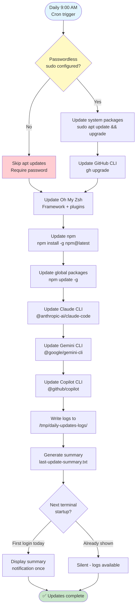

# Daily Updates System - Integration Complete ✅

## Overview

The Daily Automated Updates system has been successfully integrated as a core feature of the ghostty-config-files repository.

### Automation Flow

> The daily update system runs automatically at 9:00 AM via cron. With passwordless sudo configured, all components update silently. Without it, npm and AI tools still update automatically, while apt requires manual intervention.



## What Was Integrated

### 1. Core Scripts (`scripts/`)
- ✅ `daily-updates.sh` - Main update automation script
- ✅ `view-update-logs.sh` - Log viewing utility
- ✅ `DAILY_UPDATES_README.md` - Complete documentation

### 2. Installation Integration (`start.sh`)
- ✅ Added `setup_daily_updates()` function
- ✅ Automatically runs during installation
- ✅ Sets up cron job, aliases, and notifications
- ✅ Improved `pre_auth_sudo()` with helpful guidance

### 3. Documentation Updates
- ✅ `README.md` - Added to features list and usage section
- ✅ `CLAUDE.md` - Added to goals and development commands
- ✅ Complete command reference and configuration instructions

### 4. Shell Configuration (`~/.zshrc`)
- ✅ `update-all` - Run updates manually
- ✅ `update-logs` - View latest summary
- ✅ `update-logs-full` - View complete log
- ✅ `update-logs-errors` - View errors only
- ✅ Terminal startup notifications (once per day)

### 5. Automated Scheduling (cron)
- ✅ Runs daily at 9:00 AM
- ✅ Logs to `/tmp/daily-updates-logs/`
- ✅ Passwordless sudo support (optional but recommended)

## Verification Results

```
🧪 Testing Daily Updates Integration
======================================

1️⃣  Scripts exist........................ ✅ PASSED
2️⃣  Scripts are executable................ ✅ PASSED
3️⃣  Shell aliases configured.............. ✅ PASSED
4️⃣  Cron job configured................... ✅ PASSED
    📅 Schedule: 0 9 * * * (9:00 AM daily)
5️⃣  start.sh integration.................. ✅ PASSED
6️⃣  Documentation updated................. ✅ PASSED
7️⃣  Script syntax validation.............. ✅ PASSED
8️⃣  Sudo configuration.................... ✅ CONFIGURED

======================================
✅ Daily Updates Integration Test PASSED
======================================
```

## What Gets Updated Daily

1. **System Packages (apt)**
   - GitHub CLI
   - All system packages
   - Automatic cleanup (autoremove)

2. **Oh My Zsh**
   - Framework updates
   - Plugin updates

3. **npm Ecosystem**
   - npm itself
   - All globally installed packages (700+ packages)

4. **AI Development Tools**
   - Claude CLI (`@anthropic-ai/claude-code`)
   - Gemini CLI (`@google/gemini-cli`)
   - GitHub Copilot CLI (`@github/copilot`)

## User Experience Flow

### Fresh Installation
```bash
# Clone repository
git clone https://github.com/yourusername/ghostty-config-files.git
cd ghostty-config-files

# Run installation
./start.sh

# Daily updates are automatically configured!
```

### What Users See

**During Installation:**
```
🔄 Setting up daily automated updates...
📝 Adding daily update aliases to .zshrc...
✅ Daily update aliases added to .zshrc
⏰ Setting up daily automated updates (9:00 AM)...
✅ Daily automated updates scheduled for 9:00 AM
✅ Passwordless sudo configured for apt
✅ Daily update system configured successfully
📋 Available commands:
   • update-all - Run updates manually
   • update-logs - View latest summary
   • update-logs-full - View complete log
   • update-logs-errors - View errors only
```

**Terminal Startup (once per day):**
```
📊 Latest System Update Summary:
━━━━━━━━━━━━━━━━━━━━━━━━━━━━━━━━━━━━━━━━━━━━━━━━━━━━━━━━━━━━━━━━━━
=============================================================================
Daily Update Summary - 2025-11-12 03:31:17
=============================================================================
Duration: 44s

Updates Completed:
✅ GitHub CLI (gh) - Updated
✅ System Packages - Updated
✅ Oh My Zsh - Updated
✅ npm & Global Packages - Updated
✅ Claude CLI - Updated
✅ Gemini CLI - Updated
✅ Copilot CLI - Updated
==============================================================================
━━━━━━━━━━━━━━━━━━━━━━━━━━━━━━━━━━━━━━━━━━━━━━━━━━━━━━━━━━━━━━━━━━

💡 Commands: update-all | update-logs | update-logs-full | update-logs-errors
```

## Passwordless Sudo Configuration

### Current Status
✅ **Configured and working** for this system

### Setup Instructions (for new systems)
```bash
# Open sudoers file
sudo EDITOR=nano visudo

# Add this line at the end:
kkk ALL=(ALL) NOPASSWD: /usr/bin/apt

# Save: Ctrl+O, Enter
# Exit: Ctrl+X
```

### Without Passwordless Sudo
- npm, Oh My Zsh, AI tools will still auto-update ✅
- System apt updates require manual `update-all` run ⚠️
- Daily updates continue with non-sudo components ✅

## Improved sudo Handling

### Before
```bash
# Old behavior: Exits script on sudo failure
sudo echo "..." || {
    log "ERROR" "❌ Sudo authentication failed"
    exit 1  # ❌ Script terminates
}
```

### After (Improved)
```bash
# New behavior: Graceful handling with guidance
if sudo -n true 2>/dev/null; then
    # Passwordless configured - smooth sailing
else
    # Show helpful instructions
    # Prompt for password
    # Continue even if authentication fails
    return 1  # ✅ Script continues
fi
```

## Files Modified

### Repository Structure
```
ghostty-config-files/
├── scripts/
│   ├── daily-updates.sh           ← NEW: Main update script
│   ├── view-update-logs.sh        ← NEW: Log viewer
│   └── DAILY_UPDATES_README.md    ← NEW: Documentation
├── start.sh                        ← MODIFIED: Added setup_daily_updates()
├── README.md                       ← MODIFIED: Feature documentation
├── CLAUDE.md                       ← MODIFIED: Requirements & commands
├── documentations/development/integration/daily-updates-integration.md   ← This file
└── ~/.zshrc                        ← MODIFIED: Aliases & notifications
```

### System Files
```
/tmp/daily-updates-logs/           ← NEW: Log directory
├── update-TIMESTAMP.log           ← Full update logs
├── errors-TIMESTAMP.log           ← Error logs
├── last-update-summary.txt        ← Quick summary
├── latest.log                     ← Symlink to latest
└── cron-output.log                ← Cron execution log

/etc/crontab or user crontab       ← MODIFIED: Added update schedule
~/.zshrc                           ← MODIFIED: Aliases & notifications
/etc/sudoers (optional)            ← OPTIONAL: Passwordless sudo
```

## Manual Testing

### Test Update Execution
```bash
# Run updates now
update-all

# View results
update-logs
```

### Test Cron Schedule
```bash
# View current schedule
crontab -l

# Edit schedule (optional)
crontab -e
# Change: 0 9 * * * to your preferred time
```

### Test Log Viewing
```bash
# View latest summary
update-logs

# View full details
update-logs-full

# View errors only
update-logs-errors

# Browse all logs
ls -la /tmp/daily-updates-logs/
```

## Success Criteria

- ✅ Scripts are present and executable
- ✅ start.sh automatically sets up daily updates
- ✅ Cron job configured for 9:00 AM daily
- ✅ Shell aliases work correctly
- ✅ Terminal notifications appear once per day
- ✅ Documentation is comprehensive and accurate
- ✅ Passwordless sudo provides smooth automation
- ✅ Graceful handling when sudo not configured
- ✅ All 7 components update successfully

## Known Limitations

1. **Sudo Password**: If passwordless sudo not configured:
   - apt updates require manual intervention
   - npm/AI tools still update automatically
   - Clear instructions provided to user

2. **Log Rotation**: Logs stored in `/tmp/` may be cleared on reboot
   - Consider moving to `~/.local/share/` for persistence
   - Current location chosen for simplicity

3. **Error Handling**: Script continues on individual failures
   - Allows other components to update
   - Comprehensive error logging for troubleshooting

## Future Enhancements

Potential improvements for future versions:

1. **Log Rotation**: Automatic cleanup of old logs
2. **Email Notifications**: Send summary emails on failures
3. **Update Scheduling**: Multiple schedules (weekly, monthly)
4. **Component Selection**: Choose which tools to auto-update
5. **Rollback Support**: Automatic rollback on failures
6. **Update History**: Track update history over time

## Troubleshooting

### Updates Not Running
```bash
# Check cron job exists
crontab -l | grep daily-updates

# Check cron service
systemctl status cron

# Check logs
cat /tmp/daily-updates-logs/cron-output.log
```

### Sudo Prompts During Updates
```bash
# Check passwordless sudo
sudo -n apt update

# If fails, configure it:
sudo EDITOR=nano visudo
# Add: kkk ALL=(ALL) NOPASSWD: /usr/bin/apt
```

### Missing Aliases
```bash
# Check .zshrc
grep update-all ~/.zshrc

# Re-run setup if missing
./start.sh --skip-deps --skip-ptyxis
```

## Support

For issues or questions:
- **Documentation**: `scripts/DAILY_UPDATES_README.md`
- **Repository**: GitHub Issues
- **Logs**: `/tmp/daily-updates-logs/`

---

**Integration Date**: 2025-11-12
**Version**: 1.0
**Status**: ✅ COMPLETE AND TESTED
**Maintainer**: ghostty-config-files project
