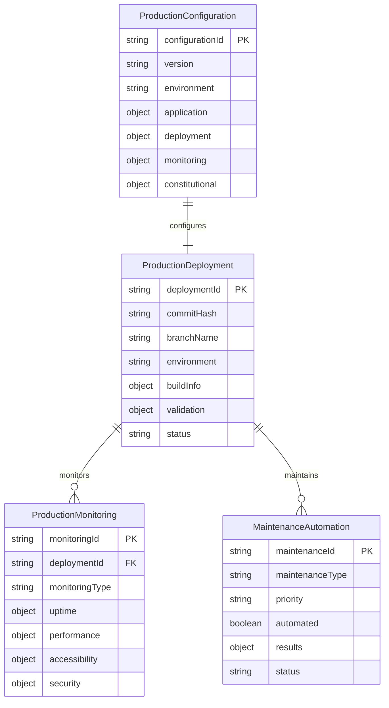

# Data Model: Production Deployment & Maintenance Excellence

**Feature**: 002-production-deployment
**Created**: 2025-09-20
**Prerequisites**: Feature 001 (Modern Web Development Stack) - COMPLETED ✅
**Focus**: Data structures for production operations, monitoring, and maintenance

---

## 📊 Data Model Overview

This document defines the data structures, entities, and relationships required for Feature 002's production deployment and maintenance system, building upon the Feature 001 foundation while introducing production-specific data requirements.

---

## 🏗️ Core Data Entities

### 1. Production Deployment Entity

```typescript
interface ProductionDeployment {
  // Deployment Identification
  deploymentId: string;           // Format: YYYYMMDD-HHMMSS-deployment
  commitHash: string;             // Git commit SHA
  branchName: string;             // Constitutional branch naming
  timestamp: string;              // ISO 8601 format

  // Deployment Context
  environment: 'staging' | 'production';
  deploymentType: 'initial' | 'update' | 'hotfix' | 'rollback';
  triggerSource: 'manual' | 'automated' | 'emergency';
  deployedBy: string;             // User or automation system

  // Build Information
  buildInfo: {
    astroVersion: string;
    nodeVersion: string;
    buildTime: number;            // Seconds
    bundleSize: {
      javascript: number;         // Bytes
      css: number;               // Bytes
      assets: number;            // Bytes
      total: number;             // Bytes
    };
    optimizations: string[];      // Applied optimizations
  };

  // Validation Results
  validation: {
    constitutionalCompliance: {
      score: number;              // 0-100
      violations: string[];
      passedChecks: string[];
    };
    performance: {
      lighthouse: {
        performance: number;      // 0-100
        accessibility: number;    // 0-100
        bestPractices: number;   // 0-100
        seo: number;             // 0-100
      };
      coreWebVitals: {
        lcp: number;             // Seconds
        fcp: number;             // Seconds
        cls: number;             // Score
        fid: number;             // Milliseconds
      };
    };
    security: {
      vulnerabilities: SecurityVulnerability[];
      securityScore: number;     // 0-100
    };
    accessibility: {
      wcagLevel: 'A' | 'AA' | 'AAA';
      violations: AccessibilityViolation[];
      complianceScore: number;   // 0-100
    };
  };

  // Deployment Status
  status: 'pending' | 'building' | 'validating' | 'deploying' | 'success' | 'failed' | 'rolled-back';
  deploymentUrl: string;          // Production URL
  rollbackDeploymentId?: string;  // Previous deployment for rollback

  // Error Handling
  errors: DeploymentError[];
  warnings: string[];

  // Metadata
  metadata: {
    constitutionalCompliance: boolean;
    performanceBaseline: boolean;
    userImpact: 'none' | 'low' | 'medium' | 'high';
    estimatedUsers: number;
  };
}
```

### 2. Production Monitoring Entity

```typescript
interface ProductionMonitoring {
  // Monitoring Identification
  monitoringId: string;           // Format: YYYYMMDD-HHMMSS-monitor
  timestamp: string;              // ISO 8601 format
  monitoringType: 'uptime' | 'performance' | 'accessibility' | 'security' | 'constitutional';

  // Site Information
  siteUrl: string;
  environment: 'staging' | 'production';
  deploymentId: string;           // Associated deployment

  // Uptime Monitoring
  uptime: {
    status: 'up' | 'down' | 'degraded';
    responseTime: number;         // Milliseconds
    httpStatus: number;
    location: string;             // Monitoring location
    availability: number;         // Percentage over time period
    incidents: UptimeIncident[];
  };

  // Performance Monitoring
  performance: {
    lighthouse: {
      performance: number;
      accessibility: number;
      bestPractices: number;
      seo: number;
      lastRun: string;            // ISO 8601
    };
    coreWebVitals: {
      lcp: {
        value: number;
        rating: 'good' | 'needs-improvement' | 'poor';
      };
      fcp: {
        value: number;
        rating: 'good' | 'needs-improvement' | 'poor';
      };
      cls: {
        value: number;
        rating: 'good' | 'needs-improvement' | 'poor';
      };
      fid: {
        value: number;
        rating: 'good' | 'needs-improvement' | 'poor';
      };
    };
    bundleAnalysis: {
      javascript: number;
      css: number;
      assets: number;
      total: number;
      compressionRatio: number;
    };
    loadTime: {
      dns: number;
      connect: number;
      firstByte: number;
      domLoad: number;
      complete: number;
    };
  };

  // Accessibility Monitoring
  accessibility: {
    wcagCompliance: {
      level: 'A' | 'AA' | 'AAA';
      violations: AccessibilityViolation[];
      passedTests: string[];
    };
    axeResults: {
      violations: number;
      incomplete: number;
      passes: number;
    };
    screenReaderTest: {
      compatible: boolean;
      issues: string[];
    };
  };

  // Security Monitoring
  security: {
    sslCheck: {
      valid: boolean;
      expiryDate: string;
      grade: string;
    };
    headers: {
      csp: boolean;
      hsts: boolean;
      xFrame: boolean;
      xContent: boolean;
    };
    vulnerabilities: SecurityVulnerability[];
  };

  // Constitutional Compliance
  constitutional: {
    zeroGitHubActions: boolean;
    performanceFirst: boolean;
    userPreservation: boolean;
    branchPreservation: boolean;
    localValidation: boolean;
    complianceScore: number;      // 0-100
  };

  // Alerting
  alerts: MonitoringAlert[];

  // Trends
  trends: {
    performanceTrend: 'improving' | 'stable' | 'degrading';
    availabilityTrend: 'improving' | 'stable' | 'degrading';
    errorRateTrend: 'improving' | 'stable' | 'degrading';
  };
}
```

### 3. Maintenance Automation Entity

```typescript
interface MaintenanceAutomation {
  // Maintenance Identification
  maintenanceId: string;          // Format: YYYYMMDD-HHMMSS-maintenance
  maintenanceType: 'dependency-update' | 'content-validation' | 'backup' | 'security-patch' | 'optimization';
  scheduledTime: string;          // ISO 8601 format
  executedTime?: string;          // ISO 8601 format

  // Maintenance Context
  priority: 'low' | 'medium' | 'high' | 'critical';
  automated: boolean;
  approvalRequired: boolean;
  impactAssessment: {
    userImpact: 'none' | 'low' | 'medium' | 'high';
    downtime: number;             // Seconds
    rollbackTime: number;         // Seconds
  };

  // Dependency Updates
  dependencyUpdates?: {
    updates: DependencyUpdate[];
    securityUpdates: number;
    breakingChanges: number;
    testResults: {
      buildSuccess: boolean;
      testsPassed: number;
      testsFailed: number;
      constitutionalCompliance: boolean;
    };
  };

  // Content Validation
  contentValidation?: {
    linksChecked: number;
    brokenLinks: string[];
    imagesValidated: number;
    invalidImages: string[];
    contentFreshness: {
      staleContent: string[];
      lastUpdated: string;
    };
  };

  // Backup Operations
  backup?: {
    backupType: 'full' | 'incremental' | 'configuration';
    backupSize: number;           // Bytes
    backupLocation: string;
    integrity: {
      verified: boolean;
      checksum: string;
    };
    retention: {
      keepUntil: string;          // ISO 8601
      autoDelete: boolean;
    };
  };

  // Security Patches
  securityPatch?: {
    vulnerabilities: SecurityVulnerability[];
    patchedPackages: string[];
    riskLevel: 'low' | 'medium' | 'high' | 'critical';
    testResults: {
      securityScanPassed: boolean;
      functionalTestsPassed: boolean;
    };
  };

  // Execution Status
  status: 'scheduled' | 'running' | 'success' | 'failed' | 'requires-approval' | 'cancelled';
  progress: {
    totalSteps: number;
    completedSteps: number;
    currentStep: string;
  };

  // Results
  results: {
    success: boolean;
    changes: string[];
    errors: MaintenanceError[];
    rollbackRequired: boolean;
    constitutionalCompliance: boolean;
  };

  // Approval Workflow
  approval?: {
    required: boolean;
    requestedBy: string;
    requestedAt: string;          // ISO 8601
    approvedBy?: string;
    approvedAt?: string;          // ISO 8601
    comments: string[];
  };
}
```

### 4. Production Configuration Entity

```typescript
interface ProductionConfiguration {
  // Configuration Identification
  configurationId: string;        // Format: YYYYMMDD-HHMMSS-config
  version: string;               // Semantic versioning
  environment: 'staging' | 'production';

  // Application Configuration
  application: {
    name: string;
    version: string;
    description: string;
    homepage: string;
    repository: string;
  };

  // Deployment Configuration
  deployment: {
    strategy: 'blue-green' | 'rolling' | 'atomic';
    rollbackStrategy: 'automatic' | 'manual';
    healthCheckUrl: string;
    healthCheckTimeout: number;   // Seconds
    validationSteps: string[];
  };

  // Performance Configuration
  performance: {
    targets: {
      lighthouse: {
        performance: number;
        accessibility: number;
        bestPractices: number;
        seo: number;
      };
      coreWebVitals: {
        lcp: number;              // Seconds
        fcp: number;              // Seconds
        cls: number;              // Score
        fid: number;              // Milliseconds
      };
      bundleSize: {
        javascript: number;       // Bytes
        css: number;             // Bytes
        total: number;           // Bytes
      };
    };
    optimizations: {
      compression: boolean;
      minification: boolean;
      codeSplitting: boolean;
      treeshaking: boolean;
      imageOptimization: boolean;
    };
  };

  // Monitoring Configuration
  monitoring: {
    uptime: {
      enabled: boolean;
      frequency: number;          // Seconds
      locations: string[];
      alertThreshold: number;     // Response time in ms
    };
    performance: {
      enabled: boolean;
      frequency: number;          // Hours
      budgets: {
        javascript: number;
        css: number;
        images: number;
      };
    };
    accessibility: {
      enabled: boolean;
      wcagLevel: 'A' | 'AA' | 'AAA';
      frequency: number;          // Hours
    };
    security: {
      enabled: boolean;
      vulnerabilityScanning: boolean;
      sslMonitoring: boolean;
      headerChecking: boolean;
    };
  };

  // Maintenance Configuration
  maintenance: {
    dependencyUpdates: {
      enabled: boolean;
      frequency: 'daily' | 'weekly' | 'monthly';
      autoApprove: boolean;
      excludePackages: string[];
    };
    contentValidation: {
      enabled: boolean;
      frequency: 'daily' | 'weekly';
      checkLinks: boolean;
      validateImages: boolean;
    };
    backup: {
      enabled: boolean;
      frequency: 'daily' | 'weekly';
      retention: number;          // Days
      compression: boolean;
    };
  };

  // Security Configuration
  security: {
    headers: {
      csp: string;
      hsts: boolean;
      xFrame: string;
      xContent: boolean;
    };
    scanning: {
      dependencies: boolean;
      content: boolean;
      frequency: number;          // Hours
    };
  };

  // Constitutional Compliance
  constitutional: {
    zeroGitHubActions: boolean;
    performanceFirst: boolean;
    userPreservation: boolean;
    branchPreservation: boolean;
    localValidation: boolean;
    enforcementLevel: 'strict' | 'standard' | 'flexible';
  };

  // Environment Variables
  environment: {
    variables: Record<string, string>;
    secrets: string[];            // Names only, not values
  };

  // Feature Flags
  features: {
    flags: Record<string, boolean>;
    rolloutPercentage: Record<string, number>;
  };
}
```

---

## 🔗 Supporting Data Structures

### Security Vulnerability
```typescript
interface SecurityVulnerability {
  id: string;
  severity: 'low' | 'moderate' | 'high' | 'critical';
  title: string;
  description: string;
  package: string;
  version: string;
  patchedVersion?: string;
  cve?: string;
  discoveredAt: string;          // ISO 8601
  patchedAt?: string;            // ISO 8601
}
```

### Accessibility Violation
```typescript
interface AccessibilityViolation {
  id: string;
  impact: 'minor' | 'moderate' | 'serious' | 'critical';
  wcagCriterion: string;
  description: string;
  help: string;
  helpUrl: string;
  selector: string;
  context: string;
  discoveredAt: string;          // ISO 8601
  fixedAt?: string;              // ISO 8601
}
```

### Deployment Error
```typescript
interface DeploymentError {
  errorId: string;
  type: 'build' | 'validation' | 'deployment' | 'rollback';
  severity: 'warning' | 'error' | 'critical';
  message: string;
  stack?: string;
  context: Record<string, any>;
  timestamp: string;             // ISO 8601
  resolved: boolean;
  resolution?: string;
}
```

### Uptime Incident
```typescript
interface UptimeIncident {
  incidentId: string;
  startTime: string;             // ISO 8601
  endTime?: string;              // ISO 8601
  duration?: number;             // Seconds
  severity: 'minor' | 'major' | 'critical';
  status: 'investigating' | 'identified' | 'monitoring' | 'resolved';
  description: string;
  impactedServices: string[];
  rootCause?: string;
  resolution?: string;
  postMortem?: string;
}
```

### Monitoring Alert
```typescript
interface MonitoringAlert {
  alertId: string;
  type: 'uptime' | 'performance' | 'accessibility' | 'security' | 'constitutional';
  severity: 'info' | 'warning' | 'error' | 'critical';
  title: string;
  description: string;
  triggeredAt: string;           // ISO 8601
  acknowledgedAt?: string;       // ISO 8601
  resolvedAt?: string;           // ISO 8601
  escalated: boolean;
  notificationsSent: string[];   // Email addresses or webhook URLs
  metadata: Record<string, any>;
}
```

### Dependency Update
```typescript
interface DependencyUpdate {
  package: string;
  currentVersion: string;
  targetVersion: string;
  updateType: 'patch' | 'minor' | 'major';
  breaking: boolean;
  security: boolean;
  description: string;
  releaseNotes?: string;
  testRequired: boolean;
  approved: boolean;
  appliedAt?: string;            // ISO 8601
}
```

### Maintenance Error
```typescript
interface MaintenanceError {
  errorId: string;
  type: 'dependency' | 'content' | 'backup' | 'security' | 'configuration';
  severity: 'warning' | 'error' | 'critical';
  message: string;
  context: Record<string, any>;
  timestamp: string;             // ISO 8601
  rollbackTriggered: boolean;
  resolution?: string;
}
```

---

## 📊 Data Relationships

### Entity Relationship Diagram


### Data Flow Relationships

#### 1. Deployment → Monitoring Flow
```typescript
// Deployment creates monitoring entry
const monitoring: ProductionMonitoring = {
  monitoringId: generateId('monitor'),
  deploymentId: deployment.deploymentId,
  timestamp: new Date().toISOString(),
  monitoringType: 'uptime',
  // ... monitoring data
};
```

#### 2. Monitoring → Maintenance Flow
```typescript
// Monitoring alerts trigger maintenance
if (monitoring.constitutional.complianceScore < 95) {
  const maintenance: MaintenanceAutomation = {
    maintenanceId: generateId('maintenance'),
    maintenanceType: 'optimization',
    priority: 'high',
    // ... maintenance data
  };
}
```

#### 3. Configuration → Deployment Flow
```typescript
// Configuration drives deployment parameters
const deployment: ProductionDeployment = {
  deploymentId: generateId('deployment'),
  validation: {
    constitutionalCompliance: {
      score: calculateScore(config.constitutional),
      // ... validation based on config
    }
  }
};
```

---

## 🎯 Data Storage Strategy

### Local Storage (Constitutional Compliance)
```typescript
interface LocalStorage {
  // Deployment History
  deployments: ProductionDeployment[];

  // Monitoring Data (Last 30 days)
  monitoring: ProductionMonitoring[];

  // Maintenance Log
  maintenance: MaintenanceAutomation[];

  // Active Configuration
  configuration: ProductionConfiguration;

  // Metadata
  metadata: {
    lastSync: string;
    version: string;
    constitutionalCompliance: boolean;
  };
}
```

### File System Structure
```
/home/kkk/Apps/ghostty-config-files/
├── production/
│   ├── deployments/
│   │   ├── YYYYMMDD-HHMMSS-deployment.json
│   │   └── index.json                    # Deployment index
│   ├── monitoring/
│   │   ├── YYYY/MM/DD/
│   │   │   ├── uptime-HHMMSS.json
│   │   │   ├── performance-HHMMSS.json
│   │   │   └── accessibility-HHMMSS.json
│   │   └── index.json                    # Monitoring index
│   ├── maintenance/
│   │   ├── YYYYMMDD-HHMMSS-maintenance.json
│   │   └── index.json                    # Maintenance index
│   └── configuration/
│       ├── current.json                  # Active configuration
│       ├── history/
│       │   └── config-YYYYMMDD-HHMMSS.json
│       └── index.json                    # Configuration index
```

### Data Retention Policy
```typescript
interface DataRetentionPolicy {
  deployments: {
    retention: '1 year';
    archiveAfter: '6 months';
    compressionEnabled: true;
  };
  monitoring: {
    detailed: '30 days';        // Full monitoring data
    aggregated: '1 year';       // Summary statistics
    alerts: '6 months';         // Alert history
  };
  maintenance: {
    retention: '1 year';
    successfulMaintenance: '3 months';
    failedMaintenance: '1 year';
  };
  configuration: {
    retention: 'indefinite';    // All configuration changes
    activeVersions: 10;         // Keep last 10 versions readily available
  };
}
```

---

## 🔍 Data Validation & Integrity

### Schema Validation
```typescript
// JSON Schema validation for all entities
import Ajv from 'ajv';

const ajv = new Ajv();

// Deployment schema validation
const deploymentSchema = {
  type: 'object',
  required: ['deploymentId', 'commitHash', 'timestamp', 'environment'],
  properties: {
    deploymentId: { type: 'string', pattern: '^[0-9]{8}-[0-9]{6}-deployment$' },
    commitHash: { type: 'string', pattern: '^[a-f0-9]{40}$' },
    timestamp: { type: 'string', format: 'date-time' },
    environment: { enum: ['staging', 'production'] },
    // ... additional properties
  }
};

const validateDeployment = ajv.compile(deploymentSchema);
```

### Data Integrity Checks
```typescript
interface DataIntegrityCheck {
  checksum: string;              // SHA256 of data
  lastValidated: string;         // ISO 8601
  validationRules: {
    deploymentChain: boolean;    // Ensure deployment sequence integrity
    monitoringContinuity: boolean; // Ensure monitoring data continuity
    configurationHistory: boolean; // Ensure configuration change tracking
  };
}
```

### Backup Verification
```typescript
interface BackupVerification {
  backupId: string;
  originalChecksum: string;
  backupChecksum: string;
  verified: boolean;
  verificationTime: string;      // ISO 8601
  restorationTested: boolean;
  restorationTime?: number;      // Seconds for full restoration
}
```

---

## 📈 Data Analytics & Reporting

### Performance Analytics
```typescript
interface PerformanceAnalytics {
  deploymentFrequency: {
    daily: number;
    weekly: number;
    monthly: number;
  };
  buildTimes: {
    average: number;
    trend: 'improving' | 'stable' | 'degrading';
    percentile95: number;
  };
  deploymentSuccess: {
    rate: number;               // Percentage
    trend: 'improving' | 'stable' | 'degrading';
    failureReasons: Record<string, number>;
  };
  constitutionalCompliance: {
    averageScore: number;
    trend: 'improving' | 'stable' | 'degrading';
    violations: Record<string, number>;
  };
}
```

### Monitoring Analytics
```typescript
interface MonitoringAnalytics {
  uptime: {
    current: number;            // Percentage
    trend: 'improving' | 'stable' | 'degrading';
    incidents: number;
    mttr: number;               // Mean Time To Recovery (seconds)
  };
  performance: {
    lighthouseScores: {
      performance: number;
      accessibility: number;
      bestPractices: number;
      seo: number;
    };
    coreWebVitals: {
      lcp: { current: number; trend: string };
      fcp: { current: number; trend: string };
      cls: { current: number; trend: string };
      fid: { current: number; trend: string };
    };
  };
  constitutionalCompliance: {
    overallScore: number;
    principleScores: {
      zeroGitHubActions: number;
      performanceFirst: number;
      userPreservation: number;
      branchPreservation: number;
      localValidation: number;
    };
  };
}
```

---

**Data Model Complete - Ready for Feature 002 Implementation** 📊