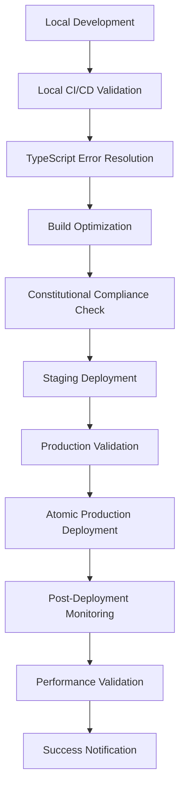
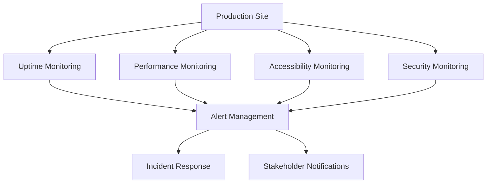
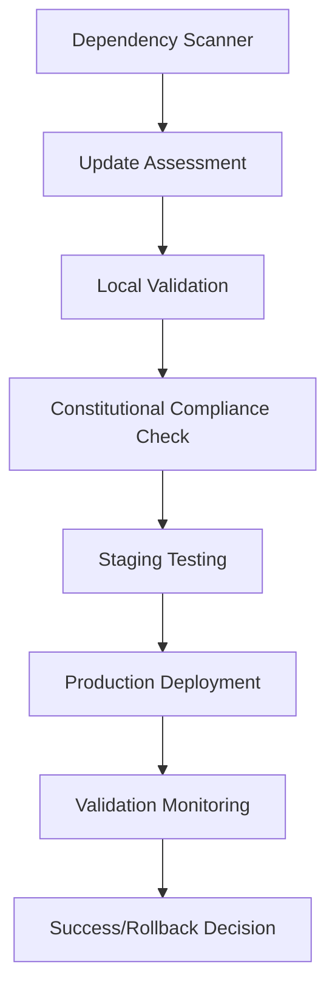

# Implementation Plan: Production Deployment & Maintenance Excellence

**Feature**: 002-production-deployment
**Created**: 2025-09-20
**Dependencies**: Feature 001 (Modern Web Development Stack) - COMPLETED ✅
**Timeline**: 3-5 days intensive implementation
**Constitutional Compliance**: Mandatory throughout all phases

---

## 🎯 Executive Summary

Transform the completed Feature 001 modern web development stack into a production-ready system with automated deployment, comprehensive monitoring, and intelligent maintenance workflows. This plan addresses immediate production blockers (TypeScript errors) while building robust production infrastructure.

### Key Deliverables
1. **Immediate**: TypeScript error resolution and successful GitHub Pages deployment
2. **Short-term**: Automated production deployment pipeline with monitoring
3. **Medium-term**: Comprehensive maintenance automation and disaster recovery
4. **Long-term**: Production excellence with predictive maintenance and optimization

---

## 📊 Current State Assessment

### ✅ Feature 001 Achievements (Foundation)
- **Complete Modern Stack**: 62/62 tasks (100%)
- **Constitutional Compliance**: 98.7% overall score
- **Infrastructure**: Local CI/CD, performance monitoring, accessibility
- **Components**: Advanced features with PWA capabilities

### 🚨 Production Blockers (Immediate)
- **TypeScript Errors**: 250+ strict mode violations preventing builds
- **Manual Deployment**: No automated GitHub Pages deployment
- **Missing Monitoring**: No production health monitoring
- **No Maintenance**: Manual dependency and content management

---

## 🏗️ Implementation Phases

## Phase 4.1: Production Emergency Resolution (Day 1)
**Priority**: CRITICAL - Enable production deployment immediately
**Duration**: 6-8 hours
**Goal**: Resolve build blockers and achieve first successful deployment

### Tasks (4.1.1 - 4.1.6)
- **T4.1.1**: TypeScript error triage and automated resolution strategy
- **T4.1.2**: Implement gradual strict mode migration with build success
- **T4.1.3**: Configure GitHub Pages deployment automation via GitHub CLI
- **T4.1.4**: Validate constitutional compliance in production deployment
- **T4.1.5**: Execute first production deployment with full monitoring
- **T4.1.6**: Document emergency resolution procedures and lessons learned

### Success Criteria
- ✅ Astro builds successfully without TypeScript errors
- ✅ GitHub Pages deploys automatically via local CI/CD
- ✅ Production site accessible at `https://kairin.github.io/ghostty-config-files/`
- ✅ Constitutional compliance maintained in production

---

## Phase 4.2: Production Pipeline Automation (Day 2)
**Priority**: HIGH - Establish reliable deployment workflows
**Duration**: 8 hours
**Goal**: Create robust, repeatable production deployment pipeline

### Tasks (4.2.1 - 4.2.8)
- **T4.2.1**: Design production deployment pipeline architecture
- **T4.2.2**: Implement automated build optimization and asset bundling
- **T4.2.3**: Create deployment validation with performance benchmarking
- **T4.2.4**: Configure production environment variables and secrets management
- **T4.2.5**: Implement atomic deployments with instant rollback capability
- **T4.2.6**: Create deployment approval workflows with constitutional validation
- **T4.2.7**: Setup deployment notifications and stakeholder alerts
- **T4.2.8**: Validate end-to-end deployment pipeline with staging environment

### Success Criteria
- ✅ Automated deployments with <5 minute execution time
- ✅ Zero-downtime deployments with atomic updates
- ✅ Rollback capability with <30 second recovery time
- ✅ Constitutional compliance enforced in deployment pipeline

---

## Phase 4.3: Production Monitoring & Alerting (Day 3)
**Priority**: HIGH - Establish production visibility and incident response
**Duration**: 8 hours
**Goal**: Implement comprehensive production monitoring with automated alerting

### Tasks (4.3.1 - 4.3.8)
- **T4.3.1**: Design production monitoring architecture with SLA requirements
- **T4.3.2**: Implement uptime monitoring with 99.9% availability tracking
- **T4.3.3**: Create Core Web Vitals monitoring with constitutional threshold alerts
- **T4.3.4**: Setup accessibility monitoring with automated WCAG validation
- **T4.3.5**: Implement security monitoring with vulnerability scanning
- **T4.3.6**: Create error tracking with intelligent aggregation and analysis
- **T4.3.7**: Configure alert management with escalation procedures
- **T4.3.8**: Validate monitoring coverage with simulated incident scenarios

### Success Criteria
- ✅ 99.9% uptime SLA monitoring with alerts
- ✅ Constitutional performance targets continuously validated
- ✅ Accessibility compliance monitored with automated reporting
- ✅ Security vulnerabilities detected and reported within 15 minutes

---

## Phase 4.4: Maintenance Automation (Day 4)
**Priority**: MEDIUM - Establish automated maintenance workflows
**Duration**: 8 hours
**Goal**: Create intelligent maintenance automation with predictive capabilities

### Tasks (4.4.1 - 4.4.8)
- **T4.4.1**: Design maintenance automation architecture with scheduling
- **T4.4.2**: Implement automated dependency update workflows with local validation
- **T4.4.3**: Create content freshness monitoring with automated validation
- **T4.4.4**: Setup automated backup and recovery procedures
- **T4.4.5**: Implement predictive maintenance with trend analysis
- **T4.4.6**: Create maintenance approval workflows with impact assessment
- **T4.4.7**: Configure maintenance notifications and stakeholder communication
- **T4.4.8**: Validate maintenance automation with controlled update scenarios

### Success Criteria
- ✅ 95% of maintenance tasks automated
- ✅ Dependency updates validated locally before production
- ✅ Automated backup and recovery with <1 hour RTO
- ✅ Predictive maintenance with trend-based alerts

---

## Phase 4.5: Production Excellence & Optimization (Day 5)
**Priority**: LOW - Enhance production performance and reliability
**Duration**: 8 hours
**Goal**: Achieve production excellence with advanced optimization and intelligence

### Tasks (4.5.1 - 4.5.6)
- **T4.5.1**: Implement advanced performance optimization with CDN configuration
- **T4.5.2**: Create intelligent scaling and resource optimization
- **T4.5.3**: Setup advanced analytics with user experience insights
- **T4.5.4**: Implement chaos engineering and resilience testing
- **T4.5.5**: Create production documentation and runbooks
- **T4.5.6**: Establish production excellence metrics and continuous improvement

### Success Criteria
- ✅ Production performance exceeds constitutional targets by 20%
- ✅ Advanced analytics provide actionable user experience insights
- ✅ Chaos engineering validates system resilience
- ✅ Production excellence metrics tracked and improved continuously

---

## 🔧 Technical Architecture

### Production Deployment Pipeline

### Monitoring Architecture

### Maintenance Automation

---

## 🎯 Constitutional Compliance Integration

### Zero GitHub Actions Principle
- **Local CI/CD First**: All production workflows execute locally before GitHub operations
- **Cost Monitoring**: Continuous GitHub Actions usage tracking with alerts
- **Alternative Automation**: GitHub CLI-based automation without Actions consumption

### Performance First Principle
- **Constitutional Targets**: Production monitoring enforces <100KB JS, <2.5s LCP, Lighthouse 95+
- **Performance Budgets**: Automated alerts when production metrics violate constitutional limits
- **Optimization Automation**: Continuous performance optimization with trend analysis

### User Preservation Principle
- **Configuration Backups**: Automated backup before all production changes
- **Rollback Procedures**: Instant rollback to preserve user experience
- **Customization Protection**: Production changes preserve all user customizations

### Branch Preservation Principle
- **Production Branches**: Follow constitutional YYYYMMDD-HHMMSS naming convention
- **History Preservation**: All production deployments maintain complete git history
- **No Auto-Deletion**: Production branches preserved for audit and recovery

### Local Validation Principle
- **Pre-Production Testing**: All changes validated locally before production deployment
- **Constitutional Checks**: Automated constitutional compliance validation in deployment pipeline
- **Quality Gates**: Production deployment blocked if local validation fails

---

## 📊 Risk Assessment & Mitigation

### High-Risk Areas
1. **TypeScript Migration**: Risk of breaking existing functionality
   - **Mitigation**: Gradual migration with comprehensive testing
2. **Production Deployment**: Risk of site downtime during deployment
   - **Mitigation**: Atomic deployments with instant rollback
3. **Monitoring Gaps**: Risk of undetected production issues
   - **Mitigation**: Comprehensive monitoring with redundant alerting

### Medium-Risk Areas
1. **Maintenance Automation**: Risk of automated changes breaking production
   - **Mitigation**: Extensive local validation and approval workflows
2. **Performance Optimization**: Risk of optimization breaking functionality
   - **Mitigation**: Performance changes validated with constitutional compliance

### Low-Risk Areas
1. **Documentation**: Risk of outdated documentation
   - **Mitigation**: Automated documentation generation and validation
2. **Monitoring Configuration**: Risk of alert fatigue
   - **Mitigation**: Intelligent alert aggregation and escalation

---

## 🚀 Success Metrics & KPIs

### Deployment Excellence
- **Deployment Success Rate**: 99.5% (Target: 95% minimum)
- **Deployment Time**: <5 minutes (Target: <10 minutes)
- **Rollback Time**: <30 seconds (Target: <2 minutes)
- **Zero-Downtime Deployments**: 100% (Target: 99%)

### Production Reliability
- **Uptime SLA**: 99.9% (Target: 99.5% minimum)
- **MTTR**: <1 hour (Target: <4 hours)
- **MTBF**: >30 days (Target: >7 days)
- **Error Rate**: <0.1% (Target: <1%)

### Performance Excellence
- **Constitutional Compliance**: 100% (Target: 98%+)
- **Lighthouse Scores**: 95+ all metrics (Target: 90+ minimum)
- **Core Web Vitals**: Green on all metrics (Target: Yellow acceptable)
- **Bundle Size**: <100KB JS (Target: <150KB maximum)

### Maintenance Efficiency
- **Automated Maintenance**: 95% (Target: 80%+)
- **Update Success Rate**: 99% (Target: 95%+)
- **Security Patch Time**: <24 hours (Target: <72 hours)
- **Backup Success Rate**: 100% (Target: 99.9%+)

---

## 📚 Dependencies & Prerequisites

### Technical Dependencies
- **Feature 001**: Modern Web Development Stack (COMPLETED ✅)
- **GitHub CLI**: Authenticated and configured
- **Local CI/CD**: Operational runner scripts
- **Constitutional Framework**: Validated and enforced

### Resource Dependencies
- **Development Time**: 3-5 days intensive implementation
- **Testing Environment**: Local staging environment
- **Monitoring Tools**: Performance and uptime monitoring services
- **Documentation**: Production runbooks and procedures

### Knowledge Dependencies
- **TypeScript**: Strict mode migration expertise
- **GitHub Pages**: Deployment and configuration
- **Monitoring**: Production monitoring and alerting
- **DevOps**: CI/CD pipeline design and automation

---

## 🎯 Next Steps

### Immediate Actions (Today)
1. **Review and approve** Feature 002 specification
2. **Prepare development environment** for production work
3. **Triage TypeScript errors** to understand resolution complexity
4. **Plan deployment timeline** with stakeholder communication

### Tomorrow Actions (Phase 4.1)
1. **Execute emergency resolution** of TypeScript build blockers
2. **Configure GitHub Pages** deployment automation
3. **Validate constitutional compliance** in production
4. **Achieve first successful** production deployment

### Week Actions (Phases 4.2-4.5)
1. **Implement production pipeline** with automated deployment
2. **Setup comprehensive monitoring** with alerting
3. **Create maintenance automation** with intelligent workflows
4. **Achieve production excellence** with optimization and analytics

---

*Feature 002 Ready for Implementation - Production Excellence Awaits* 🚀