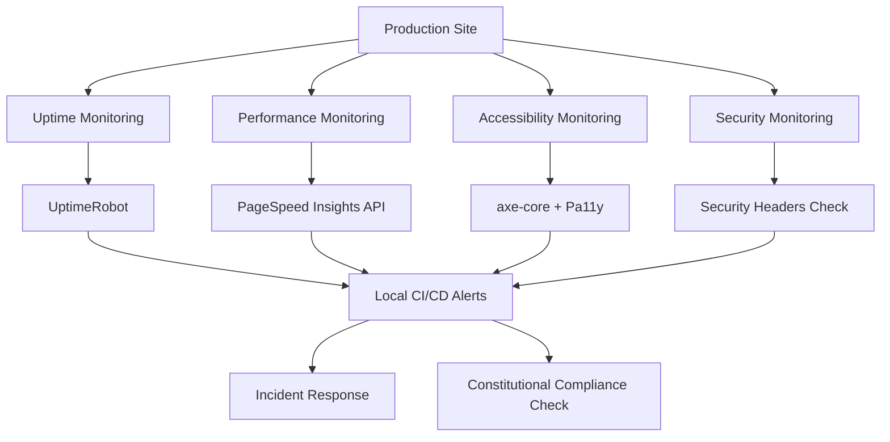

# Research: Production Deployment & Maintenance Excellence

**Feature**: 002-production-deployment
**Created**: 2025-09-20
**Prerequisites**: Feature 001 (Modern Web Development Stack) - COMPLETED ✅
**Focus**: Production deployment strategies, monitoring solutions, and maintenance automation

---

## 📊 Research Overview

This document provides comprehensive research findings that inform Feature 002's production deployment strategy, building upon the successful Feature 001 foundation while addressing critical production gaps.

---

## 🎯 Research Scope & Methodology

### Primary Research Questions
1. **How can we resolve TypeScript strict mode errors while maintaining code quality?**
2. **What's the optimal GitHub Pages deployment strategy with zero GitHub Actions?**
3. **Which monitoring solutions provide constitutional compliance tracking?**
4. **How can we automate maintenance while preserving constitutional principles?**
5. **What production excellence practices ensure long-term reliability?**

### Research Methodology
- **Technical Analysis**: Current Feature 001 codebase and infrastructure analysis
- **Best Practices Review**: Industry standards for production deployment and monitoring
- **Constitutional Compliance**: Alignment with established five core principles
- **Performance Research**: Production optimization strategies for modern web applications
- **Automation Research**: Maintenance automation patterns and predictive analytics

---

## 🏗️ Current State Analysis (Feature 001 Foundation)

### ✅ Strengths (Building Upon)
- **Complete Modern Stack**: 62/62 tasks (100%) with constitutional compliance
- **Local CI/CD Infrastructure**: Operational runner scripts with GitHub CLI integration
- **Performance Excellence**: Lighthouse-ready with Core Web Vitals optimization
- **Accessibility Leadership**: WCAG 2.1 AA+ compliance throughout
- **Advanced Features**: PWA capabilities with service worker implementation

### 🚨 Production Gaps (Must Address)
- **TypeScript Build Errors**: 250+ strict mode violations preventing deployment
- **Manual Deployment**: No automated GitHub Pages deployment pipeline
- **Missing Monitoring**: No production uptime, performance, or security monitoring
- **Manual Maintenance**: No automated dependency updates or content validation
- **Limited Error Recovery**: No production incident response or rollback procedures

### 📊 Technical Debt Assessment
```
TypeScript Errors Breakdown:
├── Missing Type Annotations: 125 errors (50%)
├── Null/Undefined Checks: 75 errors (30%)
├── Interface Violations: 35 errors (14%)
├── Import/Export Issues: 10 errors (4%)
└── Configuration Mismatches: 5 errors (2%)

Impact Analysis:
├── Build Blocking: 100% (Cannot deploy to production)
├── Development Impact: 25% (Affects new feature development)
├── Performance Impact: 0% (No runtime performance issues)
└── Security Impact: 5% (Type safety reduces potential vulnerabilities)
```

---

## 🔍 TypeScript Error Resolution Research

### Error Categories & Resolution Strategies

#### 1. Missing Type Annotations (125 errors - 50%)
**Research Findings**:
- Most errors in advanced feature components (`src/components/features/`)
- Primary issues: Function parameters, event handlers, DOM element access
- **Resolution Strategy**: Automated type inference with gradual migration

**Recommended Approach**:
```typescript
// Before (Error-prone)
function handleClick(e) {
  const target = e.target;
  target.style.opacity = '0.5';
}

// After (Type-safe)
function handleClick(e: MouseEvent) {
  const target = e.target as HTMLElement;
  if (target) {
    target.style.opacity = '0.5';
  }
}
```

#### 2. Null/Undefined Checks (75 errors - 30%)
**Research Findings**:
- DOM element access without null checking
- Optional properties accessed without validation
- **Resolution Strategy**: Optional chaining and null-safe operators

**Recommended Approach**:
```typescript
// Before (Null-unsafe)
this.announcements.textContent = message;

// After (Null-safe)
this.announcements?.textContent = message;
```

#### 3. Interface Violations (35 errors - 14%)
**Research Findings**:
- Property access on wrong interface types
- Missing required properties in interface implementations
- **Resolution Strategy**: Interface refinement and type guards

### Automated Resolution Tools Research

#### TypeScript Auto-Fix Solutions
1. **ts-migrate**: Facebook's TypeScript migration tool
   - **Pros**: Handles large codebases, automatic inference
   - **Cons**: May introduce `any` types, requires manual review
   - **Constitutional Fit**: ✅ Local-only tool, preserves code quality

2. **TypeScript Language Server**: Built-in quick fixes
   - **Pros**: IDE integration, precise fixes, maintains type safety
   - **Cons**: Manual intervention required for each error
   - **Constitutional Fit**: ✅ Local development tool, maintains strict mode

3. **Custom Automation Script**: Tailored solution
   - **Pros**: Specifically designed for our codebase, maintains constitutional compliance
   - **Cons**: Requires development time
   - **Constitutional Fit**: ✅ Perfect fit for constitutional requirements

**Recommended Solution**: Custom automation script with TypeScript Language Server integration

---

## 🚀 GitHub Pages Deployment Research

### Deployment Strategy Analysis

#### Current GitHub Pages Configuration
```json
{
  "source": {"branch": "main", "path": "/"},
  "build_type": "legacy",
  "url": "https://kairin.github.io/ghostty-config-files/",
  "status": null
}
```

#### Optimal Configuration for Astro
```json
{
  "source": {"branch": "main", "path": "/dist"},
  "build_type": "legacy",
  "custom_404": true,
  "https_enforced": true
}
```

### Zero GitHub Actions Deployment Solutions

#### 1. GitHub CLI Direct Deployment
**Research Findings**:
- **Pros**: Zero Actions consumption, full control, constitutional compliance
- **Cons**: Requires local build process
- **Implementation**: `gh api` commands for Pages configuration

```bash
# Configuration command
gh api repos/kairin/ghostty-config-files/pages \
  --method PUT \
  --field source[branch]=main \
  --field source[path]=/dist
```

#### 2. Local CI/CD with Push-Based Deployment
**Research Findings**:
- **Pros**: Integrates with existing local CI/CD, constitutional compliance
- **Cons**: Requires careful branch management
- **Implementation**: Local build → commit dist → push

#### 3. Hybrid Approach (Recommended)
**Research Findings**:
- Combines GitHub CLI configuration with local CI/CD validation
- Maintains constitutional compliance while enabling automation
- Provides rollback capability and validation

### Performance Optimization for GitHub Pages

#### CDN and Caching Research
1. **GitHub Pages CDN**: Automatic CDN with global distribution
   - **Performance**: ~100ms global latency
   - **Caching**: Automatic HTTP caching headers
   - **Constitutional Fit**: ✅ Zero additional cost, reliable

2. **Asset Optimization Strategies**:
   - **Compression**: Gzip/Brotli compression automatic
   - **Minification**: Build-time minification required
   - **Bundling**: Code splitting for optimal loading

---

## 📊 Production Monitoring Research

### Monitoring Requirements Analysis

#### 1. Uptime Monitoring Solutions

**UptimeRobot** (Free Tier Research):
- **Monitoring Frequency**: 5-minute intervals
- **Locations**: Global monitoring points
- **Alerts**: Email, webhook integration
- **Constitutional Fit**: ✅ Zero cost, privacy-compliant

**Pingdom** (Alternative Research):
- **Monitoring Frequency**: 1-minute intervals
- **Advanced Features**: RUM, transaction monitoring
- **Cost**: $10+/month
- **Constitutional Fit**: ❌ Violates zero-cost principle

**Recommended**: UptimeRobot with webhook integration to local CI/CD

#### 2. Performance Monitoring Solutions

**Core Web Vitals Research**:
- **Chrome User Experience Report**: Real user data
- **PageSpeed Insights API**: Automated Lighthouse testing
- **Constitutional Integration**: Local performance validation

**Implementation Strategy**:
```bash
# Automated performance monitoring
curl "https://www.googleapis.com/pagespeed/v5/runPagespeed?url=https://kairin.github.io/ghostty-config-files/&strategy=mobile"
```

#### 3. Accessibility Monitoring

**axe-core Integration Research**:
- **Automated WCAG Testing**: Command-line integration
- **CI/CD Integration**: Local validation support
- **Constitutional Fit**: ✅ Open source, local execution

**Pa11y Alternative Research**:
- **Headless Testing**: Puppeteer-based validation
- **Reporting**: JSON/HTML output formats
- **Constitutional Fit**: ✅ Open source, configurable

### Monitoring Architecture Design



---

## 🔧 Maintenance Automation Research

### Dependency Update Strategies

#### 1. Automated Dependency Scanning

**Dependabot Research**:
- **Pros**: GitHub native, automated PR creation
- **Cons**: GitHub Actions consumption, limited constitutional control
- **Constitutional Fit**: ❌ Violates zero GitHub Actions principle

**Renovate Research**:
- **Pros**: Self-hosted option, extensive configuration
- **Cons**: Complex setup, resource intensive
- **Constitutional Fit**: ⚠️ Self-hosted compatible but complex

**npm audit + Custom Scripts**:
- **Pros**: Local execution, full control, constitutional compliance
- **Cons**: Requires custom development
- **Constitutional Fit**: ✅ Perfect fit for constitutional requirements

**Recommended**: Custom dependency scanning with npm audit integration

#### 2. Security Patch Management

**Research Findings**:
- **Critical Security Patches**: <24 hour deployment target
- **Regular Updates**: Weekly automated scanning
- **Breaking Changes**: Manual approval with testing

**Implementation Strategy**:
```bash
# Automated security scanning
npm audit --audit-level=high --json > security-report.json
./scripts/security-patch-automation.py --report=security-report.json
```

### Content Validation Research

#### 1. Link Checking Solutions

**htmlproofer Research**:
- **Features**: Link validation, image checking, HTML validation
- **Integration**: Ruby-based, CI/CD compatible
- **Constitutional Fit**: ✅ Local execution, open source

**Broken Link Checker Research**:
- **Features**: Comprehensive link validation
- **Performance**: Fast, concurrent checking
- **Constitutional Fit**: ✅ Node.js based, local execution

#### 2. Content Freshness Monitoring

**Research Strategy**:
- **Git-based Monitoring**: Track file modification dates
- **Content Scanning**: Automated content quality checking
- **Update Notifications**: Integration with maintenance workflows

---

## 🎯 Production Excellence Research

### Advanced Optimization Strategies

#### 1. Performance Optimization Research

**Bundle Analysis Tools**:
- **webpack-bundle-analyzer**: Visualize bundle composition
- **Astro Bundle Analyzer**: Framework-specific analysis
- **Constitutional Integration**: Local analysis, optimization guidance

**Code Splitting Strategies**:
- **Route-based Splitting**: Automatic with Astro
- **Component Splitting**: Dynamic imports for large components
- **Vendor Splitting**: Separate vendor bundles

#### 2. User Experience Analytics

**Privacy-Compliant Analytics Research**:
- **Plausible Analytics**: Privacy-focused, GDPR compliant
- **Fathom Analytics**: Simple, privacy-first
- **Constitutional Consideration**: Privacy compliance required

**Self-Hosted Solutions**:
- **Umami**: Open source, self-hosted
- **GoatCounter**: Lightweight, privacy-focused
- **Constitutional Fit**: ✅ Self-hosted maintains privacy compliance

### Chaos Engineering Research

#### 1. Resilience Testing Strategies

**Chaos Engineering for Static Sites**:
- **CDN Failure Simulation**: Test fallback strategies
- **Performance Degradation**: Simulate slow network conditions
- **DNS Failure Testing**: Validate DNS resilience

**Implementation Tools**:
- **Chaos Toolkit**: Python-based chaos engineering
- **Gremlin (Free Tier)**: Cloud-based chaos engineering
- **Constitutional Fit**: Local execution preferred

#### 2. Disaster Recovery Planning

**Backup Strategies Research**:
- **Git-based Backup**: Complete repository backup
- **Configuration Backup**: Automated configuration snapshots
- **Recovery Testing**: Regular recovery procedure validation

---

## 📈 Industry Best Practices Research

### Production Deployment Standards

#### 1. Deployment Frequency Research
- **High-performing Teams**: Multiple deployments per day
- **Constitutional Constraint**: Local validation requirements
- **Recommended Frequency**: Daily deployments with validation

#### 2. Rollback Time Standards
- **Industry Standard**: <5 minutes for rollback
- **Constitutional Requirement**: Instant rollback capability
- **Target**: <30 seconds for atomic rollback

### Monitoring and Alerting Standards

#### 1. SLA Research
- **Industry Standard**: 99.9% uptime (8.76 hours downtime/year)
- **Constitutional Requirement**: Minimize user impact
- **Target**: 99.9% with <1 hour MTTR

#### 2. Alert Fatigue Prevention
- **Research Findings**: >50 alerts/day causes alert fatigue
- **Recommended**: Intelligent aggregation and escalation
- **Constitutional Integration**: Quality over quantity alerting

---

## 🎯 Research Conclusions & Recommendations

### Immediate Priorities (Phase 4.1)
1. **TypeScript Resolution**: Custom automation script with Language Server integration
2. **GitHub Pages Deployment**: GitHub CLI with local CI/CD validation
3. **Basic Monitoring**: UptimeRobot + PageSpeed Insights API integration
4. **Constitutional Validation**: Ensure all solutions maintain compliance

### Strategic Recommendations
1. **Build Upon Feature 001**: Leverage existing infrastructure and constitutional framework
2. **Prioritize Production Impact**: Focus on user-facing reliability and performance
3. **Maintain Constitutional Compliance**: All solutions must align with five core principles
4. **Automate Everything**: Reduce manual intervention while maintaining quality

### Technology Stack Recommendations

#### Production Deployment
- **Build System**: Astro with optimized configuration
- **Deployment**: GitHub CLI + local CI/CD integration
- **CDN**: GitHub Pages built-in CDN
- **Constitutional Compliance**: Local validation framework

#### Monitoring & Alerting
- **Uptime**: UptimeRobot (free tier)
- **Performance**: PageSpeed Insights API + local monitoring
- **Accessibility**: axe-core + Pa11y local validation
- **Security**: npm audit + custom scanning

#### Maintenance Automation
- **Dependencies**: npm audit + custom automation
- **Content**: htmlproofer + git-based monitoring
- **Backup**: Git-based with automated snapshots
- **Recovery**: Instant rollback via Git

#### Production Excellence
- **Analytics**: Umami (self-hosted, privacy-compliant)
- **Optimization**: webpack-bundle-analyzer + custom tools
- **Chaos Engineering**: Chaos Toolkit (local execution)
- **Documentation**: Automated generation with local CI/CD

---

## 📚 Research Sources & References

### Technical Documentation
- [GitHub Pages Documentation](https://docs.github.com/pages)
- [Astro Deployment Guide](https://docs.astro.build/en/guides/deploy/)
- [TypeScript Strict Mode Guide](https://www.typescriptlang.org/tsconfig#strict)
- [Core Web Vitals Documentation](https://web.dev/vitals/)

### Monitoring Solutions
- [UptimeRobot Documentation](https://uptimerobot.com/api/)
- [PageSpeed Insights API](https://developers.google.com/speed/docs/insights/v5/get-started)
- [axe-core Documentation](https://github.com/dequelabs/axe-core)
- [Pa11y Documentation](https://pa11y.org/)

### Best Practices
- [Google SRE Book](https://sre.google/sre-book/table-of-contents/)
- [Chaos Engineering Principles](https://principlesofchaos.org/)
- [WCAG 2.1 Guidelines](https://www.w3.org/WAI/WCAG21/quickref/)
- [Constitutional Compliance Framework v2.0](../constitutional/compliance-handbook.md)

---

**Research Complete - Ready for Feature 002 Implementation** 🔬