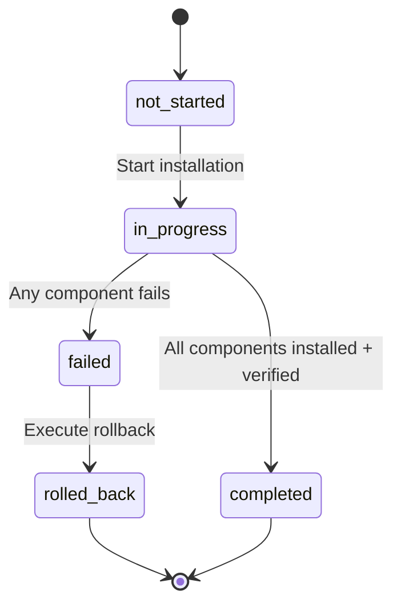
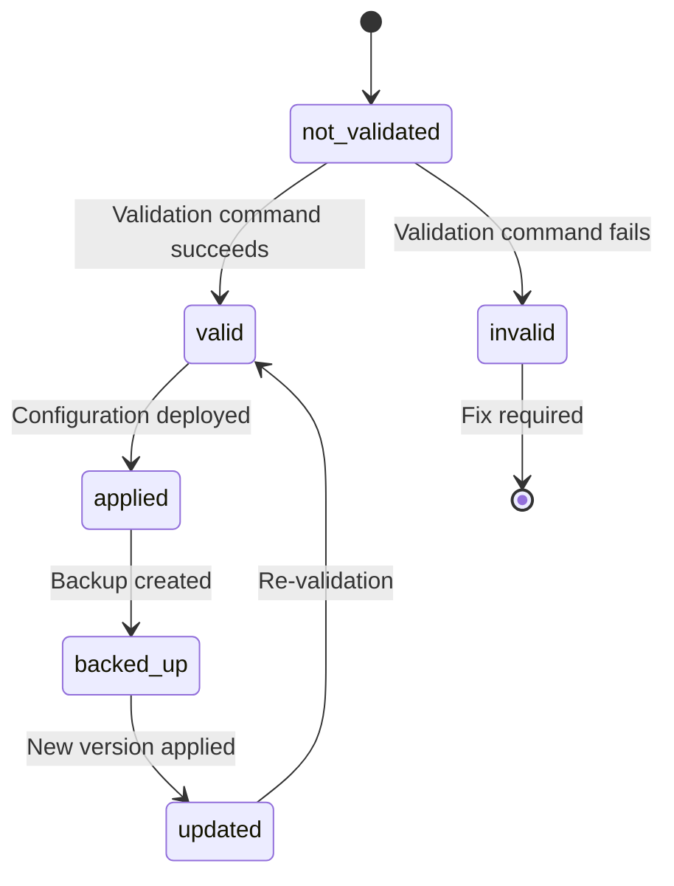
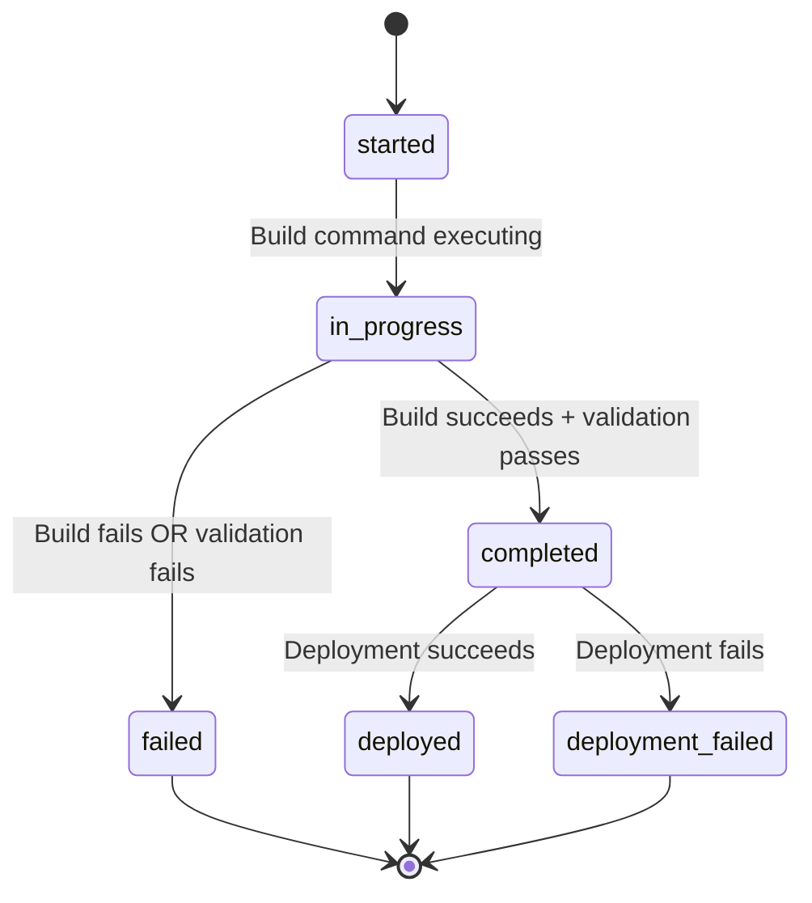
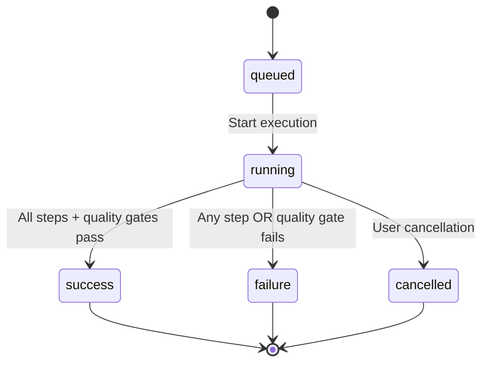
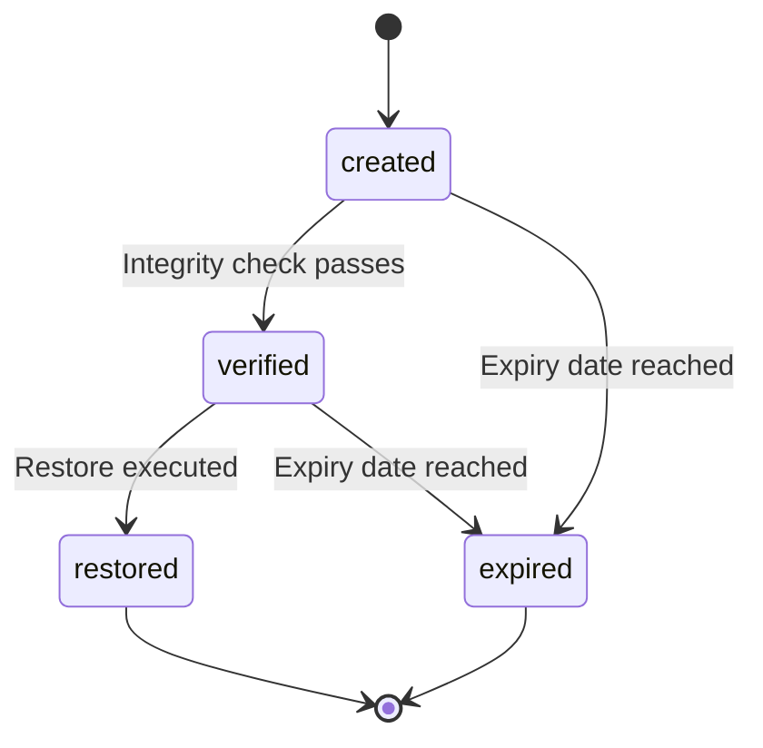
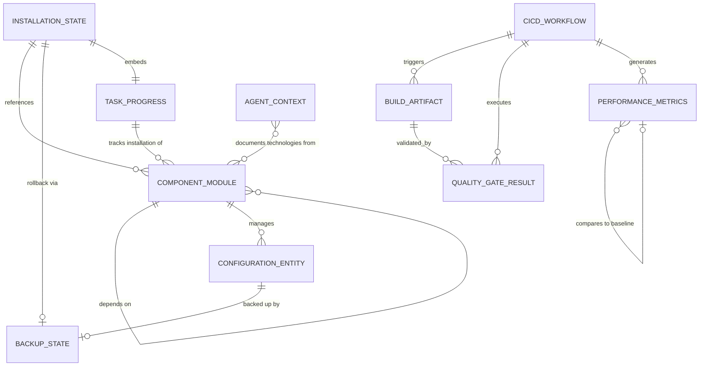

# Data Model: Complete Terminal Development Infrastructure
**Feature**: 005-complete-terminal-infrastructure
**Date**: 2025-11-16
**Status**: Phase 1 Design

This document defines all data entities, relationships, validation rules, and state transitions for the complete terminal infrastructure feature.

---

## Entity Catalog

| Entity ID | Entity Name | Primary Purpose | Storage Location |
|-----------|-------------|----------------|------------------|
| **E1** | Installation State | Track installation progress and component status | `/tmp/ghostty-start-logs/installation_state.json` |
| **E2** | Component Module | Define installable components (scripts, configs) | `scripts/*.sh` (code), `installation_manifest.json` (metadata) |
| **E3** | Configuration Entity | Manage application configurations | `~/.config/*/config`, `/tmp/ghostty-start-logs/config_state.json` |
| **E4** | Build Artifact | Documentation site build outputs | `docs/` directory, `website/build-manifest.json` |
| **E5** | CI/CD Workflow | Local workflow execution and results | `.runners-local/logs/*.json` |
| **E6** | Performance Metrics | System performance measurements | `.runners-local/logs/performance-*.json` |
| **E7** | Quality Gate Result | Accessibility, security, performance test results | `.runners-local/logs/quality-gates-*.json` |
| **E8** | Backup State | Configuration backups and restore points | `~/.config/*/backup-TIMESTAMP/`, `backup_manifest.json` |
| **E9** | Task Progress | Parallel task UI state (installation display) | `installation_state.json` (nested) |
| **E10** | Agent Context | AI assistant technology knowledge | `.specify/memory/agent-context-*.json` |

---

## E1: Installation State

### Purpose
Tracks overall installation progress, component statuses, and verification results for the unified terminal infrastructure setup.

### Schema
```json
{
  "installation_id": "string (UUID v4)",
  "timestamp_started": "ISO 8601 datetime",
  "timestamp_completed": "ISO 8601 datetime | null",
  "status": "enum (not_started, in_progress, completed, failed, rolled_back)",
  "current_phase": "string (e.g., 'Phase 5: Modular Scripts')",
  "components": [
    {
      "component_id": "string (e.g., 'ghostty', 'node', 'ai-tools')",
      "component_name": "string",
      "status": "enum (pending, installing, installed, failed, skipped)",
      "start_time": "ISO 8601 datetime | null",
      "end_time": "ISO 8601 datetime | null",
      "verification_status": "enum (not_verified, verified, failed_verification)",
      "verification_method": "string (command executed for verification)",
      "verification_output": "string | null",
      "subtasks": [
        {
          "subtask_id": "string",
          "description": "string",
          "status": "enum (pending, running, completed, failed)",
          "output": "string (truncated verbose output)",
          "collapsed": "boolean (true when subtask completed)"
        }
      ],
      "error": {
        "message": "string | null",
        "code": "string | null",
        "stacktrace": "string | null"
      }
    }
  ],
  "system_checks": {
    "ubuntu_version": "string (e.g., '25.10')",
    "kernel_version": "string",
    "passwordless_sudo": "boolean",
    "disk_space_gb": "number",
    "network_connectivity": "boolean"
  },
  "rollback_available": "boolean",
  "rollback_path": "string (path to backup directory) | null"
}
```

### Validation Rules
- **VR-E1-001**: `installation_id` MUST be unique UUID v4
- **VR-E1-002**: `status` transitions MUST follow state machine: `not_started` → `in_progress` → (`completed` | `failed` | `rolled_back`)
- **VR-E1-003**: `timestamp_completed` MUST be NULL when `status` is `not_started` or `in_progress`
- **VR-E1-004**: Component `status` MUST be `completed` when parent `status` is `completed`
- **VR-E1-005**: `verification_method` MUST be non-empty string when `verification_status` is `verified`
- **VR-E1-006**: `verification_status` MUST be `verified` before component marked as `installed`
- **VR-E1-007**: Subtask `collapsed` MUST be `true` when subtask `status` is `completed`

### Relationships
- **Has-Many**: Installation State → Component Status (1:N)
- **Has-Many**: Component Status → Subtask Progress (1:N)
- **References**: Installation State → Backup State (via `rollback_path`)

### State Transitions


### Business Rules
- **BR-E1-001**: System checks MUST pass before `status` transitions from `not_started` to `in_progress`
- **BR-E1-002**: Installation MUST NOT proceed if `passwordless_sudo` is `false`
- **BR-E1-003**: Components MUST install in dependency order (defined in Component Module entity)
- **BR-E1-004**: Parallel tasks MUST display on separate lines (FR-006)
- **BR-E1-005**: Verbose subtask output MUST collapse into parent when completed (FR-006)
- **BR-E1-006**: Verification MUST use dynamic status, not hardcoded messages (FR-007)

---

## E2: Component Module

### Purpose
Defines installable components, their dependencies, installation scripts, and verification methods.

### Schema
```json
{
  "component_id": "string (unique identifier)",
  "component_name": "string (human-readable)",
  "component_type": "enum (terminal, shell, ai_tool, unix_tool, web_tool, configuration)",
  "script_path": "string (absolute path to installation script)",
  "version_policy": "enum (latest_stable, specific_version, system_default)",
  "version_constraint": "string (e.g., '>=0.9.0') | null",
  "dependencies": [
    {
      "dependency_id": "string (component_id of dependency)",
      "dependency_type": "enum (required, optional, conflicts)"
    }
  ],
  "installation_method": "enum (apt, npm_global, cargo, from_source, manual)",
  "verification": {
    "command": "string (shell command to verify installation)",
    "expected_pattern": "string (regex pattern for success)",
    "timeout_seconds": "number"
  },
  "configuration_files": [
    {
      "source_path": "string (path in repository)",
      "destination_path": "string (absolute path in system)",
      "backup_required": "boolean",
      "merge_strategy": "enum (replace, merge, preserve_user)"
    }
  ],
  "estimated_install_time_seconds": "number",
  "estimated_disk_space_mb": "number",
  "priority": "enum (P1_critical, P2_recommended, P3_optional)"
}
```

### Validation Rules
- **VR-E2-001**: `component_id` MUST be unique across all modules
- **VR-E2-002**: `script_path` MUST point to existing executable file
- **VR-E2-003**: `dependencies` MUST NOT create circular references
- **VR-E2-004**: `verification.command` MUST be non-empty string
- **VR-E2-005**: `version_policy` = `latest_stable` when `version_constraint` is NULL (constitutional requirement)
- **VR-E2-006**: Components with `priority` = `P1_critical` MUST have `dependencies.dependency_type` = `required` for all deps

### Relationships
- **Has-Many**: Component Module → Component Module (dependencies, N:M)
- **Has-Many**: Component Module → Configuration Entity (1:N)
- **Referenced-By**: Installation State → Component Module (component_id)

### Dependency Graph Example
```
ghostty (P1_critical)
├── zig (required) → installed from source
└── libxkbcommon (required) → apt package

node (P1_critical)
└── fnm (required) → cargo install

ai-tools (P1_critical)
└── node (required) → dependency on 'node' component

unix-tools (P2_recommended)
└── No dependencies

web-development (P1_critical)
├── node (required)
└── uv (required) → cargo install or direct download
```

### Business Rules
- **BR-E2-001**: Components MUST install in topological sort order of dependency graph
- **BR-E2-002**: If dependency `dependency_type` is `required`, installation MUST fail if dependency not satisfied
- **BR-E2-003**: Latest stable version policy (FR-061, FR-064): `version_policy` = `latest_stable` for global installations
- **BR-E2-004**: Per-project versions via fnm .nvmrc override global policy (FR-062)
- **BR-E2-005**: Module scripts MUST complete independent tests in <10s (SC-015)

---

## E3: Configuration Entity

### Purpose
Manages application configurations, including Ghostty, ZSH, dircolors, and other dotfiles.

### Schema
```json
{
  "config_id": "string (UUID v4)",
  "config_name": "string (e.g., 'ghostty-config', 'zshrc')",
  "config_type": "enum (terminal, shell, editor, system)",
  "source_path": "string (path in repository)",
  "destination_path": "string (absolute path in system)",
  "current_hash": "string (SHA256 of current file) | null",
  "repository_hash": "string (SHA256 of repository version)",
  "user_customizations": [
    {
      "line_number": "number",
      "original_line": "string",
      "user_line": "string",
      "timestamp": "ISO 8601 datetime"
    }
  ],
  "merge_strategy": "enum (replace, preserve_user, merge_with_markers)",
  "backup_path": "string (path to backup) | null",
  "last_updated": "ISO 8601 datetime",
  "validation_command": "string (command to validate config) | null",
  "validation_status": "enum (not_validated, valid, invalid)",
  "validation_output": "string | null"
}
```

### Validation Rules
- **VR-E3-001**: `config_id` MUST be unique UUID v4
- **VR-E3-002**: `destination_path` MUST be absolute path
- **VR-E3-003**: `current_hash` != `repository_hash` indicates user customizations or updates needed
- **VR-E3-004**: `validation_status` MUST be `valid` before configuration applied
- **VR-E3-005**: `backup_path` MUST be non-NULL before `merge_strategy` = `replace` executed

### Relationships
- **Belongs-To**: Configuration Entity → Component Module (via config_name mapping)
- **Has-One**: Configuration Entity → Backup State (latest backup)
- **Has-Many**: Configuration Entity → User Customizations (1:N, embedded)

### State Transitions


### Business Rules
- **BR-E3-001**: User customizations MUST be preserved during updates (FR-074)
- **BR-E3-002**: Automatic backup MUST be created before configuration changes (FR-075)
- **BR-E3-003**: Ghostty config MUST be validated with `ghostty +show-config` before application
- **BR-E3-004**: Failed validation MUST trigger automatic rollback (FR-076)
- **BR-E3-005**: XDG-compliant paths: `~/.config/dircolors` (not `~/.dircolors`)

### Special Configurations

**Ghostty Configuration** (`~/.config/ghostty/config`):
- **Validation**: `ghostty +show-config` must exit 0
- **Critical Settings**: `linux-cgroup = single-instance` (constitutional requirement)
- **Merge Strategy**: `preserve_user` (user customizations maintained)

**ZSH Configuration** (`~/.zshrc`):
- **Validation**: `zsh -n ~/.zshrc` (syntax check)
- **Performance**: Startup time <50ms (SC-010)
- **Merge Strategy**: `merge_with_markers` (preserve user additions)

**Dircolors Configuration** (`~/.config/dircolors`):
- **Validation**: `dircolors ~/.config/dircolors` must exit 0
- **XDG Compliance**: MUST use `~/.config/dircolors` (not home directory)
- **Merge Strategy**: `replace` (standard configuration, user can override)

---

## E4: Build Artifact

### Purpose
Represents documentation site build outputs, including HTML, CSS, JavaScript, and critical .nojekyll file.

### Schema
```json
{
  "build_id": "string (UUID v4)",
  "timestamp": "ISO 8601 datetime",
  "build_status": "enum (started, in_progress, completed, failed)",
  "source_directory": "string (absolute path, e.g., 'website/src/')",
  "output_directory": "string (absolute path, e.g., 'docs/')",
  "build_command": "string (e.g., 'npm run build')",
  "build_duration_seconds": "number",
  "artifacts": [
    {
      "artifact_path": "string (relative to output_directory)",
      "artifact_type": "enum (html, css, js, image, nojekyll, other)",
      "size_bytes": "number",
      "hash": "string (SHA256)"
    }
  ],
  "lighthouse_scores": {
    "performance": "number (0-100)",
    "accessibility": "number (0-100)",
    "best_practices": "number (0-100)",
    "seo": "number (0-100)",
    "timestamp": "ISO 8601 datetime"
  },
  "bundle_analysis": {
    "javascript_total_kb": "number",
    "css_total_kb": "number",
    "images_total_kb": "number",
    "fonts_total_kb": "number"
  },
  "critical_files_present": {
    "nojekyll": "boolean",
    "index_html": "boolean",
    "astro_assets": "boolean"
  },
  "deployment_status": "enum (not_deployed, deployed, deployment_failed)",
  "deployment_url": "string | null",
  "error": {
    "message": "string | null",
    "stdout": "string | null",
    "stderr": "string | null"
  }
}
```

### Validation Rules
- **VR-E4-001**: `build_id` MUST be unique UUID v4
- **VR-E4-002**: `critical_files_present.nojekyll` MUST be `true` before `deployment_status` = `deployed` (CRITICAL)
- **VR-E4-003**: `lighthouse_scores.performance` >= 95 required for deployment (SC-013)
- **VR-E4-004**: `lighthouse_scores.accessibility` >= 95 required for deployment (SC-025, SC-047)
- **VR-E4-005**: `bundle_analysis.javascript_total_kb` < 100 required for deployment (SC-014, FR-026)
- **VR-E4-006**: `critical_files_present.index_html` MUST be `true`
- **VR-E4-007**: `critical_files_present.astro_assets` MUST be `true` (at least one file in _astro/ directory)

### Relationships
- **Belongs-To**: Build Artifact → CI/CD Workflow (build triggered by workflow)
- **Has-Many**: Build Artifact → Quality Gate Result (Lighthouse, accessibility, security)

### State Transitions


### Business Rules
- **BR-E4-001**: `.nojekyll` file ABSOLUTELY CRITICAL (constitutional requirement)
- **BR-E4-002**: Without `.nojekyll`, ALL CSS/JS assets return 404 on GitHub Pages
- **BR-E4-003**: 4 protection layers for `.nojekyll`: public/ directory, Vite plugin, post-build validation, pre-commit hooks
- **BR-E4-004**: Build MUST fail if Lighthouse scores < 95 (quality gate)
- **BR-E4-005**: Build MUST fail if JavaScript bundles >= 100KB (quality gate)
- **BR-E4-006**: Build output MUST be committed to repository (docs/ directory for GitHub Pages)
- **BR-E4-007**: Source documentation (website/src/) and build output (docs/) MUST be separated (FR-010, FR-011, FR-012)

---

## E5: CI/CD Workflow

### Purpose
Represents local CI/CD workflow executions, including GitHub Actions simulations, test runs, and validation results.

### Schema
```json
{
  "workflow_id": "string (UUID v4)",
  "workflow_name": "string (e.g., 'pre-commit-local', 'gh-workflow-local')",
  "workflow_type": "enum (pre_commit, pre_push, manual, scheduled)",
  "timestamp_started": "ISO 8601 datetime",
  "timestamp_completed": "ISO 8601 datetime | null",
  "status": "enum (queued, running, success, failure, cancelled)",
  "trigger": {
    "trigger_type": "enum (manual, git_hook, cron, api)",
    "triggered_by": "string (user or system)",
    "trigger_context": "object (git branch, commit hash, etc.)"
  },
  "steps": [
    {
      "step_id": "string",
      "step_name": "string",
      "command": "string",
      "status": "enum (pending, running, success, failure, skipped)",
      "start_time": "ISO 8601 datetime | null",
      "end_time": "ISO 8601 datetime | null",
      "duration_seconds": "number",
      "exit_code": "number | null",
      "stdout": "string (truncated if >10KB)",
      "stderr": "string (truncated if >10KB)"
    }
  ],
  "quality_gates": [
    {
      "gate_name": "string (e.g., 'shellcheck', 'lighthouse', 'axe-core')",
      "gate_status": "enum (passed, failed, skipped)",
      "threshold": "string (e.g., '>=95', 'zero violations')",
      "actual_value": "string",
      "blocking": "boolean"
    }
  ],
  "performance_metrics": {
    "total_duration_seconds": "number",
    "cpu_usage_percent": "number",
    "memory_usage_mb": "number"
  },
  "github_actions_minutes_consumed": "number (MUST be 0 for local workflows)",
  "error": {
    "message": "string | null",
    "failed_step": "string | null"
  }
}
```

### Validation Rules
- **VR-E5-001**: `workflow_id` MUST be unique UUID v4
- **VR-E5-002**: `status` transitions MUST follow state machine: `queued` → `running` → (`success` | `failure` | `cancelled`)
- **VR-E5-003**: `github_actions_minutes_consumed` MUST be 0 for all local workflows (constitutional requirement)
- **VR-E5-004**: `quality_gates` with `blocking` = `true` and `gate_status` = `failed` MUST cause workflow `status` = `failure`
- **VR-E5-005**: `performance_metrics.total_duration_seconds` MUST be < 120 (2 minutes, SC-012, constitutional requirement)

### Relationships
- **Has-Many**: CI/CD Workflow → Workflow Step (1:N)
- **Has-Many**: CI/CD Workflow → Quality Gate Result (1:N)
- **Triggers**: CI/CD Workflow → Build Artifact (workflow can trigger build)

### State Transitions


### Business Rules
- **BR-E5-001**: Local CI/CD MUST execute before ANY GitHub operations (constitutional requirement)
- **BR-E5-002**: Zero GitHub Actions consumption for routine operations (constitutional requirement)
- **BR-E5-003**: Complete local workflow MUST execute in <2 minutes (performance target)
- **BR-E5-004**: Blocking quality gates MUST prevent deployment if failed
- **BR-E5-005**: Local GitHub Actions runners MUST support ALL workflow features (FR-031, FR-032)

### Quality Gates

**Required Gates** (blocking = true):
1. **shellcheck**: Zero errors in shell scripts
2. **Lighthouse Performance**: >= 95
3. **Lighthouse Accessibility**: >= 95
4. **Lighthouse Best Practices**: >= 95
5. **Lighthouse SEO**: >= 95
6. **axe-core**: Zero violations (WCAG 2.1 Level AA)
7. **npm audit**: Zero high/critical vulnerabilities
8. **Bundle Size**: JavaScript < 100KB

**Optional Gates** (blocking = false):
1. **Build Time**: Track but don't block if exceeds target
2. **Memory Usage**: Monitor but don't block
3. **Test Coverage**: Monitor trends

---

## E6: Performance Metrics

### Purpose
Captures and tracks system performance measurements, including shell startup, terminal startup, and web performance.

### Schema
```json
{
  "metric_id": "string (UUID v4)",
  "timestamp": "ISO 8601 datetime",
  "metric_type": "enum (shell_startup, terminal_startup, build_performance, web_performance)",
  "measurements": {
    "shell_startup_ms": "number | null",
    "terminal_startup_ms": "number | null",
    "build_duration_seconds": "number | null",
    "lighthouse_performance": "number (0-100) | null",
    "lighthouse_accessibility": "number (0-100) | null",
    "lighthouse_best_practices": "number (0-100) | null",
    "lighthouse_seo": "number (0-100) | null"
  },
  "system_context": {
    "hostname": "string",
    "kernel_version": "string",
    "cpu_model": "string",
    "memory_total_gb": "number",
    "disk_free_gb": "number"
  },
  "performance_targets": {
    "shell_startup_target_ms": 50,
    "terminal_startup_target_ms": 500,
    "lighthouse_target": 95,
    "build_duration_target_seconds": 120
  },
  "targets_met": {
    "shell_startup": "boolean",
    "terminal_startup": "boolean",
    "web_performance": "boolean",
    "build_performance": "boolean"
  },
  "baseline_comparison": {
    "baseline_id": "string (UUID of baseline measurement) | null",
    "percent_change": "number (positive = improvement)",
    "regression": "boolean"
  }
}
```

### Validation Rules
- **VR-E6-001**: `metric_id` MUST be unique UUID v4
- **VR-E6-002**: `measurements.shell_startup_ms` MUST be <= 50 for `targets_met.shell_startup` = `true` (SC-010)
- **VR-E6-003**: `measurements.terminal_startup_ms` MUST be <= 500 for `targets_met.terminal_startup` = `true` (SC-011)
- **VR-E6-004**: `measurements.lighthouse_*` MUST be >= 95 for `targets_met.web_performance` = `true` (SC-013, SC-025, SC-047)
- **VR-E6-005**: `measurements.build_duration_seconds` MUST be <= 120 for `targets_met.build_performance` = `true` (SC-012)

### Relationships
- **References**: Performance Metrics → Performance Metrics (baseline_id for comparisons)
- **Referenced-By**: CI/CD Workflow → Performance Metrics (workflows generate metrics)

### Business Rules
- **BR-E6-001**: Baseline measurements MUST be established during initial installation
- **BR-E6-002**: Performance regressions MUST be detected by comparing to baseline
- **BR-E6-003**: Weekly performance reports MUST aggregate metrics (FR-054)
- **BR-E6-004**: Performance targets from success criteria are non-negotiable

---

## E7: Quality Gate Result

### Purpose
Stores results from automated quality gates, including accessibility, security, and performance testing.

### Schema
```json
{
  "result_id": "string (UUID v4)",
  "timestamp": "ISO 8601 datetime",
  "gate_type": "enum (accessibility, security, performance, validation)",
  "tool_name": "string (e.g., 'axe-core', 'npm-audit', 'lighthouse', 'shellcheck')",
  "tool_version": "string",
  "target": "string (what was tested, e.g., 'docs/index.html', 'scripts/install_node.sh')",
  "status": "enum (passed, failed, warning, error)",
  "score": "number (0-100) | null",
  "threshold": "number | string (e.g., 95, 'zero violations')",
  "violations": [
    {
      "violation_id": "string",
      "severity": "enum (critical, high, medium, low, info)",
      "category": "string (e.g., 'WCAG 2.1 Level AA', 'security vulnerability')",
      "description": "string",
      "location": "string (file:line or DOM selector)",
      "remediation": "string (suggested fix)"
    }
  ],
  "summary": {
    "total_checks": "number",
    "passed": "number",
    "failed": "number",
    "warnings": "number"
  },
  "blocking": "boolean (does this gate block deployment?)",
  "error": {
    "message": "string | null",
    "stacktrace": "string | null"
  }
}
```

### Validation Rules
- **VR-E7-001**: `result_id` MUST be unique UUID v4
- **VR-E7-002**: `gate_type` = `accessibility` with `status` = `failed` MUST have `violations` array with `category` containing 'WCAG'
- **VR-E7-003**: `gate_type` = `security` with `status` = `failed` MUST have `violations` with `severity` in ('critical', 'high')
- **VR-E7-004**: `blocking` = `true` and `status` = `failed` MUST prevent deployment
- **VR-E7-005**: `score` >= `threshold` required for `status` = `passed` (when score applicable)

### Relationships
- **Belongs-To**: Quality Gate Result → CI/CD Workflow (gate executed during workflow)
- **Belongs-To**: Quality Gate Result → Build Artifact (for Lighthouse/accessibility results)

### Business Rules
- **BR-E7-001**: Accessibility gate (axe-core) MUST achieve zero violations for WCAG 2.1 Level AA (FR-029, SC-045, SC-046)
- **BR-E7-002**: Security gate (npm audit) MUST report zero high/critical vulnerabilities (FR-030, SC-048, SC-049)
- **BR-E7-003**: Performance gate (Lighthouse) MUST achieve 95+ all metrics (FR-025, SC-013)
- **BR-E7-004**: Blocking gates MUST prevent deployment if failed

### Quality Gate Configurations

**Accessibility Gate** (axe-core):
- **Tool**: @axe-core/cli
- **Threshold**: Zero violations (WCAG 2.1 Level AA)
- **Blocking**: true
- **Success Criteria**: SC-045, SC-046, SC-047

**Security Gate** (npm audit):
- **Tool**: npm audit
- **Threshold**: Zero high/critical vulnerabilities
- **Blocking**: true
- **Success Criteria**: SC-048, SC-049

**Performance Gate** (Lighthouse):
- **Tool**: lighthouse
- **Threshold**: 95+ (Performance, Accessibility, Best Practices, SEO)
- **Blocking**: true
- **Success Criteria**: SC-013, SC-025, SC-047

**Validation Gate** (shellcheck):
- **Tool**: shellcheck
- **Threshold**: Zero errors
- **Blocking**: true
- **Success Criteria**: Implicit (code quality)

---

## E8: Backup State

### Purpose
Manages configuration backups and restore points for safe rollback during failures.

### Schema
```json
{
  "backup_id": "string (UUID v4)",
  "timestamp": "ISO 8601 datetime",
  "backup_type": "enum (automatic, manual, pre_migration, pre_update)",
  "backup_path": "string (absolute path to backup directory)",
  "backed_up_items": [
    {
      "item_type": "enum (configuration, package_state, system_state)",
      "source_path": "string",
      "backup_path": "string",
      "size_bytes": "number",
      "hash": "string (SHA256)"
    }
  ],
  "system_snapshot": {
    "ubuntu_version": "string",
    "kernel_version": "string",
    "installed_packages": "array of strings (package names + versions)",
    "configuration_hashes": "object (config file paths → SHA256 hashes)"
  },
  "restore_instructions": "string (human-readable restore steps)",
  "restore_script": "string (path to automated restore script)",
  "verified": "boolean (has backup integrity been verified?)",
  "restore_tested": "boolean (has restore been tested?)",
  "expiry_date": "ISO 8601 datetime | null (when backup can be deleted)",
  "status": "enum (created, verified, restored, expired)"
}
```

### Validation Rules
- **VR-E8-001**: `backup_id` MUST be unique UUID v4
- **VR-E8-002**: `backup_path` MUST exist and be readable
- **VR-E8-003**: `verified` MUST be `true` before backup used for restore
- **VR-E8-004**: `backed_up_items` MUST include all configuration files for `backup_type` = `pre_update`
- **VR-E8-005**: `restore_script` MUST be executable file

### Relationships
- **Referenced-By**: Installation State → Backup State (via `rollback_path`)
- **Referenced-By**: Configuration Entity → Backup State (latest backup)

### State Transitions


### Business Rules
- **BR-E8-001**: Automatic backup MUST be created before configuration changes (FR-075)
- **BR-E8-002**: Failed operations MUST trigger automatic rollback (FR-076)
- **BR-E8-003**: Backup integrity MUST be verified (hash checks) before use
- **BR-E8-004**: Backups MUST preserve user customizations (FR-074)
- **BR-E8-005**: Timestamped backup directories prevent overwrites

---

## E9: Task Progress (Parallel Task UI)

### Purpose
Manages parallel task display state for installation UI, including task status, subtask collapsing, and screen management.

### Schema
```json
{
  "session_id": "string (UUID v4)",
  "timestamp_started": "ISO 8601 datetime",
  "display_mode": "enum (parallel, sequential, quiet)",
  "screen_height": "number (terminal lines)",
  "max_visible_tasks": "number (calculated from screen_height)",
  "tasks": [
    {
      "task_id": "string",
      "task_name": "string",
      "task_type": "enum (download, install, configure, validate)",
      "display_line": "number (line number on screen)",
      "status": "enum (pending, running, completed, failed)",
      "status_icon": "string (e.g., '⏳', '▶', '✓', '✗')",
      "start_time": "ISO 8601 datetime | null",
      "end_time": "ISO 8601 datetime | null",
      "subtasks": [
        {
          "subtask_id": "string",
          "description": "string",
          "status": "enum (pending, running, completed, failed)",
          "collapsed": "boolean",
          "verbose_output": "string (full output, stored but not displayed when collapsed)"
        }
      ],
      "collapsed_summary": "string (one-line summary when task completed)",
      "verification": {
        "method": "string (command or check performed)",
        "result": "string (dynamic verification result)",
        "status": "enum (not_started, verifying, verified, failed)"
      }
    }
  ],
  "current_task_index": "number (which task is currently active)",
  "completed_tasks": "number",
  "total_tasks": "number",
  "overall_progress_percent": "number (0-100)"
}
```

### Validation Rules
- **VR-E9-001**: `session_id` MUST be unique UUID v4
- **VR-E9-002**: `tasks[].display_line` MUST be unique for each visible task
- **VR-E9-003**: `tasks[].status` = `completed` MUST have `collapsed_summary` non-empty (FR-008)
- **VR-E9-004**: `tasks[].subtasks[].collapsed` MUST be `true` when subtask `status` = `completed` (FR-006)
- **VR-E9-005**: `tasks[].verification.method` MUST be non-empty when task requires verification (FR-007)
- **VR-E9-006**: `max_visible_tasks` <= `screen_height` - 5 (reserve space for header/footer)

### Relationships
- **Embedded-In**: Task Progress → Installation State (as `task_progress` property)
- **References**: Task Progress → Component Module (tasks correspond to components)

### Business Rules
- **BR-E9-001**: Each task MUST display on separate line (FR-006, clarification 2025-11-16)
- **BR-E9-002**: Verbose subtasks MUST collapse into parent task when completed (FR-006)
- **BR-E9-003**: Screen MUST remain clean and tidy (FR-006, FR-008)
- **BR-E9-004**: User MUST always see current step and overall progress (SC-028)
- **BR-E9-005**: Verification MUST use dynamic status, not hardcoded messages (FR-007)

### Display Example
```
╔══════════════════════════════════════════════════════════╗
║ Installing Complete Terminal Infrastructure (47%)       ║
╠══════════════════════════════════════════════════════════╣
║ ✓ Installing Ghostty from source (complete)             ║
║ ✓ Installing Node.js via fnm (complete)                 ║
║ ▶ Installing AI tools (2/3 complete)                    ║
║   ├── ✓ Claude Code (verified)                          ║
║   ├── ▶ Gemini CLI (installing v1.2.0...)               ║
║   └── ⏳ Copilot CLI (pending)                           ║
║ ⏳ Building documentation site (pending)                 ║
║ ⏳ Configuring shell environment (pending)               ║
╠══════════════════════════════════════════════════════════╣
║ Step 3/5 • Estimated: 2 minutes remaining               ║
╚══════════════════════════════════════════════════════════╝
```

---

## E10: Agent Context

### Purpose
Maintains AI assistant technology knowledge, tracking project technologies for context-aware assistance.

### Schema
```json
{
  "agent_type": "enum (claude, gemini, copilot)",
  "context_file_path": "string (e.g., '.specify/memory/agent-context-claude.json')",
  "last_updated": "ISO 8601 datetime",
  "technologies": [
    {
      "technology_name": "string (e.g., 'Astro', 'Tailwind CSS', 'DaisyUI')",
      "technology_category": "enum (language, framework, library, tool)",
      "version": "string (e.g., '>=5.0', 'latest')",
      "purpose": "string (why used in project)",
      "documentation_url": "string | null",
      "added_by_feature": "string (feature ID that introduced this technology)"
    }
  ],
  "manual_additions": [
    {
      "content": "string (user-added context)",
      "added_date": "ISO 8601 datetime"
    }
  ],
  "auto_managed_section": {
    "start_marker": "string (e.g., '<!-- AUTO-MANAGED SECTION START -->')",
    "end_marker": "string (e.g., '<!-- AUTO-MANAGED SECTION END -->')",
    "last_sync": "ISO 8601 datetime"
  }
}
```

### Validation Rules
- **VR-E10-001**: `agent_type` MUST match supported AI assistants (claude, gemini, copilot)
- **VR-E10-002**: `technologies[].version` = 'latest' when latest-stable policy applies
- **VR-E10-003**: `manual_additions` MUST be preserved during auto-updates

### Relationships
- **Updated-By**: Agent Context ← Component Module (when new technologies added)

### Business Rules
- **BR-E10-001**: Agent context MUST update after Phase 1 design (plan workflow requirement)
- **BR-E10-002**: Manual user additions MUST be preserved between auto-managed markers
- **BR-E10-003**: Technology list MUST reflect latest-stable version policy

---

## Entity Relationship Diagram



---

## Data Validation Summary

| Entity | Critical Validations | Performance Considerations |
|--------|---------------------|----------------------------|
| **E1: Installation State** | Status transitions, verification before completion | Real-time updates for parallel task UI |
| **E2: Component Module** | Dependency acyclicity, version policy compliance | Topological sort for installation order |
| **E3: Configuration Entity** | Hash verification, validation before apply | Backup before every change |
| **E4: Build Artifact** | .nojekyll presence (CRITICAL), Lighthouse >= 95 | Bundle size < 100KB enforcement |
| **E5: CI/CD Workflow** | Zero GitHub Actions minutes, <2min execution | Parallel step execution where possible |
| **E6: Performance Metrics** | Shell <50ms, Terminal <500ms, Lighthouse >= 95 | Baseline comparison for regression detection |
| **E7: Quality Gate Result** | Blocking gates prevent deployment | axe-core, npm audit, Lighthouse integration |
| **E8: Backup State** | Integrity verification before restore | Timestamped to prevent overwrites |
| **E9: Task Progress** | Subtask collapse on completion, dynamic verification | Screen space management for clean UI |
| **E10: Agent Context** | Preserve manual additions during updates | Auto-managed section markers |

---

## Implementation Notes

### Storage Strategy
- **Ephemeral Data** (session-only): `/tmp/ghostty-start-logs/*.json`
- **Persistent Data** (across sessions): `~/.config/*/`, `.runners-local/logs/*.json`
- **Build Artifacts** (committed): `docs/` directory (GitHub Pages)
- **Configuration Backups** (timestamped): `~/.config/*/backup-YYYYMMDD-HHMMSS/`

### Performance Considerations
- Installation State updates: Real-time for UI responsiveness
- Performance Metrics: Weekly aggregation to prevent log bloat
- Quality Gate Results: Retained for last 30 days, then archived
- Backup State: Auto-expire backups older than 90 days (configurable)

### Constitutional Compliance
- **Branch Preservation**: Not applicable to data model (git workflow only)
- **GitHub Pages Protection**: E4 Build Artifact enforces .nojekyll presence
- **Local CI/CD First**: E5 CI/CD Workflow validates zero Actions consumption
- **Agent File Integrity**: E10 Agent Context maintains technology knowledge
- **LLM Conversation Logging**: Not part of data model (manual process)
- **Zero-Cost Operations**: E5 CI/CD Workflow tracks GitHub Actions minutes (must be 0)

---

**Data Model Status**: ✅ COMPLETE
**Total Entities**: 10 (E1-E10)
**Total Validation Rules**: 65+ across all entities
**Total Business Rules**: 60+ across all entities
**Constitutional Compliance**: All 6 principles addressed

**Next Steps**: Proceed to API contracts generation (Phase 1 continued)
