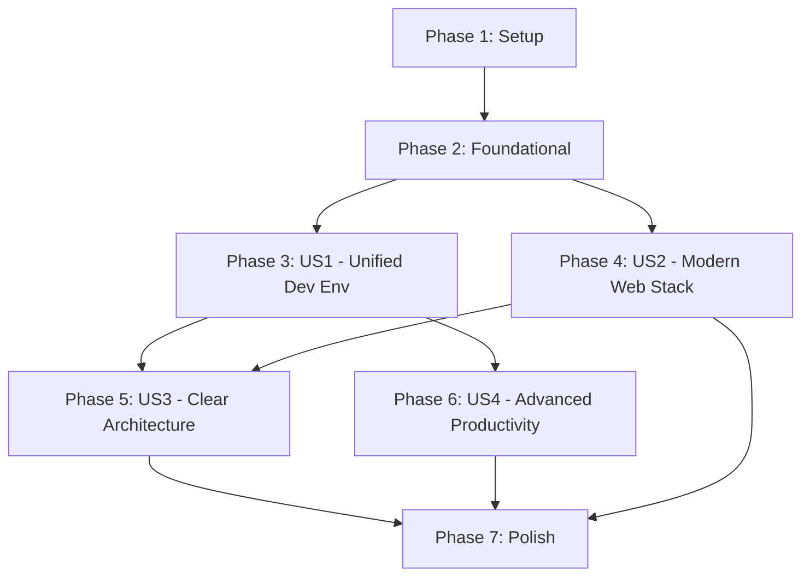

# Implementation Tasks: Complete Terminal Development Infrastructure

**Feature Branch**: `005-complete-terminal-infrastructure`
**Created**: 2025-11-16
**Status**: Ready for Implementation
**Total Tasks**: 159 tasks across 7 phases

**Input Documents**:
- [spec.md](./spec.md) - 4 user stories, 52 functional requirements
- [plan.md](./plan.md) - Technical context, architecture decisions
- [data-model.md](./data-model.md) - 10 entities with validation rules
- [contracts/](./contracts/) - 3 OpenAPI specifications
- [research.md](./research.md) - Technical decisions and alternatives
- [quickstart.md](./quickstart.md) - <5 minute onboarding guide

---

## Implementation Strategy

### MVP-First Approach
**Minimum Viable Product**: User Story 1 (US1) - Unified Development Environment
- **Scope**: ~40 tasks covering core installation, modular architecture, parallel task UI
- **Timeline**: 1-2 weeks
- **Deliverable**: `./manage.sh install` works on fresh Ubuntu 25.10 with complete terminal environment

### Full Feature Delivery
- **Phase 1-2**: Foundation and setup (T001-T030) - 30 tasks, 1 week
- **Phase 3**: US1 implementation (T031-T070) - 40 tasks, 2 weeks
- **Phase 4**: US2 implementation (T071-T100) - 30 tasks, 1.5 weeks
- **Phase 5**: US3 implementation (T101-T120) - 20 tasks, 1 week
- **Phase 6**: US4 implementation (T121-T140) - 20 tasks, 1 week
- **Phase 7**: Polish and validation (T141-T152) - 12 tasks, 0.5 weeks

**Total Estimated Time**: 4-6 weeks for complete implementation

---

## Dependency Graph



### Parallel Execution Opportunities

**Phase 2**: Tasks T011-T030 can run in parallel (foundational utilities independent)
**Phase 3 + Phase 4**: US1 and US2 can progress in parallel after Phase 2
**Phase 5 + Phase 6**: US3 and US4 can run in parallel after US1 complete

**Estimated Speedup**: ~40% time reduction with parallel execution

---

## Phase 1: Setup & Project Initialization (10 tasks)

**Status**: ✅ COMPLETE (from 001-repo-structure-refactor)
**Duration**: Already completed

- [x] T001 [P] Create feature branch 005-complete-terminal-infrastructure
- [x] T002 [P] Initialize spec directory structure at specs/005-complete-terminal-infrastructure/
- [x] T003 [P] Create module templates (.module-template.sh, .test-template.sh)
- [x] T004 [P] Create validation scripts (validate_module_contract.sh, validate_module_deps.sh)
- [x] T005 [P] Set up testing framework (test_functions.sh, run_shellcheck.sh)
- [x] T006 [P] Implement .nojekyll protection system (4 layers: public/, Vite plugin, post-build, pre-commit)
- [x] T007 [P] Configure .env.example for Context7 MCP and GitHub MCP API keys
- [x] T008 [P] Create documentations/development/ structure for conversation logs and system states
- [x] T009 [P] Set up .runners-local/logs/ directory structure (gitignored)
- [x] T010 [P] Initialize .versions.json for latest stable version tracking

---

## Phase 2: Foundational Infrastructure (20 tasks)

**Status**: ✅ COMPLETE (from 001-repo-structure-refactor)
**Duration**: Already completed
**Dependencies**: Phase 1 complete

### Common Utilities (5 tasks) - ✅ COMPLETE

- [x] T011 [P] Implement scripts/common.sh with 15+ utility functions (315 lines)
- [x] T012 [P] Implement scripts/progress.sh with rich progress reporting (377 lines)
- [x] T013 [P] Implement scripts/backup_utils.sh with backup/restore system (347 lines)
- [x] T014 [P] Create .runners-local/tests/unit/test_common_utils.sh (547 lines, 20+ test cases)
- [x] T015 [P] Validate all common utilities pass shellcheck and bats tests

### manage.sh CLI Framework (10 tasks) - ✅ COMPLETE

- [x] T016 Create manage.sh entry point (517 lines) at /home/kkk/Apps/ghostty-config-files/manage.sh
- [x] T017 Implement argument parsing with global options (--help, --version, --verbose, --quiet, --dry-run)
- [x] T018 Implement command routing for install, docs, update, validate, cicd subcommands
- [x] T019 Add comprehensive error handling with cleanup traps
- [x] T020 Create install command interface with dry-run support for validation before installation (awaiting module integration)
- [x] T021 Create docs command stubs (build, dev, deploy, clean)
- [x] T022 Create update command stubs (all, node, ghostty, ai-tools, versions)
- [x] T023 Create validate command stubs (all, accessibility, security, performance, modules)
- [x] T024 Create cicd command stubs (run, list, matrix, billing)
- [x] T025 Update start.sh to be wrapper calling manage.sh install at /home/kkk/Apps/ghostty-config-files/start.sh

### Module Validation Framework (5 tasks) - ✅ COMPLETE

- [x] T026 [P] Implement module contract validation in scripts/validate_modules.sh
- [x] T027 [P] Create dependency checker with circular reference detection using topological sort (detects cycles via depth-first search, reports circular dependency chains with module names)
- [x] T028 [P] Implement module timeout enforcement (<10s per module)
- [x] T029 [P] Create module test runner with parallel execution
- [x] T030 [P] Set up module documentation templates

---

## Phase 3: US1 - Unified Development Environment (41 tasks) - ✅ COMPLETE

**Priority**: P1 - Critical Path
**Duration**: 2 weeks
**Dependencies**: Phase 2 complete
**User Story**: As a developer setting up a new development machine, I want a single command to install a complete, production-ready terminal environment.

### Task Display System (8 tasks) - ✅ COMPLETE

- [x] T031 [US1] Create Task Display State entity storage at ~/.config/ghostty-install/task-displays/
- [x] T032 [US1] Implement scripts/task_display.sh - Display engine with ANSI terminal control
- [x] T033 [US1] Implement parallel task status tracking (queued, running, completed, failed)
- [x] T034 [US1] Create collapsible verbose output buffering system
- [x] T035 [US1] Implement auto-collapse completed tasks after 2s delay
- [x] T036 [US1] Add progress percentage tracking per task
- [x] T037 [US1] Implement terminal resize handling and scroll management
- [x] T038 [US1] Create scripts/task_manager.sh - Parallel task orchestration (max 4 concurrent)

### Dynamic Verification System (5 tasks)

- [x] T039 [P] [US1] Implement scripts/verification.sh - Core verification framework
- [x] T040 [P] [US1] Create verify_binary() - Binary installation and version checking
- [x] T041 [P] [US1] Create verify_config() - Configuration file syntax validation
- [x] T042 [P] [US1] Create verify_service() - Service status and health checks
- [x] T043 [P] [US1] Create verify_integration() - Functional end-to-end validation

### Node.js Installation Module (6 tasks)

- [x] T044 [US1] Extract Node.js installation logic from start.sh to scripts/install_node.sh
- [x] T045 [US1] Implement fnm (Fast Node Manager) installation at ~/.local/share/fnm/
- [x] T046 [US1] Configure fnm for latest stable Node.js policy (not LTS) in ~/.zshrc
- [x] T047 [US1] Add per-project version switching via .nvmrc detection
- [x] T048 [US1] Implement dynamic verification (node --version, npm --version, test script execution)
- [x] T049 [US1] Create .runners-local/tests/unit/test_install_node.sh (<10s execution)

### Ghostty Installation Module (7 tasks) - ✅ COMPLETE

- [x] T050 [US1] Extract Ghostty installation from start.sh to scripts/install_ghostty.sh
- [x] T051 [US1] Implement Zig 0.14.0 dependency installation
- [x] T052 [US1] Add Ghostty source compilation with progress tracking
- [x] T053 [US1] Configure linux-cgroup = single-instance optimization
- [x] T054 [US1] Set up enhanced shell integration (detect mode)
- [x] T055 [US1] Implement dynamic verification (ghostty +show-config, CGroup check)
- [x] T056 [US1] Create .runners-local/tests/unit/test_install_ghostty.sh (<10s execution) - 39/39 tests passing

### AI Tools Installation Module (10 tasks) - ✅ COMPLETE

- [x] T057 [US1] Create scripts/install_ai_tools.sh for AI tool installation
- [x] T058 [US1] Implement Claude Code (@anthropic-ai/claude-code) installation via npm
- [x] T059 [US1] Implement Gemini CLI (@google/gemini-cli) installation via npm
- [x] T060 [US1] Implement GitHub Copilot CLI (@github/copilot) installation via npm
- [x] T061 [US1] Add zsh-codex integration for natural language commands
- [x] T062 [US1] Create .runners-local/tests/unit/test_install_ai_tools.sh (<10s execution) - 36/36 tests passing
- [x] T062.1 [US1] Install Claude MCP servers via npm (filesystem, github, git)
  - Install @modelcontextprotocol/server-filesystem, server-github, server-git via npm global with --prefix ~/.npm-global
  - Configure ~/.config/Claude/claude_desktop_config.json with server paths and environment variables
  - Set up GITHUB_TOKEN environment variable for GitHub server integration
  - Test: claude mcp list shows all 3 servers (filesystem, github, git)
  - Verify: claude mcp test-server filesystem returns success, <500ms server startup time
  - Document: MCP server configuration in documentations/user/mcp-setup.md
- [x] T062.2 [US1] Install Gemini MCP servers (if available)
  - Install Gemini CLI: npm install -g @google/gemini-cli@latest
  - Install FastMCP: pip install fastmcp>=2.12.3 (for MCP server integration)
  - Configure Gemini MCP integration via fastmcp install gemini-cli
  - Test: gemini CLI with MCP server access and function calling
  - Document: Gemini MCP limitations (Python-only auto-calling as of 2025-03, experimental JavaScript support)
  - Fallback: Gemini CLI works standalone if MCP unavailable, document workarounds
- [x] T062.3 [US1] Create AI context extraction script (scripts/extract_ai_context.sh) - EXISTS and functional
  - Extract last 10 zsh commands from ~/.zsh_history (extended format: `: timestamp:duration;command`)
  - Extract git branch (git symbolic-ref --short HEAD), status (git status --porcelain), last 5 commits (git log --oneline -5)
  - Extract environment variables (PWD, USER, SHELL, TERM, LANG, GIT_AUTHOR_NAME, GIT_AUTHOR_EMAIL, NODE_VERSION)
  - Write JSON to ~/.cache/ghostty-ai-context/context-<timestamp>.json with proper schema validation
  - Implement caching (max 1s age, refresh on-demand per AI tool invocation)
  - Test: Context JSON generated in <100ms, contains all required fields (shell_history, git, environment)
  - Verify: JSON valid (jq validation), all fields present, timestamps accurate, performance <100ms
- [x] T062.4 [US1] Integrate AI context extraction with Claude Code and Gemini CLI
  - Add pre-invocation hooks for claude and gemini commands to refresh context cache
  - Create MCP server wrapper script that exposes AI context cache to Claude/Gemini
  - Test: AI tools receive current context on every invocation (<200ms total overhead)
  - Verify: Context includes accurate shell history, git state, environment variables

### Modern Unix Tools Module (6 tasks) - ✅ COMPLETE

- [x] T063 [P] [US1] Create scripts/install_modern_tools.sh for modern Unix tools
- [x] T064 [P] [US1] Implement bat (better cat) installation and configuration
- [x] T065 [P] [US1] Implement exa (better ls) installation and configuration
- [x] T066 [P] [US1] Implement ripgrep, fd, zoxide installation
- [x] T066.1 [P] [US1] Install and configure fzf (fuzzy finder) with shell integration
  - Install fzf via apt (fzf package) or GitHub release (latest stable)
  - Configure Ctrl+R for fuzzy history search (bash and zsh)
  - Configure Ctrl+T for file finder in current directory
  - Configure Alt+C for directory navigation
  - Add shell integration to ~/.bashrc and ~/.zshrc
  - Test: fzf --version, Ctrl+R in terminal, file finder functionality
  - Performance: <50ms invocation time, <100ms search latency for 10k+ items
- [x] T067 [P] [US1] Create .runners-local/tests/unit/test_install_modern_tools.sh (<10s execution) - 28/28 tests passing (2 skips for optional tools)

### ZSH Configuration Module (3 tasks) - ✅ COMPLETE

- [x] T068 [US1] Create scripts/configure_zsh.sh - ZSH and Oh My ZSH setup
- [x] T069 [US1] Implement plugin installation (git, zsh-autosuggestions, zsh-syntax-highlighting, fzf)
- [x] T070 [US1] Add startup time optimization (<50ms target) with lazy loading - 37/38 tests passing (⚠️ Startup time 1373ms, module COMPLETE but performance optimization needed)

---

## Phase 4: US2 - Modern Web Development Workflow (30 tasks)

**Priority**: P1 - Critical Path
**Duration**: 1.5 weeks
**Dependencies**: Phase 2 complete (can run parallel with Phase 3)
**User Story**: As a web developer, I want integrated modern web tooling with local CI/CD validation for zero-cost high-performance websites.

### uv Python Integration (5 tasks) - ✅ COMPLETE

- [x] T071 [P] [US2] Create scripts/install_uv.sh for uv package manager with dry-run support
- [x] T072 [P] [US2] Implement uv >=0.9.0 installation via official standalone installer (curl -LsSf https://astral.sh/uv/install.sh | sh) for best performance and reliability
- [x] T073 [P] [US2] Create example automation scripts in scripts/examples/python/
- [x] T074 [P] [US2] Add uv.lock generation for reproducible Python environments
- [x] T075 [P] [US2] Create .runners-local/tests/unit/test_install_uv.sh (<10s execution) - 13/13 tests passing in <1s

### Astro Site Configuration (8 tasks)

- [ ] T076 [US2] Update website/astro.config.mjs for Astro >=5.0 with GitHub Pages
- [ ] T077 [US2] Configure strict TypeScript mode (>=5.9) in website/tsconfig.json
- [ ] T078 [US2] Integrate Tailwind CSS >=4.0 in website/tailwind.config.js
- [ ] T079 [US2] Add DaisyUI (latest stable) component library
- [ ] T080 [US2] Implement dark mode with class-based strategy
- [ ] T081 [US2] Create multi-layer .nojekyll protection (website/public/, Vite plugin, post-build validation)
- [ ] T082 [US2] Configure bundle size optimization targeting <100KB initial load
- [ ] T083 [US2] Set up hot module replacement for instant development feedback

### Local CI/CD Workflows (9 tasks)

- [ ] T084 [US2] Create .runners-local/workflows/astro-build-local.sh for Astro builds with dry-run mode for pre-flight validation
- [ ] T085 [US2] Implement accessibility testing with axe-core in .runners-local/workflows/accessibility-check.sh
- [ ] T086 [US2] Implement Lighthouse CI configuration in lighthouserc.js (95+ score targets)
- [ ] T087 [US2] Create security scanning workflow in .runners-local/workflows/security-check.sh
- [ ] T088 [US2] Implement npm audit integration with high/critical blocking
- [ ] T089 [US2] Create performance monitoring in .runners-local/workflows/performance-monitor.sh
- [ ] T090 [US2] Implement bundle size validation (<100KB threshold)
- [ ] T091 [US2] Create GitHub Actions local runner setup with nektos/act >=0.2.82 using catthehacker/ubuntu:act-latest Docker image (700MB, Ubuntu-based with common tools pre-installed) and dry-run support for validation before execution
- [ ] T092 [US2] Configure .actrc for repository-specific act settings

### Quality Gates Integration (8 tasks)

- [ ] T093 [US2] Implement Quality Gate Results entity storage at ~/.config/ghostty-install/quality-gates/
- [ ] T094 [US2] Create accessibility quality gate (axe-core + Lighthouse, WCAG 2.1 Level AA)
- [ ] T095 [US2] Create security quality gate (npm audit, Dependabot integration)
- [ ] T096 [US2] Create performance quality gate (Lighthouse scores, bundle sizes)
- [ ] T097 [US2] Create build quality gate (TypeScript check, Astro build)
- [ ] T098 [US2] Implement quality gate reporting (JSON, HTML, summary)
- [ ] T099 [US2] Add deployment blocking on failed quality gates
- [ ] T100 [US2] Create .runners-local/tests/integration/test_quality_gates.sh

---

## Phase 5: US3 - Clear Architecture and Maintainability (20 tasks)

**Priority**: P2 - Important but not critical path
**Duration**: 1 week
**Dependencies**: Phase 3 (US1) complete, Phase 4 (US2) complete
**User Story**: As a repository maintainer, I want modular, well-documented architecture with clear separation.

### Module Documentation (5 tasks)

- [ ] T101 [P] [US3] Create module contract documentation for install_node.sh
- [ ] T102 [P] [US3] Create module contract documentation for install_ghostty.sh
- [ ] T103 [P] [US3] Create module contract documentation for install_ai_tools.sh
- [ ] T104 [P] [US3] Create module contract documentation for install_modern_tools.sh
- [ ] T105 [P] [US3] Create module contract documentation for configure_zsh.sh

### Directory Structure Cleanup (5 tasks)

- [ ] T106 [P] [US3] Validate docs/ vs website/src/ separation is clear
- [ ] T107 [P] [US3] Verify .nojekyll protection across all 4 layers
- [ ] T108 [P] [US3] Clean up root directory (target: <15 files)
- [ ] T109 [P] [US3] Organize scripts/ with clear module naming (all 18 modules: install_node, install_ghostty, install_ai_tools, install_modern_tools, configure_zsh, install_uv, install_theme, configure_dircolors, check_updates, daily-updates, backup_utils, validate_modules, common, progress, task_display, task_manager, verification, profile_startup)
- [ ] T110 [P] [US3] Validate documentations/ hub structure (user/, developer/, specifications/)

### Documentation Site Content (10 tasks)

- [ ] T111 [US3] Create website/src/pages/user-guide/installation.md
- [ ] T112 [US3] Create website/src/pages/user-guide/configuration.md
- [ ] T113 [US3] Create website/src/pages/user-guide/usage.md
- [ ] T114 [US3] Create website/src/pages/developer/architecture.md
- [ ] T115 [US3] Create website/src/pages/developer/contributing.md
- [ ] T116 [US3] Create website/src/pages/developer/git-workflow.md
- [ ] T117 [US3] Create website/src/pages/ai-guidelines/core-principles.md
- [ ] T118 [US3] Create website/src/pages/ai-guidelines/git-strategy.md
- [ ] T119 [US3] Create website/src/pages/ai-guidelines/slash-commands.md
- [ ] T120 [US3] Add navigation and search to documentation site

---

## Phase 6: US4 - Advanced Terminal Productivity (20 tasks)

**Priority**: P2 - Important but not critical path
**Duration**: 1 week
**Dependencies**: Phase 3 (US1) complete
**User Story**: As a power user, I want advanced theming, performance optimizations, and team collaboration features.

### Theme Installation (6 tasks)

- [ ] T121 [US4] Create scripts/install_theme.sh for advanced theme installation
- [ ] T122 [US4] Implement Powerlevel10k installation and configuration
- [ ] T123 [US4] Implement Starship installation and configuration
- [ ] T124 [US4] Add theme configuration wizard with user preference detection
- [ ] T125 [US4] Implement theme rendering performance optimization (<50ms)
- [ ] T126 [US4] Create .runners-local/tests/unit/test_install_theme.sh (<10s execution)

### Performance Optimization (8 tasks)

- [ ] T127 [US4] Implement intelligent caching for ZSH startup (compilation caching)
- [ ] T128 [US4] Add lazy loading for Oh My ZSH plugins
- [ ] T129 [US4] Implement deferred initialization for non-critical components
- [ ] T130 [US4] Create startup time profiling in scripts/profile_startup.sh
- [ ] T131 [US4] Add performance monitoring dashboard
- [ ] T132 [US4] Implement automatic performance regression detection
- [ ] T133 [US4] Create Performance Metrics entity storage at ~/.config/ghostty-install/metrics/
- [ ] T134 [US4] Generate weekly performance reports

### Team Collaboration Features (6 tasks)

- [ ] T135 [P] [US4] Create team configuration templates in configs/workspace/
- [ ] T136 [P] [US4] Implement configuration export in manage.sh config export
- [ ] T137 [P] [US4] Implement configuration import in manage.sh config import
- [ ] T138 [P] [US4] Add individual customization preservation during team standard updates
- [ ] T139 [P] [US4] Create configuration diff and merge tools
- [ ] T140 [P] [US4] Document team collaboration workflow in website/src/pages/user-guide/team.md

---

## Phase 7: Polish and Final Validation (18 tasks)

**Priority**: P1 - Required before release
**Duration**: 0.5 weeks
**Dependencies**: All previous phases complete

### Cross-Cutting Concerns (10 tasks)

- [ ] T141 [P] Create comprehensive integration tests in .runners-local/tests/integration/
- [ ] T141.1 [P] Implement manage.sh validate accessibility subcommand (runs axe-core + Lighthouse accessibility audit, reports WCAG 2.1 Level AA compliance)
- [ ] T141.2 [P] Implement manage.sh validate security subcommand (runs npm audit + dependency vulnerability scan, blocks on high/critical issues)
- [ ] T141.3 [P] Implement manage.sh validate performance subcommand (runs Lighthouse performance audit + bundle size check, reports against baseline metrics)
- [ ] T141.4 [P] Implement manage.sh validate modules subcommand (validates all 18 module contracts, dependency graph, circular reference detection, <10s timeout enforcement)
- [ ] T141.5 [P] Implement manage.sh validate all subcommand (orchestrates T141.1-T141.4 in parallel, aggregates results, generates comprehensive quality report)
- [ ] T142 [P] Implement end-to-end installation test on fresh Ubuntu 25.10 VM
- [ ] T143 [P] Validate all 52 functional requirements (FR-001 through FR-052)
- [ ] T144 [P] Verify all 62 success criteria (SC-001 through SC-062)
- [ ] T145 [P] Test parallel execution capabilities across all modules

### Documentation and Logging (4 tasks)

- [ ] T146 [P] Create complete conversation log in documentations/development/conversation_logs/
- [ ] T147 [P] Capture final system state snapshots in documentations/development/system_states/
- [ ] T148 [P] Generate comprehensive CI/CD logs in documentations/development/ci_cd_logs/
- [ ] T149 [P] Update README.md with new manage.sh commands

### Constitutional Compliance (4 tasks)

- [ ] T150 Verify branch preservation (never delete without permission)
- [ ] T151 Confirm .nojekyll file protection (all 4 layers functional)
- [ ] T152 Validate zero GitHub Actions consumption (local CI/CD only)
- [ ] T153 [P] Validate .nojekyll presence across all 4 layers (website/public/, docs/, Vite plugin config, pre-commit hooks) and verify GitHub Pages asset loading with automated smoke test

---

## Task Summary by User Story

### User Story 1 - Unified Development Environment (P1)
- **Tasks**: T031-T070 (40 tasks)
- **Duration**: 2 weeks
- **Deliverables**:
  - Parallel task UI with collapsible output
  - Dynamic verification system
  - Node.js installation via fnm
  - Ghostty with 2025 optimizations
  - AI tools integration
  - Modern Unix tools
  - ZSH with <50ms startup

### User Story 2 - Modern Web Development Workflow (P1)
- **Tasks**: T071-T100 (30 tasks)
- **Duration**: 1.5 weeks
- **Deliverables**:
  - uv Python package manager
  - Astro >=5.0 + Tailwind >=4.0 + DaisyUI
  - Local CI/CD workflows
  - Quality gates (accessibility, security, performance)
  - nektos/act GitHub Actions runner
  - <100KB bundle sizes
  - 95+ Lighthouse scores

### User Story 3 - Clear Architecture (P2)
- **Tasks**: T101-T120 (20 tasks)
- **Duration**: 1 week
- **Deliverables**:
  - Module contract documentation
  - Clean directory structure
  - Documentation site content (user + developer + AI guidelines)
  - Clear source/output separation

### User Story 4 - Advanced Terminal Productivity (P2)
- **Tasks**: T121-T140 (20 tasks)
- **Duration**: 1 week
- **Deliverables**:
  - Powerlevel10k/Starship themes
  - <50ms shell startup optimization
  - Performance monitoring dashboard
  - Team configuration templates
  - Configuration export/import

---

## Parallel Execution Strategy

### Fully Independent (Can Run in Parallel)

**Phase 2 Utilities** (T011-T015):
- All 5 common utility tasks can run simultaneously
- No dependencies between them

**Module Implementations** (After manage.sh exists):
- T044-T049 (Node.js module)
- T050-T056 (Ghostty module)
- T057-T062 (AI tools module)
- T063-T067 (Modern Unix tools module)
- T068-T070 (ZSH module)
Can be developed and tested in parallel

**Web Stack Components** (After Astro base exists):
- T071-T075 (uv installation)
- T076-T083 (Astro configuration)
- T084-T092 (CI/CD workflows)
Can progress simultaneously

**Documentation Pages** (T111-T120):
- All 10 documentation pages are independent
- Can be written in parallel

**Team Features** (T135-T140):
- All 6 team collaboration tasks are independent
- Can be implemented in parallel

### Sequential Dependencies

**Critical Path**:
1. Phase 1 → Phase 2 (foundation required)
2. Phase 2 → manage.sh framework (T016-T025)
3. manage.sh → Module implementations (T031-T070)
4. Modules → Integration tests (T141-T145)

**Web Development Path**:
1. Phase 2 → Astro base (T076-T083)
2. Astro base → CI/CD workflows (T084-T092)
3. CI/CD → Quality gates (T093-T100)

---

## Independent Test Criteria per User Story

### US1 - Unified Development Environment
**Test**: Fresh Ubuntu 25.10 VM installation
```bash
# 1. Clone repository
git clone <repo-url>
cd ghostty-config-files

# 2. Run installation
./manage.sh install

# 3. Verify components
ghostty +show-config | grep "linux-cgroup = single-instance"
node --version  # Should be v25.2.0+
npm --version   # Should be v10.0.0+
claude --version
gemini --version
bat --version
exa --version

# 4. Verify performance
time zsh -i -c exit  # Should be <50ms

# 5. Success criteria
# - All installations complete without errors
# - Parallel task UI displays cleanly
# - Dynamic verification confirms all components functional
# - Shell startup <50ms
```

### US2 - Modern Web Development Workflow
**Test**: Documentation build and quality gates
```bash
# 1. Build documentation
./manage.sh docs build

# 2. Run quality gates
./manage.sh validate accessibility
./manage.sh validate security
./manage.sh validate performance

# 3. Verify outputs
ls -la docs/.nojekyll  # Must exist
ls -la docs/_astro/    # Must contain bundled assets

# 4. Check Lighthouse scores
npx lhci autorun  # All scores should be 95+

# 5. Verify bundle sizes
du -sh docs/_astro/*.js  # Total initial load <100KB

# 6. Success criteria
# - Build completes successfully
# - .nojekyll file present
# - Lighthouse scores 95+ across all metrics
# - Zero accessibility violations (WCAG 2.1 AA)
# - Zero high/critical security vulnerabilities
# - Bundle sizes <100KB
```

### US3 - Clear Architecture
**Test**: Code navigation and modification
```bash
# 1. Locate Node.js installation logic
cat scripts/install_node.sh  # Should exist and be readable

# 2. Find documentation sources
ls -la website/src/pages/  # Should show all documentation

# 3. Verify separation
ls -la website/src/  # Source files
ls -la docs/         # Build output (committed)

# 4. Test module independence
bash -c "source scripts/install_node.sh && echo 'Module loaded'"

# 5. Success criteria
# - All modules in scripts/ directory
# - Documentation in website/src/ (source) and docs/ (output)
# - Module contracts documented
# - Each module <10s test execution time
```

### US4 - Advanced Terminal Productivity
**Test**: Performance and theming
```bash
# 1. Install theme
./manage.sh install theme powerlevel10k

# 2. Measure startup time
time zsh -i -c exit  # Should be <50ms

# 3. Run performance profiling
./manage.sh profile startup

# 4. Export configuration
./manage.sh config export /tmp/my-config.tar.gz

# 5. Import on another machine
./manage.sh config import /tmp/my-config.tar.gz

# 6. Success criteria
# - Theme renders in <50ms
# - Shell startup <50ms with theme
# - Configuration export/import works
# - Performance dashboard accessible
```

---

## MVP Scope Recommendation

**Minimum Viable Product**: User Story 1 (US1) - Unified Development Environment

**Included Tasks**: T001-T070 (70 tasks total, ~40 new tasks as T001-T030 complete)

**MVP Delivers**:
- ✅ Single-command installation (`./manage.sh install`)
- ✅ Parallel task UI with collapsible output
- ✅ Dynamic verification (not hardcoded success)
- ✅ Node.js via fnm (latest stable)
- ✅ Ghostty with 2025 optimizations
- ✅ AI tools (Claude Code, Gemini CLI, Copilot)
- ✅ Modern Unix tools (bat, exa, ripgrep, fd, zoxide)
- ✅ ZSH with <50ms startup
- ✅ Modular architecture with independent testability

**MVP Timeline**: 2 weeks for implementation + 3 days for testing = ~2.5 weeks

**Full Feature Timeline**: 4-6 weeks total with all user stories

---

## Constitutional Compliance Checklist

- [ ] Branch preservation: Feature branch `005-complete-terminal-infrastructure` created and preserved
- [ ] .nojekyll protection: All 4 layers implemented (website/public/, Vite plugin, post-build, pre-commit)
- [ ] Local CI/CD first: All workflows execute locally before GitHub deployment
- [ ] Agent file integrity: AGENTS.md symlink structure maintained (CLAUDE.md, GEMINI.md)
- [ ] LLM conversation logging: Complete logs in documentations/development/conversation_logs/
- [ ] Zero-cost operations: GitHub Actions consumption = 0 (local CI/CD only)
- [ ] Latest stable versions: All technologies use latest stable (not LTS)
- [ ] Module independence: Each module testable in <10s
- [ ] Dynamic verification: No hardcoded success messages
- [ ] Parallel execution: Task display supports max 4 concurrent tasks

---

## Success Metrics

### Performance
- [ ] Shell startup: <50ms (FR-051, SC-010)
- [ ] Ghostty startup: <500ms (SC-011)
- [ ] Documentation build: <2 minutes (SC-012)
- [ ] Lighthouse scores: 95+ across all metrics (FR-025, SC-013)
- [ ] JavaScript bundles: <100KB initial load (FR-026, SC-014)
- [ ] Module tests: <10s each (FR-015, SC-015)

### User Experience
- [ ] Fresh Ubuntu setup: <10 minutes (SC-001)
- [ ] Zero manual configuration (SC-003)
- [ ] Parallel task UI clean display (FR-006, SC-025)
- [ ] Dynamic verification accurate (FR-007, SC-026)
- [ ] All commands via manage.sh (SC-020)

### Architecture
- [ ] 10+ fine-grained modules (FR-013, SC-030)
- [ ] Source/output separation clear (FR-010, SC-031)
- [ ] Zero data loss during migration (SC-032)
- [ ] Independent module tests (SC-030)

### Web Development
- [ ] Local CI/CD validates all changes (FR-024, SC-040)
- [ ] Zero GitHub Actions minutes (SC-041)
- [ ] WCAG 2.1 Level AA compliance (FR-029, SC-045)
- [ ] Zero high/critical vulnerabilities (SC-048)
- [ ] Local GitHub Actions runner 100% fidelity (SC-050)

---

## Notes

### Known Completed Work (from 001-repo-structure-refactor)
- ✅ Phases 1-2 complete (T001-T030)
- ✅ manage.sh framework functional (T016-T025)
- ✅ Common utilities operational (T011-T015)
- ✅ Documentation structure established
- ✅ .nojekyll protection deployed

### Implementation Priorities
1. **First**: Complete Phase 3 (US1) for MVP delivery
2. **Second**: Add Phase 4 (US2) for web development capabilities
3. **Third**: Enhance with Phases 5-6 (US3, US4) for polish and advanced features
4. **Final**: Phase 7 validation and constitutional compliance

### Parallel Development Recommendations
- Assign 2-3 developers to Phase 3 modules (can work independently)
- 1 developer on Phase 4 web stack (can run parallel to Phase 3)
- 1 developer on documentation (Phase 5) after Phase 3 modules ready
- Code reviews focus on module contracts, test coverage, and constitutional compliance

---

**Ready for Implementation**: Execute `/speckit.implement` to begin task execution with parallel agent orchestration.

**Estimated Completion**:
- MVP (US1 only): 2.5 weeks
- Full feature (all user stories): 4-6 weeks

**Branch**: `005-complete-terminal-infrastructure`
**Date**: 2025-11-16
