# Local CI/CD Pipeline

Complete workflow validation locally before GitHub deployment. Zero GitHub Actions costs.

## Overview

This project implements a comprehensive local CI/CD pipeline that simulates GitHub Actions workflows locally. All testing, validation, and deployment verification happens on your machine before pushing to GitHub.

## Zero-Cost Strategy

### Why Local CI/CD?

**Cost Savings**:
- GitHub Actions: 2,000 minutes/month free
- Each workflow run: 5-10 minutes
- Monthly limit: ~200-400 runs
- Local CI/CD: **Unlimited runs, $0 cost**

**Speed Benefits**:
- Local: 2-3 minutes per full workflow
- GitHub: 5-10 minutes + queue time
- Feedback: Immediate vs. waiting for cloud

**Development Benefits**:
- Iterate faster
- Debug locally
- No commit pollution
- Complete control

## Pipeline Architecture

### 7-Stage Local Pipeline

```
01: Validate Config     → Ghostty configuration validation
02: Test Performance    → 2025 optimization verification
03: Check Compatibility → Cross-system compatibility
04: Simulate Workflows  → GitHub Actions local simulation
05: Generate Docs       → Documentation update validation
06: Package Release     → Release artifact preparation
07: Deploy Pages        → GitHub Pages local build and test
```

### Pipeline Flow

```mermaid
flowchart LR
    Start([Code change]) --> Stage1[01: Validate Config<br/>ghostty +show-config]

    Stage1 -->|Pass| Stage2[02: Test Performance<br/>CGroup, shell integration]
    Stage1 -->|Fail| Fix1[Fix configuration]
    Fix1 --> Stage1

    Stage2 -->|Pass| Stage3[03: Check Compatibility<br/>Cross-system validation]
    Stage2 -->|Fail| Fix2[Fix performance issues]
    Fix2 --> Stage2

    Stage3 -->|Pass| Stage4[04: Simulate Workflows<br/>GitHub Actions local]
    Stage3 -->|Fail| Fix3[Fix compatibility]
    Fix3 --> Stage3

    Stage4 -->|Pass| Stage5[05: Generate Docs<br/>Update & validate]
    Stage4 -->|Fail| Fix4[Fix workflow issues]
    Fix4 --> Stage4

    Stage5 -->|Pass| Stage6[06: Package Release<br/>Prepare artifacts]
    Stage5 -->|Fail| Fix5[Fix documentation]
    Fix5 --> Stage5

    Stage6 -->|Pass| Stage7[07: Deploy Pages<br/>Local build & test]
    Stage6 -->|Fail| Fix6[Fix packaging]
    Fix6 --> Stage6

    Stage7 -->|Pass| Deploy{Zero GitHub<br/>Actions cost?}
    Stage7 -->|Fail| Fix7[Fix deployment]
    Fix7 --> Stage7

    Deploy -->|✅ Yes| Complete([✅ DEPLOY TO GITHUB])
    Deploy -->|❌ No| Warn[🚨 STOP: Consuming Actions minutes]
    Warn --> Review[Review .runners-local/logs/]
    Review --> Fix7

    style Start fill:#e1f5fe
    style Complete fill:#c8e6c9
    style Warn fill:#ff5252,color:#fff
    style Deploy fill:#fff9c4
```



## Core Scripts

### gh-workflow-local.sh

Main workflow orchestration script.

**Location**: `.runners-local/workflows/gh-workflow-local.sh`

**Commands**:

```bash
# Run complete workflow
./.runners-local/workflows/gh-workflow-local.sh all

# Individual stages
./.runners-local/workflows/gh-workflow-local.sh validate    # Config validation
./.runners-local/workflows/gh-workflow-local.sh test       # Performance testing
./.runners-local/workflows/gh-workflow-local.sh build      # Build simulation
./.runners-local/workflows/gh-workflow-local.sh deploy     # Deployment simulation

# Monitoring
./.runners-local/workflows/gh-workflow-local.sh status     # Workflow status
./.runners-local/workflows/gh-workflow-local.sh billing    # Actions usage

# Help
./.runners-local/workflows/gh-workflow-local.sh --help
```

**Features**:
- Robust error handling (`set -euo pipefail`)
- Structured logging with timestamps
- Color-coded output
- Performance timing
- Automatic cleanup
- Constitutional compliance checks

### performance-monitor.sh

Monitors Ghostty terminal performance and validates 2025 optimizations.

**Location**: `.runners-local/workflows/performance-monitor.sh`

**Commands**:

```bash
# Run performance test
./.runners-local/workflows/performance-monitor.sh --test

# Establish baseline
./.runners-local/workflows/performance-monitor.sh --baseline

# Generate report
./.runners-local/workflows/performance-monitor.sh --weekly-report

# Help
./.runners-local/workflows/performance-monitor.sh --help
```

**Metrics Collected**:
- Startup time measurement
- Configuration load time
- CGroup optimization status
- Shell integration status
- System information

**Output**: `.runners-local/logs/performance-*.json`

### gh-pages-setup.sh

Configures zero-cost GitHub Pages deployment with Astro.build.

**Location**: `.runners-local/workflows/gh-pages-setup.sh`

**Commands**:

```bash
# Complete setup
./.runners-local/workflows/gh-pages-setup.sh

# Individual operations
./.runners-local/workflows/gh-pages-setup.sh --verify      # Verify build
./.runners-local/workflows/gh-pages-setup.sh --build       # Run build
./.runners-local/workflows/gh-pages-setup.sh --configure   # Configure Pages

# Help
./.runners-local/workflows/gh-pages-setup.sh --help
```

**Critical Validations**:
- `.nojekyll` file existence (REQUIRED)
- Astro build output verification
- Asset directory validation
- GitHub Pages configuration
- Manual setup fallback

## Stage Details

### Stage 1: Validate Config

**Purpose**: Ensure Ghostty configuration is valid.

**Check**:
```bash
ghostty +show-config
```

**Success Criteria**:
- Configuration parses without errors
- All required settings present
- 2025 optimizations enabled

**Failure Actions**:
- Display configuration errors
- Show problematic settings
- Provide fix suggestions

### Stage 2: Test Performance

**Purpose**: Verify 2025 performance optimizations.

**Checks**:
- CGroup single-instance enabled
- Shell integration active
- Memory management configured
- Theme switching functional

**Success Criteria**:
- All optimizations present
- Performance baseline met
- No degradation detected

### Stage 3: Check Compatibility

**Purpose**: Ensure cross-system compatibility.

**Checks**:
- Ubuntu version compatibility
- Package dependencies available
- File system structure valid
- Permissions correct

**Success Criteria**:
- Compatible with Ubuntu 25.10+
- All dependencies installable
- Directory structure valid

### Stage 4: Simulate Workflows

**Purpose**: Test GitHub Actions workflows locally.

**Simulations**:
- Build workflow
- Test workflow
- Deploy workflow
- Release workflow

**Success Criteria**:
- All workflows execute successfully
- No GitHub Actions consumption
- Full local validation

### Stage 5: Generate Docs

**Purpose**: Update and validate documentation.

**Checks**:
- Markdown syntax valid
- Links functional
- Images accessible
- Astro build succeeds

**Success Criteria**:
- Documentation builds
- No broken links
- Assets properly referenced

### Stage 6: Package Release

**Purpose**: Prepare release artifacts.

**Artifacts**:
- Configuration files
- Installation scripts
- Documentation
- Change logs

**Success Criteria**:
- All artifacts present
- Proper versioning
- Complete metadata

### Stage 7: Deploy Pages

**Purpose**: Verify GitHub Pages deployment.

**Critical Check**: `.nojekyll` file presence

**Validations**:
- Astro build completes
- `docs/index.html` exists
- `docs/_astro/` directory present
- `.nojekyll` file exists
- Assets loadable

**Success Criteria**:
- Build output valid
- All assets present
- Ready for deployment

## Logging System

### Log Locations

```
.runners-local/logs/
├── workflows/           # Workflow execution logs
├── builds/             # Build logs
├── tests/              # Test logs
├── performance/        # Performance metrics
└── errors/             # Error-only logs
```

### Log Format

**Structured JSON**:
```json
{
  "timestamp": "2025-11-13T13:57:12Z",
  "stage": "validate",
  "status": "success",
  "duration_ms": 1250,
  "details": {
    "config_valid": true,
    "optimizations_enabled": true
  }
}
```

**Human-Readable**:
```
[2025-11-13 13:57:12] ✅ Stage 1: Validate Config - SUCCESS (1.25s)
  - Configuration valid
  - 2025 optimizations enabled
  - CGroup single-instance active
```

### View Logs

```bash
# Latest workflow log
cat .runners-local/logs/workflows/latest.log

# Performance metrics
jq '.' .runners-local/logs/performance/latest.json

# Errors only
cat .runners-local/logs/errors/latest.log

# All logs for date
ls -la .runners-local/logs/workflows/2025-11-13*
```

## Cost Monitoring

### Check GitHub Actions Usage

```bash
# Via local script
./.runners-local/workflows/gh-workflow-local.sh billing

# Via GitHub CLI directly
gh api user/settings/billing/actions | jq '{
  total_minutes_used,
  included_minutes,
  total_paid_minutes_used
}'
```

### Workflow Run History

```bash
# Recent runs
gh run list --limit 10 --json status,conclusion,name,createdAt

# Failed runs only
gh run list --status failure --limit 5

# Today's runs
gh run list --created $(date +%Y-%m-%d)
```

### Zero-Cost Verification

**Goal**: 0 paid minutes used

**Monitor**:
- `total_paid_minutes_used` should be 0
- `total_minutes_used` under free tier
- All CI/CD happens locally

## Integration with Guardian Commands

Local CI/CD integrates with guardian commands:

### /guardian-deploy

Complete deployment workflow:

```bash
/guardian-deploy
```

Executes:
1. Full local CI/CD pipeline (all 7 stages)
2. Astro build and validation
3. Constitutional commit
4. GitHub Pages deployment
5. Zero GitHub Actions cost

### /guardian-health

Comprehensive health check:

```bash
/guardian-health
```

Validates:
- Local CI/CD infrastructure
- GitHub MCP integration
- Context7 MCP availability
- Git repository status
- Documentation health

## Troubleshooting

### Pipeline Failures

**Stage 1 Fails**:
```bash
# Check Ghostty config
ghostty +show-config

# View errors
cat .runners-local/logs/errors/validate.log
```

**Stage 2 Fails**:
```bash
# Run performance test
./.runners-local/workflows/performance-monitor.sh --test

# Check metrics
jq '.' .runners-local/logs/performance/latest.json
```

**Stage 7 Fails**:
```bash
# Verify .nojekyll
ls -la docs/.nojekyll

# Rebuild if missing
./.runners-local/workflows/gh-pages-setup.sh --build
```

### Performance Issues

**Slow pipeline**:
```bash
# Check system resources
htop

# Review timing logs
jq '.duration_ms' .runners-local/logs/workflows/*.json
```

**Disk space**:
```bash
# Check log directory size
du -sh .runners-local/logs/

# Clean old logs (optional)
find .runners-local/logs/ -mtime +30 -delete
```

## Best Practices

### Pre-Commit Workflow

Always run before committing:

```bash
# 1. Complete validation
./.runners-local/workflows/gh-workflow-local.sh all

# 2. Review logs
cat .runners-local/logs/workflows/latest.log

# 3. Commit only if successful
git add .
git commit -m "Your message"
```

### Regular Monitoring

Weekly checks:

```bash
# Performance baseline
./.runners-local/workflows/performance-monitor.sh --weekly-report

# GitHub Actions usage
./.runners-local/workflows/gh-workflow-local.sh billing

# Pipeline health
./.runners-local/workflows/gh-workflow-local.sh status
```

### CI/CD Maintenance

Monthly:

```bash
# Update workflow scripts
git pull origin main

# Clean old logs
find .runners-local/logs/ -mtime +30 -delete

# Verify infrastructure
/guardian-health
```

## Related Documentation

- [Architecture Overview](./architecture.md) - System design
- [Git Workflow](./git-workflow.md) - Branch strategy
- [Testing Guide](./testing.md) - Test procedures
- [Contributing Guide](./contributing.md) - Contribution process
