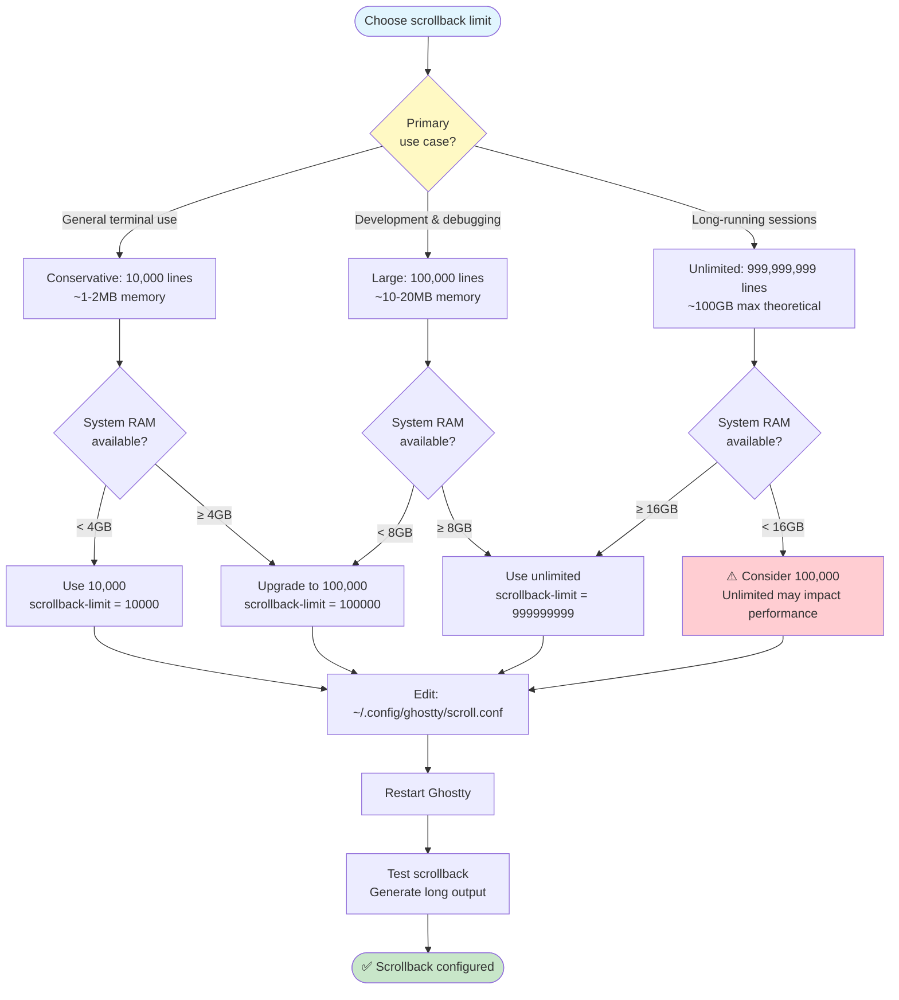
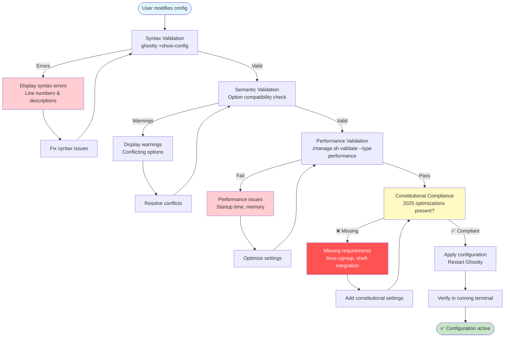

This guide explains how to customize your Ghostty terminal configuration and manage settings.

## Configuration Files

### Main Configuration

The primary configuration file is located at:
```
~/.config/ghostty/config
```

This file is modular and includes other configuration files for organization:

```bash
# Main config structure
~/.config/ghostty/
├── config           # Main configuration (includes others)
├── theme.conf       # Theme settings (Catppuccin dark/light)
├── scroll.conf      # Scrollback settings
├── layout.conf      # Font, padding, window layout
└── keybindings.conf # Custom keybindings
```

### Repository Configuration

The repository contains template configurations in:
```
/home/kkk/Apps/ghostty-config-files/configs/ghostty/
```

Any changes here will be applied during updates (with user customization preservation).

## Core Settings

### Performance Optimizations (2025)

The configuration includes mandatory 2025 performance optimizations:

```conf
# Linux CGroup single-instance (MANDATORY)
linux-cgroup = single-instance

# Enhanced shell integration
shell-integration = detect
shell-integration-features = cursor,sudo,title

# Memory management (unlimited scrollback)
scrollback-limit = 999999999
```

**Do not disable these** - they are required for optimal performance.

### Scrollback Buffer Configuration

The repository configures **unlimited scrollback** (effectively) for complete terminal history retention.

**Current Setting**: 999,999,999 lines (~1 billion lines)

#### Choosing Your Scrollback Limit

> Use this decision tree to choose an appropriate scrollback limit based on your use case and available system resources. The CGroup single-instance optimization protects against excessive memory consumption even with unlimited scrollback.



**Location**: `~/.config/ghostty/scroll.conf`

**Why 999999999 instead of -1**:
- Ghostty does not support `-1` for unlimited scrollback
- 999,999,999 lines is effectively unlimited for practical use
- Provides ~1 billion lines of terminal history

**Memory Considerations**:
- Each line consumes ~100-200 bytes of memory
- Full buffer usage (~100GB) is unlikely in normal use
- CGroup single-instance optimization manages memory efficiently
- Constitutional limit: <100MB baseline memory usage maintained

**Performance Impact**:
- Negligible impact due to Ghostty's efficient memory management
- linux-cgroup settings prevent excessive memory consumption
- Scroll performance remains optimal even with large buffers

**Customization**:

Edit `~/.config/ghostty/scroll.conf` to change:

```bash
# Conservative (default for most terminals): 10,000 lines
scrollback-limit = 10000

# Large (debugging sessions): 100,000 lines
scrollback-limit = 100000

# Unlimited (this repository's default): ~1 billion lines
scrollback-limit = 999999999
```

**Restart Required**: Changes take effect on next Ghostty window launch.

### Theme Configuration

Automatic theme switching based on system preference:

```conf
# In theme.conf
theme = catppuccin-mocha      # Dark theme
theme-light = catppuccin-latte # Light theme

# System will automatically switch based on:
# - GNOME dark mode preference
# - Time of day (if configured)
# - Manual override
```

**Supported themes**:
- `catppuccin-mocha` (Dark)
- `catppuccin-latte` (Light)
- `catppuccin-frappe` (Medium dark)
- `catppuccin-macchiato` (Dark with warm tones)

### Font Configuration

Configure fonts in `layout.conf`:

```conf
# Font family
font-family = "JetBrains Mono"

# Font size
font-size = 12

# Font features
font-feature = +liga +calt +ss01

# Line height
adjust-cell-height = 10%
```

**Recommended fonts**:
- JetBrains Mono (default)
- Fira Code
- Cascadia Code
- IBM Plex Mono

### Window Layout

```conf
# Window padding
window-padding-x = 8
window-padding-y = 8

# Window decorations
window-decoration = true

# Initial window size
window-width = 100
window-height = 30
```

### Scrollback Settings

Configure scroll behavior in `scroll.conf`:

```conf
# Scrollback limit (lines)
scrollback-limit = 100000

# Scroll multiplier
mouse-scroll-multiplier = 3

# Shift+PageUp/PageDown scrolling
scrollback-key = shift+page_up
scrollback-key = shift+page_down
```

## Keybindings

### Default Keybindings

Core keybindings are defined in `keybindings.conf`:

```conf
# Tab management
keybind = ctrl+shift+t=new_tab
keybind = ctrl+shift+w=close_tab
keybind = ctrl+tab=next_tab
keybind = ctrl+shift+tab=previous_tab

# Split management
keybind = ctrl+shift+e=new_split:right
keybind = ctrl+shift+o=new_split:down

# Font size
keybind = ctrl+plus=increase_font_size
keybind = ctrl+minus=decrease_font_size
keybind = ctrl+0=reset_font_size

# Copy/Paste
keybind = ctrl+shift+c=copy
keybind = ctrl+shift+v=paste
```

### Custom Keybindings

Add your own keybindings to `keybindings.conf`:

```conf
# Example: Quick access to frequently used commands
keybind = ctrl+shift+h=write_text:htop\r

# Example: Custom split navigation
keybind = alt+left=goto_split:left
keybind = alt+right=goto_split:right
keybind = alt+up=goto_split:up
keybind = alt+down=goto_split:down
```

## Advanced Configuration

### Shell Integration

Enhanced shell integration features:

```conf
# Enable all shell integration features
shell-integration = detect
shell-integration-features = cursor,sudo,title,jump

# OSC sequences
shell-integration-features += osc

# Custom prompt marker
shell-integration-prompt-mark = true
```

### Clipboard Protection

Security feature to prevent clipboard paste attacks:

```conf
# Clipboard paste protection
clipboard-paste-protection = true

# Paste bracketing
clipboard-paste-bracketing = true
```

### URL Handling

Configure how URLs are opened:

```conf
# URL detection
url-trigger = true

# URL click action
click-action = open

# Custom URL opener
url-opener = xdg-open
```

### Bell Configuration

```conf
# Visual bell instead of audible
visual-bell = true
visual-bell-color = #ff5555

# Or disable bell entirely
audible-bell = false
visual-bell = false
```

## Managing Configuration

### Using manage.sh

The `manage.sh` tool provides commands for configuration management:

#### Validate Configuration

```bash
# Validate current configuration
./manage.sh validate --type config

# Validate with auto-fix
./manage.sh validate --type config --fix

# Direct validation
ghostty +show-config
```

#### Update Configuration

```bash
# Check for configuration updates
./manage.sh update --check-only

# Apply configuration updates
./manage.sh update --component config

# Force configuration reset
./manage.sh update --force
```

#### Backup Configuration

Configuration is automatically backed up before updates:

```bash
# Manual backup
cp ~/.config/ghostty/config ~/.config/ghostty/config.backup-$(date +%Y%m%d)

# View backups
ls -la ~/.config/ghostty/backups/

# Restore from backup
./manage.sh restore --backup <backup-name>
```

### User Customization Preservation

**IMPORTANT**: The update system preserves your customizations.

Custom settings are automatically:
1. Extracted before update
2. Compared with new defaults
3. Merged back after update
4. Validated for conflicts

You can freely customize:
- Theme preferences
- Font settings
- Keybindings
- Window layout
- Personal preferences

These will NOT be overwritten during updates.

## Configuration Validation

> Configuration validation follows a multi-stage process ensuring syntax correctness, semantic compatibility, performance compliance, and constitutional adherence to 2025 optimization requirements.



### Syntax Validation

Ghostty includes built-in configuration validation:

```bash
# Check syntax
ghostty +show-config

# Expected output: Parsed configuration with no errors
```

### Common Validation Errors

#### Invalid Option
```
Error: Unknown option 'invalid-option'
```
**Solution**: Remove the invalid option or check spelling.

#### Invalid Value
```
Error: Invalid value for 'font-size': 'abc'
```
**Solution**: Use correct value type (number, string, boolean).

#### Conflicting Options
```
Warning: 'theme' and 'theme-light' both specified
```
**Solution**: Remove one or use conditional inclusion.

### Performance Validation

Check performance impact of your configuration:

```bash
# Performance check
./manage.sh validate --type performance

# Startup time measurement
time ghostty --version

# Memory usage check
ps aux | grep ghostty
```

## Troubleshooting

### Configuration Not Loading

**Issue**: Changes not applied

**Steps**:
1. Validate syntax: `ghostty +show-config`
2. Check file permissions: `ls -la ~/.config/ghostty/config`
3. Restart Ghostty
4. Check for conflicting settings

### Theme Not Switching

**Issue**: Theme doesn't change with system preference

**Solution**:
```conf
# Ensure theme-light is set
theme = catppuccin-mocha
theme-light = catppuccin-latte

# Check system theme integration
gsettings get org.gnome.desktop.interface color-scheme
```

### Keybindings Not Working

**Issue**: Custom keybindings ignored

**Solution**:
```bash
# Check keybinding syntax
grep "keybind" ~/.config/ghostty/keybindings.conf

# Look for conflicts
ghostty +show-config | grep keybind

# Use correct format:
keybind = ctrl+shift+t=new_tab  # Correct
keybind = Ctrl+Shift+T=new_tab  # Wrong (case sensitive)
```

### Font Not Rendering

**Issue**: Font not displaying correctly

**Solution**:
```bash
# Check if font is installed
fc-list | grep "JetBrains Mono"

# Install font if missing
sudo apt install fonts-jetbrains-mono

# Refresh font cache
fc-cache -f -v

# Verify in config
ghostty +show-config | grep font-family
```

## Configuration Templates

### Minimal Configuration

For users who prefer minimal setup:

```conf
# Minimal config - performance only
linux-cgroup = single-instance
shell-integration = detect
theme = catppuccin-mocha
font-family = "JetBrains Mono"
font-size = 12
```

### Power User Configuration

For advanced users:

```conf
# Performance
linux-cgroup = single-instance
shell-integration = detect
shell-integration-features = cursor,sudo,title,jump,osc

# Appearance
theme = catppuccin-mocha
theme-light = catppuccin-latte
font-family = "JetBrains Mono"
font-size = 12
font-feature = +liga +calt
window-padding-x = 12
window-padding-y = 12

# Behavior
scrollback-limit = 100000
clipboard-paste-protection = true
url-trigger = true

# Keybindings (extensive)
keybind = ctrl+shift+t=new_tab
keybind = ctrl+shift+w=close_tab
# ... many more custom bindings
```

## Next Steps

- **[Usage Guide](usage.md)** - Learn manage.sh commands
- **[Developer Guide](../developer/architecture.md)** - Understand the architecture
- **[AI Guidelines](../ai-guidelines/core-principles.md)** - For AI assistants

## Resources

- **Ghostty Documentation**: https://ghostty.org/docs
- **Configuration Reference**: https://ghostty.org/docs/config
- **Theme Gallery**: https://github.com/catppuccin/catppuccin
